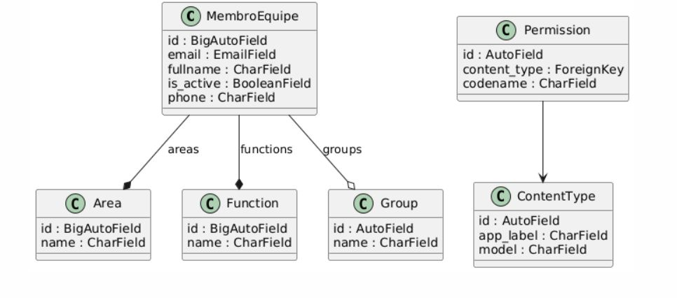
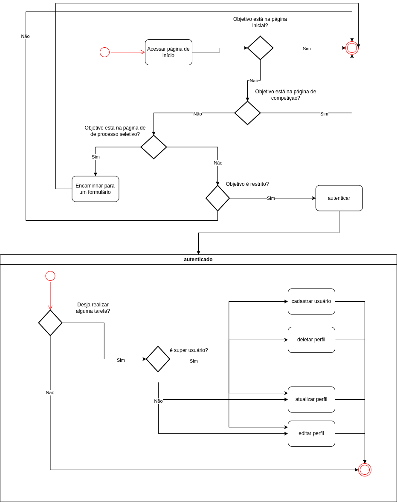
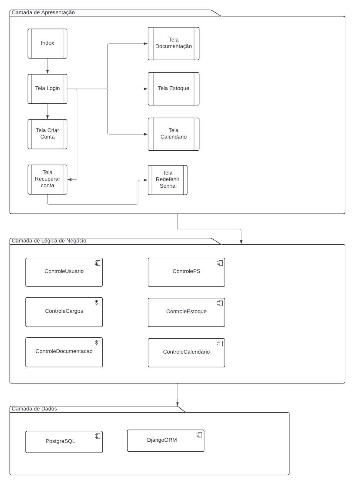
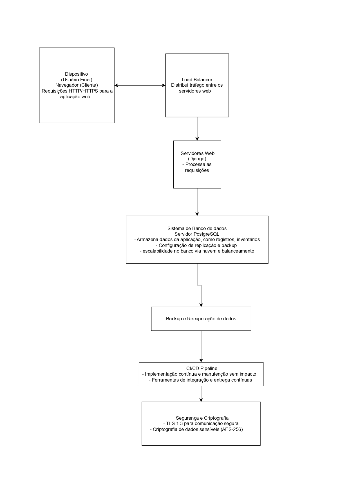

# Documento de Arquitetura

## 1. Introdução
### 1.1 Propósito

Este documento apresenta a arquitetura do sistema desenvolvido para o sistema web para a equipe de competição <strong>Mamutes do Cerrado</strong> da Universidade de Brasília (UnB). O objetivo é descrever detalhadamente as funcionalidades, integrações e especificações técnicas, fornecendo uma visão abrangente para desenvolvedores, testadores e demais envolvidos no projeto. O sistema busca aprimorar a gestão interna e aumentar a visibilidade externa da equipe, alinhando-se às suas necessidades e objetivos estratégicos.   

---

### 1.2 Escopo

O sistema desenvolvido busca melhorar a organização interna da equipe e aumentar sua
visibilidade externa. Ele contará com ferramentas para gerenciar calendários, inventário,
documentos e tarefas, além de oferecer perfis de acesso personalizados para diferentes membros.   
Também terá um site público para divulgar a equipe, suas conquistas, projetos e
informações sobre o processo seletivo. Internamente, o sistema inclui funcionalidades de
lembrete para o calendário e registro de dados importantes, como voos e acidentes, bem como
gerenciamento de estoque.   
Com isso, o objetivo é otimizar processos, centralizar informações e destacar a equipe em
competições e no meio acadêmico.   
Demais detalhes com relação ao escopo do projeto se encontram no documento
“Documento de Visão - Áries”, na seção 4.   

---

## 2. Representação Arquitetural

### 2.1 Definições

O sistema da equipe <strong>Mamutes do Cerrado</strong> adotará a arquitetura em camadas, alinhada ao padrão <strong>Model-View-Template (MVT)</strong>, utilizado pelo framework Django. Essa abordagem organiza o sistema em três componentes principais, cada um com funções bem definidas.   

---

### 2.2 Justificativa

A escolha da arquitetura <strong>MVT</strong>, fornecida pelo Django, foi motivada por suas diversas vantagens, que se alinham diretamente às necessidades do desenvolvimento do sistema Web. Entre os principais benefícios, destacam-se:   

#### 2.2.1 Separação de Responsabilidades

A arquitetura MVT separa claramente as funções do sistema, o que:

<ul>
    <li>Facilita a manutenção e a evolução independente de cada componente. </li>
    <li>Permite alterações no <strong>Template</strong> (interface do usuário) sem impactar a lógica de negócios no <strong>Model</strong>.</li>
    <li>Simplifica o desenvolvimento contínuo e modular do sistema.</li>
</ul>

#### 2.2.2 Reutilização de Componentes

A estrutura dos templates do Django permite a reutilização de layouts e blocos de código, agilizando a criação de páginas consistentes e minimizando redundâncias.    

#### 2.2.3 Facilidade de Teste

Com o MVT, as camadas podem ser testadas isoladamente:

- <strong>Models</strong> podem ser validados com testes unitários para garantir a integridade dos dados.
- <strong>Views</strong> podem ser testadas para confirmar o comportamento esperado das requisições.
- <strong>Templates</strong> podem ser revisados para verificar se os dados estão sendo apresentados corretamente.

#### 2.2.4 Desenvolvimento Paralelo

A separação em camadas permite que diferentes equipes trabalhem simultaneamente:

- Uma equipe pode desenvolver os <strong>Models</strong>, configurando o banco de dados e regras de negócio.
- Outra pode focar na criação de <strong>Templates</strong> e no design das páginas.
- Uma terceira equipe pode trabalhar nas <strong>Views</strong>, integrando os dados e ajustando a lógica de controle.

#### 2.2.5 Escalabilidade e Adaptação

A arquitetura MVT é flexível e escalável, permitindo que novas funcionalidades sejam adicionadas ou modificadas com facilidade. Isso é crucial para suportar:

- Expansões futuras, como novos módulos para gerenciamento de eventos ou integração com novos sistemas.
- Adaptações às demandas específicas da equipe Mamutes do Cerrado, como melhorias no controle de estoque e comunicação automatizada.

#### 2.2.6 Alinhamento às Necessidades

A arquitetura MVT atende perfeitamente à necessidade de um sistema robusto, modular e de fácil manutenção, conectando <strong>gestão interna</strong> (estoques, cronogramas, tarefas) e <strong>divulgação externa</strong> (site público, eventos), permitindo que a Mamutes do Cerrado se organize e cresça de forma sustentável e eficiente.

---

## 3. Detalhamento

O padrão arquitetural utilizado será em camadas, implementado com o framework Django, seguindo o design <strong>Model-View-Template (MVT)</strong>. Cada componente do MVT desempenhará funções específicas, assegurando as vantagens descritas no item 2.2 deste documento. Abaixo, detalha-se o papel de cada camada no sistema da equipe:

### 3.1 Camada de Lógica de Negócios (Model)

Essa camada gerencia os dados e a lógica de negócios da aplicação. No contexto do sistema Mamutes, será responsável por:

- <strong>Armazenar informações</strong> sobre membros, estoques, cronogramas e documentos em um banco de dados relacional.
- <strong>Gerenciar processos internos</strong>, como registro de atividades, cálculo de métricas (presenças e disponibilidade de recursos) e controle de acesso.
- <strong>Fornecer suporte aos relatórios e indicadores</strong> de desempenho da equipe.

### 3.2 Camada de Apresentação (Template)

Os templates são responsáveis pela renderização de conteúdo dinâmico para o usuário, utilizando HTML integrado com variáveis e expressões do Django Template Language (DTL). Exemplos de funcionalidades nesta camada incluem:

- <strong>Exibição de dashboards</strong> com cronogramas, indicadores-chave e relatórios dinâmicos.
- <strong>Criação de páginas públicas</strong> para divulgar eventos, identidade visual e novidades da equipe.
- <strong>Interfaces amigáveis e responsivas </strong>para facilitar o gerenciamento interno de recursos como estoques e cronogramas.

### 3.3 Camada de Controle (View)

As views atuam como intermediárias, processando as solicitações dos usuários e interagindo com o Model e o Template. São responsáveis por:

- Receber requisições do usuário e retornar respostas adequadas, como páginas HTML ou dados em formato JSON.
- <strong>Gerenciar lógica de apresentação dinâmica</strong>, como filtrar dados de cronogramas ou estoques com base no perfil do usuário.
- <strong>Integração com APIs externas</strong>, como o Google Maps, para funcionalidades avançadas, como cálculo de rotas.	

### 3.4 Benefícios do Padrão MVT no Contexto do Sistema

- <strong>Organização Modular:</strong> Cada camada desempenha um papel distinto, facilitando manutenção e futuras expansões.
- <strong>Reutilização e Consistência:</strong> Templates reutilizáveis para páginas públicas e privadas garantem consistência visual.
- <strong>Escalabilidade:</strong> Novas funcionalidades podem ser integradas sem grandes reestruturações.
- <strong>Desenvolvimento Colaborativo:</strong> Permite que diferentes equipes trabalhem simultaneamente nas três camadas, otimizando o tempo de desenvolvimento.

A figura abaixo ilustra a arquitetura MVT utilizada no desenvolvimento do sistema Mamutes do Cerrado, destacando a interação entre os componentes e suas responsabilidades:

<strong>Figura 1.</strong> Esquema da arquitetura MVT adaptada ao sistema Mamutes do Cerrado.

---

## 4. Metas e restrições arquiteturais

### Metas Arquiteturais

As metas arquiteturais do nosso sistema foram definidas para atender às necessidades funcionais e não funcionais da aplicação, garantindo eficiência, segurança e escalabilidade:

#### 4.1 Escalabilidade Horizontal

O sistema deve suportar a adição de servidores para aumentar a capacidade de processamento em cenários de crescimento da equipe ou de dados.  

<strong>Justificativa:</strong> Escalabilidade horizontal garante que o sistema possa crescer sem a necessidade de reformulações arquiteturais.

#### 4.2 Manutenibilidade Modular

Novas funcionalidades devem ser integradas ao sistema sem impactar componentes existentes, graças à separação de responsabilidades proporcionada pelo padrão <strong>MVT.</strong>  

<strong>Justificativa:</strong> A arquitetura modular simplifica a adição de novos recursos e facilita correções de erros ou atualizações de componentes.

### Restrições Arquiteturais

#### 4.3  Compatibilidade Multiplataforma

O sistema deve ser compatível com navegadores modernos (Chrome, Firefox, Edge, Safari) e dispositivos móveis com tela mínima de 5 polegadas.  

<strong>Justificativa:</strong> Garantir o acesso universal é essencial para que todos os membros possam usar o sistema sem barreiras tecnológicas.

#### 4.4 Uso do Framework Django

Todo o desenvolvimento backend será baseado no Django 4.2 LTS, incluindo o suporte ao padrão <strong>MVT</strong> e <strong>ORM</strong> nativo.  

<strong>Justificativa:</strong> O Django é robusto, oferece ferramentas integradas para desenvolvimento ágil e segue boas práticas de segurança e escalabilidade.

#### 4.5 Armazenamento e Banco de Dados

O sistema vai utilizar <strong>SQLite</strong> como banco de dados principal, com suporte a armazenamento de até 100 GB de dados, que é basicamente o plano escolhido para o projeto e atende às necessidades nesse primeiro momento.   

<strong>Justificativa:</strong> SQLite oferece alto desempenho e suporte para operações complexas,
além de ser escalável e compatível com o Django.

## 5. Visão de Casos de uso (escopo do produto)

    A arquitetura do sistema segue o padrão <strong>Model-View-Template (MVT)</strong>, implementado
    pelo framework Django, escolhido pela familiaridade da maioria dos integrantes e pelos
    requisitos técnicos, como a necessidade de autenticação robusta e gerenciamento de
    diferentes níveis de acesso, que serão explicados ao decorrer da seção.
     
    Ademais, outros
    pontos fizeram-se importantes durante a escolha, entre eles estão: a escalabilidade do projeto,
    facilitando integrações futuras (novos módulos e API's (Interface de Programação de
    Aplicação) externas, a manutenção descomplicada. O <strong>PostgreSQL</strong> foi escolhido como banco
    de dados devido à experiência prévia de membros da equipe com bancos relacionais e ao
    suporte robusto do Django, enquanto o frontend foi implementado com <strong>HTML, CSS</strong> e
    <strong>JavaScript</strong>.   
    
    No que se diz a respeito do escopo geral do sistema, ele pode ser dividido em partes
    que têm funcionalidades como:

<ul>
    <li>Gerenciamento de calendários, tarefas e inventários;</li>
    <li>Controle de acesso baseado em perfis personalizados;</li>
    <li>Exibição de informações públicas sobre a equipe, projetos e eventos;</li>
    <li>Gerenciamento de documentação, como logs de voos, ocorrências e administração do estoque de produtos da equipe.</li>
</ul>

Além disso, o sistema suporta múltiplos níveis de acesso (perfis) , cada um com
permissões específicas:

1. <strong>Capitão:</strong> Acesso irrestrito (superusuário);
2. <strong>Gerente:</strong> Pode designar tarefas em todas as áreas (superusuário);
3. <strong>Líderes:</strong> Restritos à designar tarefas apenas em suas áreas específicas, como, por exemplo, o líder do Marketing, poderá gerenciar apenas o Marketing (superusuário);
4. <strong>Membros:</strong> Limitados às suas áreas de atuação, com permissões para alterar calendários e marcar tarefas concluídas;
5. <strong>Trainees:</strong> Podem acessar áreas restritas, mas tem permissão apenas para visualizar;
6. <strong>Visitantes:</strong> Usuários comuns, com acesso apenas à parte pública do site – página inicial e a de inscrição do processo seletivo.

O diagrama abaixo destaca os casos de uso da aplicação e suas interações citadas
acima:

<strong>Figura 2.</strong> Diagrama de Casos de uso.

## 6. Visão lógica

O sistema é dividido em quatro aplicativos principais, organizados para atender às necessidades dos usuários conforme suas funções:

<strong>Guest:</strong>
<ul>
  <li><strong>Objetivo:</strong> Oferecer uma interface visual para usuários não cadastrados.</li>
  <li><strong>Principais Funcionalidades:</strong>
    <ul>
      <li>Página inicial com informações públicas;</li>
      <li>Navegação básica nas áreas públicas (apenas visual).</li>
    </ul>
  </li>
  <li><strong>Componentes:</strong>
    <ul>
      <li>Templates: Arquivos HTML para páginas como "Quem somos";</li>
      <li>Views: Controladores para renderizar essas páginas.</li>
    </ul>
  </li>
</ul>

<strong>Users:</strong>
<ul>
  <li><strong>Objetivo:</strong> Atender usuários cadastrados, fornecendo ferramentas de gerenciamento pessoal.</li>
  <li><strong>Principais Funcionalidades:</strong>
    <ul>
      <li>Criação de eventos;</li>
      <li>Visualização de tarefas;</li>
      <li>Controle de áreas ocupadas pelos usuários.</li>
    </ul>
  </li>
  <li><strong>Componentes:</strong>
    <ul>
      <li>Models: Estruturas de dados para usuários, tarefas e eventos;</li>
      <li>Views: Regras de negócio e exibição das funcionalidades;</li>
      <li>Templates: Páginas para interagir com as funcionalidades.</li>
    </ul>
  </li>
</ul>

<strong>Stock:</strong>
<ul>
  <li><strong>Objetivo:</strong> Gerenciar a entrada, saída e monitoramento de itens no estoque.</li>
  <li><strong>Principais Funcionalidades:</strong>
    <ul>
      <li>Verificar itens em falta;</li>
      <li>Atualizar quantidades de itens;</li>
      <li>Relatórios de consumo e necessidades.</li>
    </ul>
  </li>
  <li><strong>Componentes:</strong>
    <ul>
      <li>Models: Representação de itens e histórico de movimentações;</li>
      <li>Views: Controle de lógica para movimentação de estoque;</li>
      <li>Templates: Páginas para visualização e atualização.</li>
    </ul>
  </li>
</ul>

<strong>Report:</strong>
<ul>
  <li><strong>Objetivo:</strong> Criar e organizar relatórios específicos do sistema.</li>
  <li><strong>Principais Funcionalidades:</strong>
    <ul>
      <li>Relatórios de voo;</li>
      <li>Atas de documentos;</li>
      <li>Exportação e formatação de dados.</li>
    </ul>
  </li>
  <li><strong>Componentes:</strong>
    <ul>
      <li>Models: Estruturas para armazenar dados necessários aos relatórios;</li>
      <li>Views: Criação e manipulação dos relatórios;</li>
      <li>Templates: Páginas para configuração e visualização.</li>
    </ul>
  </li>
</ul>

O diagrama de classes, ilustrado na próxima figura, coincide com a versão atual do código:

<strong>Figura 3.</strong> Diagrama de Classes.

<strong>Figura 4.</strong> Diagrama de estados da aplicação.

Diagrama de Atividades encontra-se no link: <a target="_blank" href="https://www.figma.com/board/MvMowYd0J4NuHSZtLhvr6d/Untitled?node-id=0-1&t=bTk0I6htwaQWrYIt-1" >https://www.figma.com/board/MvMowYd0J4NuHSZtLhvr6d/Untitled?node-id=0-1&t=bTk0I6htwaQWrYIt-1</a>

## 7. Visão de Implementação

### 7.1 Camada de Apresentação

    A camada de apresentação é composta pelos templates HTML responsáveis pela interface com o usuário e pelos arquivos estáticos (CSS, JS e imagens) que fornecem o design e a interatividade para a aplicação.  Tantos os templates quantos as pastas de arquivos   estáticos estão organizadas dentro das aplicações guest e users.  
        Em relação aos templates, a aplicação guest contém os templates públicos que podem ser acessados sem a necessidade de uma permissão específica, sendo alguns deles:

- <strong>index.html:</strong> Página inicial com informações básicas sobre a equipe de competição Mamutes, incluindo as seções "Quem somos", "O que fazemos", "Hall da fama" e "Apoiadores".
- <strong>comp.html:</strong> Página com informações sobre a SAE Brasil Aerodesign e a jornada da equipe Mamutes na competição.
- <strong>admission.html:</strong> Página utilizada para divulgação dos processos seletivos da equipe.

Na aplicação users, encontram-se os templates relacionados ao usuário, como cadastro e login, que também são acessíveis ao público. Entre eles estão:  

- <strong>login.html:</strong> Página de login de usuários.
- <strong>recoverAccount.html:</strong> Página para solicitar o envio de um e-mail de recuperação de senha.
- <strong>redefinePassword.html:</strong>  Página para redefinição de senha.
- <strong>register.html:</strong>  Página para cadastro de novos usuários.

Já nas pastas de arquivos estáticos estão os recursos essenciais para a apresentação visual e interatividade do site, utilizados para estruturar e melhorar a interface com o usuário. No  projeto as pastas são subdivididas em pastas CSS (com os arquivos CSS responsáveis pela aparência visual das página), scripts (com os arquivos JavaScript que adicionam interatividade do usuário à aplicação) e  img (que contêm as imagens utilizadas no site, como as logos da equipe da Mamute).

### 7.2 Lógica e Regras de Negócio

Essa camada é responsável por implementar as regras do funcionamento da aplicação e suas interações com os usuários e os dados. No nosso contexto, ela abrange a gestão dos membros da equipe, o processo de autenticação e recuperação de contas, além do controle de acesso às funcionalidades do sistema. As regras de negócios são implementadas principalmente por meio de modelos e formulários, que garantem a validação dos dados e a execução correta das operações. Cada funcionalidade, como o registro e a edição de membros, a recuperação de senha e a autenticação, possui regras específicas para garantir a integridade e a segurança do sistema. Abaixo, são detalhadas as principais áreas da lógica de negócios implementadas.

<strong>1. Modelos:</strong>
<ul>
    <li>
        <strong>MembroEquipe:</strong> É uma extensão do modelo padrão AbstractUser do
        Django, personalizado para incluir atributos adicionais relevantes ao
        domínio da empresa, como fullname, email e phone. Além disso, ele
        possui relações Many-to-Many com os modelos Area e Function,
        permitindo que um membro seja vinculado a múltiplas áreas e funções.
    </li>

<li>
    <strong>Area:</strong> Modelo que é utilizado como base para criar as áreas da equipe que
    o um Membro pode fazer parte.
</li>
<li>
    <strong>Function:</strong> Modelo que é utilizado como base para criar as funções que um
    Membro pode exercer dentro da equipe.
</li>
</ul>

<strong>2. Formulários:</strong>
<ul>
    <li>
        <strong>MembroEquipeCreationForm:</strong> Permite criar novos membros com
campos personalizados e adiciona campos de seleção múltipla (areas e
functions) utilizando ModelMultipleChoiceField com
CheckboxSelectMultiple.
    </li>
<li>
    <strong>MembroEquipeChangeForm:</strong>  É utilizado para edição das informações
de um membro, mantendo os mesmos campos personalizados do
formulário de criação.
</li>
</ul>

<strong>3. Recuperação de Conta: </strong>
<ul>
    <li>
        <strong>Fluxo de Recuperação:</strong> 
A lógica para recuperação de conta é implementada na view
recoverAccount. Quando um usuário insere seu e-mail, o sistema
verifica se existe um registro correspondente no modelo
MembroEquipe.  
Se o e-mail existir, um token é gerado utilizando
PasswordResetTokenGenerator do Django, e um e-mail é enviado
com o link para redefinir a senha.  
Caso contrário, o sistema retorna uma mensagem indicando que o
e-mail não está registrado
    </li>
<li>
    <strong>Regras de Negócio:</strong> 
    Apenas e-mails cadastrados no sistema podem receber links de
redefinição.
O token de redefinição de senha é validado antes de permitir a
redefinição.
</li>
</ul>

<strong>4. Autenticação: </strong>
<ul>
    <li>
        <strong> Fluxo de Login:</strong> 
 A view login permite que um usuário insira seu nome de usuário e
senha. O sistema utiliza o método authenticate do Django para
verificar as credenciais. Caso as credenciais sejam válidas, o
usuário é autenticado e redirecionado.  
Se inválidas, o usuário é redirecionado para a página de login com
uma mensagem apropriada.
    </li>
<li>
    <strong> Regras de Negócio:</strong> 
Somente usuários com credenciais válidas podem acessar o
sistema.
A autenticação utiliza os recursos padrão do Django, garantindo
segurança e escalabilidade.
</li>
</ul>

<strong>5. Controle de Acesso: </strong>
<ul>
    <li>
        <strong>Permissões de superusuário:</strong> 
A função isSuperUser verifica se o usuário
atual é um superusuário. Essa lógica é usada como decorador em views
como register, restringindo o acesso apenas a usuários administradores.
    </li>
<li>
    <strong>  Permissões de membros:</strong> 
A função login_required delimita áreas que
somente membros registrados da equipe de competição possuem acesso
</li>
</ul>

### 7.3  Comunicação com o Banco de Dados

    A comunicação com o banco de dados no sistema é gerida pelo Django ORM, que
    facilita a interação com as tabelas do banco sem a necessidade de escrever SQL diretamente.

<strong>1. Estrutura do Banco de Dados:</strong>
<ul>
    <li>
        O banco de dados armazena as informações dos membros da equipe, áreas
        de atuação e funções. Essas informações são representadas por três
        modelos principais: MembroEquipe, Área e Function.
    </li>
    <li>
        O modelo MembroEquipe é uma extensão do modelo de usuário padrão do
        Django, com campos adicionais para o nome completo, e-mail e telefone.
        Ele também se relaciona com os modelos Área e Function, permitindo que
        um membro pertença a várias áreas e tenha várias funções.
    </li>
    <li>
        O Django automaticamente cria as tabelas no banco de dados com base
        nesses modelos durante o processo de migração.
    </li>
</ul>

<strong>2. Operações com o Banco de Dados:</strong>
<ul>
    <li>
        <strong>Criação: </strong>Quando um novo membro é registrado, os dados são salvos no
        banco através do formulário MembroEquipeCreationForm, utilizando o
        método .save() do Django.
    </li>
    <li>
        <strong>Leitura:</strong> As informações dos membros, como e-mail, são consultadas no
        banco utilizando métodos do ORM, como filter().
    </li>
    <li>
        <strong>Atualização:</strong> Para alterar os dados de um membro, como a senha, o
        sistema utiliza o método set_password() do Django, que atualiza a senha
        de forma segura no banco de dados.
    </li>
     <li>
        <strong>Exclusão:</strong> A exclusão de registros pode ser feita usando o método
        .delete() do Django.
    </li>
</ul>

<strong>3. Validações e Integridade:</strong>
<ul>
    <li>
        O Django cuida da integridade dos dados, como garantir que os campos de
        e-mail sejam válidos e que os relacionamentos entre os modelos, como os
        vínculos de um membro com áreas e funções, sejam mantidos
        corretamente no banco.
    </li>
</ul>

<strong>4. Consultas Simples:</strong>
<ul>
    <li>
        O sistema utiliza o ORM do Django para realizar consultas simples e
        recuperar informações de maneira eficiente. As consultas podem ser feitas
        diretamente nos modelos, como recuperar todos os membros de uma área
        específica.
    </li>
</ul>

Uma representação pode ser observada no seguinte diagrama de pacotes:

<strong>Figura 5.</strong> Diagrama de Pacotes.

## 8. Visão de Implantação

O software será implantado utilizando servidores que possam suportar o tráfego de usuário simultâneos e a carga de trabalho do sistema, o objetivo da implantação é tornar o sistema funcional e acessível aos usuários finais de forma eficiente e segura e isso envolve garantir que a infraestrutura de hardware e software sejam adequadas.  

### 8.1 Infraestrutura de hardware  

  
  A infraestrutura física necessária para suportar o sistema inclui servidores, a configuração de rede e como esses servidores serão dimensionados para garantir o desempenho esperado:  

  <strong>Servidores Web:</strong> Os servidores responsáveis por hospedar a aplicação e atender às requisições HTTP/HTTPS dos usuários.
  <ul>
    <li>Especificações: De acordo com a necessidade de processamento, a escolha pode ser feita entre servidores dedicados ou servidores em nuvem (AWS, Azure, Google Cloud).</li>
    <li>Justificativa: Dependendo do tráfego esperado, o número de servidores pode variar para garantir a escalabilidade horizontal.</li>
  </ul>

  <strong>Servidores de Banco de Dados:</strong> O banco de dados PostgreSQL será hospedado em um servidor dedicado ou como parte da infraestrutura em nuvem.  
  <ul>
      <li>Especificações: O banco de dados deverá ser dimensionado para suportar a quantidade de dados prevista (por exemplo, até 1 TB no primeiro ano).</li>
    <li>Redundância e Backup: Configuração de backup e replicação do banco de dados para garantir a continuidade dos negócios em caso de falhas.</li>
  </ul>

  <ul>
    <li><strong>Escalabilidade:</strong> Em um ambiente de nuvem, a escalabilidade pode ser garantida com balanceadores de carga e instâncias de servidores adicionais conforme necessário.</li>
  </ul>

### 8.2 Tecnologia e Justificativa

<strong>Framework Django:</strong> O Django foi escolhido pela sua robustez e facilidade de escalabilidade, além de ter boa integração com o banco de dados PostgreSQL.
<ul>
    <li>Justificativa:  O Django oferece um desenvolvimento rápido e seguro, com muitos recursos prontos para produção, como autenticação, gerenciamento de banco de dados e segurança.</li>
</ul>

<strong>Servidor Web:</strong> pache ou Nginx podem ser usados para hospedar a aplicação Django, dependendo da preferência da equipe e dos requisitos de desempenho.
<ul>
    <li>O Nginx, por exemplo, é altamente eficiente para servir conteúdo estático e pode atuar como um balanceador de carga, se necessário.</li>

<strong>Segurança:</strong> TLS 1.3 será utilizado para garantir a segurança das comunicações entre o cliente e o servidor, e a criptografia de dados sensíveis será realizada com AES-256.<ul>
    <li>Justificativa: A segurança é essencial, pois o sistema lidará com informações sensíveis, como dados pessoais e logs da equipe.</li>
</ul>

<strong>Escalabilidade Horizontal:</strong> O sistema será projetado para permitir a adição de novos servidores para distribuir a carga conforme o aumento no número de usuários ou de dados.
<ul>
    <li>Justificativa: A escalabilidade horizontal é essencial para que o sistema continue funcionando sem falhas à medida que a equipe cresce ou quando o número de acessos simultâneos aumenta.</li>
</ul>

<strong>Banco de Dados SQLite:</strong> O SQLite foi escolhido por ser um banco de dados relacional altamente eficiente, com suporte à escalabilidade e alta disponibilidade.
<ul>
    <li>Justificativa: Ele é adequado para armazenar grandes volumes de dados, como registros de membros da equipe, inventário e logs de atividades, além de ser bem suportado pelo Django. E o principal: já vem nativamente nele "django".</li>
</ul>

### 8.3 Estratégia de implantação:  

<strong>Fases de Implantação:</strong>
<ul>
    <li><strong>Preparação do Ambiente:</strong> Configuração do ambiente de desenvolvimento e testes, com servidores e banco de dados configurados.</li>
    <li><strong>Testes:</strong> A realização de testes em ambiente de homologação para validar as funcionalidades e o desempenho do sistema.</li>
    <li><strong>Implantação em Produção:</strong> Após os testes, a aplicação será implantada no ambiente de produção. Esta fase inclui a migração do banco de dados e a configuração final de servidores.</li>
</ul>

<strong>Implantação Contínua:</strong>
<ul>
    <li>A implantação será realizada de forma contínua, utilizando ferramentas como Docker, Kubernetes, ou CI/CD (Integração Contínua/Entrega Contínua) para facilitar atualizações e manutenção contínua.</li>
        <li>Justificativa: A utilização de CI/CD garante um ciclo de vida de desenvolvimento ágil e permite que novas versões sejam disponibilizadas rapidamente, sem impactar os usuários finais.</li>
</ul>

### 8.4 Monitoramento e manutenção:  

<ul>
Backup e Recuperação:
    <li>Será implementado um sistema de backup automático para garantir que os dados estejam protegidos e possam ser restaurados em caso de falha. </li>
        <li>Justificativa: O backup frequente é necessário para evitar a perda de dados críticos, como registros de membros e inventários. </li>
</ul>

### 8.5 Diagrama de implantação:  

Uma representação pode ser observada no seguinte diagrama:

<strong>Figura 6.</strong> Diagrama de Implatação.

## 9. Restrições adicionais

As restrições adicionais do sistema foram definidas para garantir que o software atenda aos requisitos de negócios e de qualidade necessários ao seu funcionamento, além de proporcionar uma experiência segura e eficiente para os usuários.   

<strong>Restrições de Negócios</strong>

1. <strong>Autenticação Obrigatória</strong>
    - O sistema será acessível diretamente pela internet, mas exigirá que membros da equipe se autentiquem utilizando credenciais específicas (matrícula e senha), caso o usuário seja um interessado em se inscrever no processo seletivo ou um interessado em patrocinar realizar um cadastro como usuário externo é necessário nesse caso (e-mail e senha).
    - **Justificativa:** A autenticação garante que somente usuários autorizados (como administradores, capitães e membros) tenham acesso às informações e funcionalidades sensíveis do sistema, protegendo a integridade dos dados. 
2. <strong>Acesso Restrito a Perfis</strong>
    - Funcionalidades críticas, como gerenciamento de estoque, relatório e cronogramas estarão disponíveis apenas para perfis de membros, enquanto trainee terão acesso apenas a funções específicas. 
    - **Justificativa:** A segmentação de funcionalidades por perfis de acesso melhora a segurança e organiza o fluxo de trabalho.

**Restrições de Qualidade**

1. **Usabilidade**
    - O sistema será intuitivo e responsivo, com interfaces que atendam aos princípios de design de **usabilidade (ISO 9241-11)** com o auxílio das técnicas ágeis, no caso as sprints semanais, permitindo que usuários executem tarefas comuns com eficiência e sem necessidade de treinamento extensivo.
    - **Justificativa:** Um design acessível facilita o uso do sistema por diferentes perfis de usuários, incluindo membros menos experientes com tecnologia.
2. **Portabilidade**  
    - O software será compatível com dispositivos móveis (Android e iOS) e navegadores modernos (Chrome, Firefox, Safari, Edge).
    - **Justificativa:** Garantir o acesso em múltiplas plataformas facilita o uso por membros em diferentes contextos e dispositivos.
3. **Manutenibilidade**
    - O código será modular e bem documentado, seguindo os padrões de desenvolvimento do Django, para facilitar correções de erros e futuras expansões.
    - **Justificativa:** A capacidade de realizar manutenção eficiente é fundamental para garantir a evolução contínua do sistema e atender a novas demandas.
4. **Escabilidade**
    - O sistema será preparado para aumentar a capacidade de processamento com a adição de servidores, permitindo a expansão conforme a equipe cresça ou os dados aumentem.
    - **Justificativa:** Uma infraestrutura escalável garante que o sistema se adapte ao crescimento, evitando gargalos de desempenho.

---

## 10. Bibliografia

<strong>ALURA.</strong> Django: o que é, para que serve e um guia desse framework Python. Disponível em: <a target="_blank" href="https://www.alura.com.br/artigos/django-framework">https://www.alura.com.br/artigos/django-framework</a>. Acesso em: 9 dez. 2024.   

<strong>NORMANDO</strong>, Célio. Arquitetura MVC e princípios de projeto. Disponível em: <a target="_blank" href="https://medium.com/@celionormando/arquitetura-mvc-e-princípios-de-projeto-3d0b278ef910">https://medium.com/@celionormando/arquitetura-mvc-e-princípios-de-projeto-3d0b278ef910</a>. Acesso em: 12 dez. 2024.     

<strong>DJANGO SOFTWARE FOUNDATION</strong>. Documentação do Django. Disponível em: <a target="_blank" href="https://docs.djangoproject.com/pt-br/5.1/">https://docs.djangoproject.com/pt-br/5.1/</a>. Acesso em: 18 dez. 2024.     

<strong>LUCIDCHART</strong>. Tudo sobre diagramas de pacotes UML. Disponível em: <a target="_blank" href="https://www.lucidchart.com/pages/pt/diagrama-de-pacotes-uml">https://www.lucidchart.com/pages/pt/diagrama-de-pacotes-uml</a>. Acesso em: 18 dez. 2024.     

<strong>DIAGRAMA DE CLASSES</strong>. Disponível em: <a target="_blank" href="https://www.figma.com/board/MvMowYd0J4NuHSZtLhvr6d/Untitled?node-id=0-1&t=TOB4ZlAFt7XZZCeW-1">https://www.figma.com/board/MvMowYd0J4NuHSZtLhvr6d/Untitled?node-id=0-1&t=TOB4ZlAFt7XZZCeW-1</a> Acesso em: 18 dez. 2024    

---

## Tabela de Versionamento

| Versão | Data | Descrição da Alteração | Nome(s) Integrante(s) |
| :----: | :--: | :--------------------: | :-------------------: |
| 1.0 | 25/11/2024 | Criação inicial e estrutura do artefato | Felipe Freire |
| 1.1 | 12/12/2024 | Desenvolvimento dos artefatos de **propósito**, **escopo**, **definições**, **justificativa**, **detalhamento** e **metas** e **restrições arquiteturais** | Felipe Freire |
| 1.2 | 18/12/2024 | Desenvolvimento do tópico 8, visão de implantação | Felipe Duarte |
| 1.3 | 18/12/2024 | Desenvolvimento do tópico 7, visão de implememtação | Othavio Bolzan |
| 1.4 | 18/12/2024 | Desenvolvimento do tópico 5, visão de casos de uso | Amanda Cruz |
| 1.5 | 18/12/2024 | Desenvolvimento do tópico 6, visão lógica (diagrama de classes e de atividades) | Isaque Camargos e Rafael Schadt |
| 2.0 | 19/12/2024 | Revisão do documento | Caio Duarte e Mayara Marques |
| 2.1 | 09/02/2024 | Revisão do documento e atualização dos tópicos 4.5 e 8.2 | Felipe Freire |
