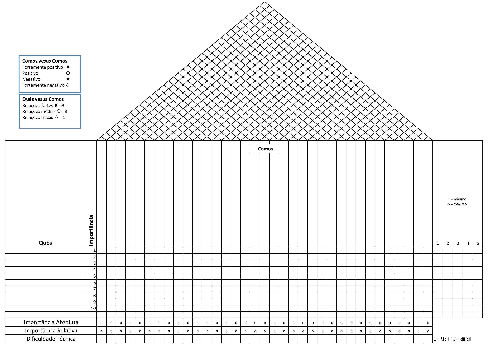

## **Moscou**

O QFD (Quality Function Deployment – Desdobramento da Função Qualidade) é uma das ferramentas da qualidade criada na década de 60 pelo japonês Yoji Akao. Desdobramento da função qualidade: um nome um tanto técnico para um processo que, essencialmente, faz as empresas integrarem a Voz do Cliente (VOC) no desenvolvimento de produtos. [1]

A **Figura 1** a seguir representam a análise de disponibilidade do grupo. Os valores numéricos variam de 0 a 7, indicando o número de membros disponíveis em cada faixa horária.

  
    
<b>Figura 1:</b> Matriz QFD

  

  

_Fonte: [Felipe das Neves](https://github.com/FelipeFreire-gf) _

## **Referências Bibliográficas**

[1] “Como preencher a matriz QFD ou Casa da Qualidade”, Lucidchart, 02-nov-2023.

## **Bibliográfia**

> “Como preencher a matriz QFD ou Casa da Qualidade”, Lucidchart, 02-nov-2023.

## Histórico de Versões

| Versão | Data de produção   | Descrição da Alteração                               | Autor(es)             | Revisor(es)      | Data de Revisão |
| :----: | :----------------: | :--------------------------------------------------: | :-------------------: | :-------------:  |  :-----------: |
| 1.0 | 28/04/2025 | Desenvolvimento do tópico QFD | Felipe das Neves | Matheus Bastos, Vitor Bessa | 28/04/25 |