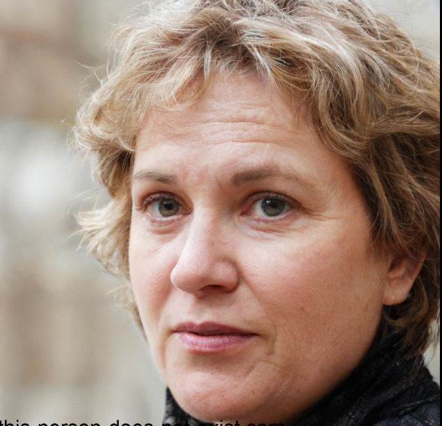

Versão 1.4

# Personas

---

## Introdução
Personas são personagens fictícios que representam perfis diferentes de usuários, criados com base em comportamentos e características reais observados em campo. Mesmo sendo construídas como arquétipos, elas reúnem motivações, necessidades, expectativas e objetivos comuns a um grupo maior de pessoas. A ideia é transformar dados em algo mais humano e fácil de entender, ajudando a equipe a enxergar o sistema pelos olhos de quem realmente vai usá-lo [[ 1 ]](#ref1).

No caso do aplicativo Celular Seguro, as personas ajudam a entender como diferentes tipos de usuários se relacionam com a tecnologia — desde os mais experientes até os que têm mais dificuldades com o uso do celular. Isso evita que o desenvolvimento seja baseado apenas em achismos e permite criar soluções mais alinhadas com a realidade de quem vai usar o app.

Com isso, conseguimos pensar em um sistema que seja realmente útil, simples de usar e que leve em conta o que importa para cada perfil de usuário, como segurança, acessibilidade ou praticidade no dia a dia.

!!! Warning "Atenção!"
    O conteúdo deste tópico **poderá sofrer alterações** ao longo da Disciplina de Requisitos de Software. Portanto, as tabelas serão organizadas iniciando pela versão mais recente e finalizando com a versão mais antiga.

## Integrantes que atuaram no desenvolvimento do artefato

Esta tabela inicial terá somente os artefatos de alta relevância que cada integrante do projeto desenvolveu. O versionamento **completo** encontra-se ao final do artefato.

_Tabela de Contribuição_

| Nome | Função |
| :--- | :--- |
| [Mateus Bastos](https://github.com/MateuSansete) | Autor do desemvolvimento do artefato |
| [repolhudo junior](https://github.com/arthurlleite) | Revisor do Artefato |

*Legenda:* 

**Nome** – participante da técnica. 

**Função** – papel desempenhado na priorização. 

!!! Tip "Observação"
    Frizando claramente que as contribuições de cada integrante ainda que mínimas são ainda sim muito relevantes no desenvolvimento do artefo, considere verificar o histórico de versão. 

---

## Metodologia
A elaboração das personas foi baseada em dados obtidos por meio da observação e análise de usuários reais, identificando polaridades comportamentais e demográficas relevantes. Essas polaridades incluem variáveis como idade, familiaridade com tecnologia, grau de independência digital e perfil de uso do dispositivo móvel.

Após essa identificação, os arquétipos foram concebidos por meio da combinação de características divergentes entre si, de forma a representar perfis extremos de usuários. A composição de cada persona envolveu a criação de histórias, expectativas e contextos de uso, conferindo identidade e propósito aos personagens, com o objetivo de apoiar decisões estratégicas de design e desenvolvimento [[ 1 ]](#ref1).

Essa metodologia resultou na construção de três personas primárias e uma antipersona, contemplando um espectro representativo dos usuários do sistema. A variedade desses perfis garante que as funcionalidades essenciais do aplicativo Celular Seguro respondam às necessidades reais dos públicos atendidos.

---

## Elenco

<b>Tabela 1</b> - Persona Primária João da Silva.

  

| **Nome**                | João da Silva                            |                 
|-------------------------|-------------------------------------------|
| **Idade**               | 36 anos                                   |
| **Profissão**           | Motoboy                                   |
| **Escolaridade**        | Ensino Médio Completo                     |
| **Habilidades e Experiências** | Experiência em transporte de mercadorias, uso intenso de smartphone para comunicação e organização de rotas |
| **Relacionamentos**     | Colegas motoboys, clientes e comerciantes locais |
| **Expectativas**        | Quer ter um celular seguro, principalmente para trabalho, e com fácil acesso para bloquear ou localizar seu aparelho em caso de roubo |
| **Tarefas Primárias**   | Trabalhar como motoboy, usar o celular para comunicação, organizar entregas |
| **Requisitos**          | Necessita de um sistema de bloqueio rápido e eficaz, que ajude a recuperar o celular em caso de perda ou furto |
| **Descrição**           | João é motoboy e depende de seu celular para comunicação com clientes e para encontrar rotas. Já foi roubado e precisa de uma solução rápida e confiável para bloquear seu celular em situações de perda ou furto. |

Fonte: <a href="https://github.com/MateuSansete?tab=overview&from=2025-02-01&to=2025-02-24" target="_blank">Mateus Bastos</a> 

 
---

<b>Tabela 2</b> - Persona Secundária Ana Paula.

  

| **Nome**                | Ana Paula Ribeiro                          |                 
|-------------------------|-------------------------------------------|
| **Idade**               | 42 anos                                   |
| **Profissão**           | Professora do Ensino Fundamental          |
| **Escolaridade**        | Ensino Superior Completo                  |
| **Habilidades e Experiências** | Habilidade em ensino e uso de tecnologia para comunicação escolar, redes sociais e organização do lar |
| **Relacionamentos**     | Colegas de trabalho, pais de alunos, amigos de longa data |
| **Expectativas**        | Busca por um app fácil de usar para proteger o celular dela e de seus filhos, com uma interface amigável |
| **Tarefas Primárias**   | Aulas, comunicação com alunos e pais, organização familiar |
| **Requisitos**          | Necessita de um aplicativo de segurança que seja intuitivo e simples para ela e sua família, com fácil acesso para bloquear ou localizar os dispositivos móveis |
| **Descrição**           | Ana é professora e usa o celular tanto para trabalho quanto para manter contato com seus filhos e amigos. Ela deseja um aplicativo de segurança que proteja tanto seu celular quanto os dispositivos de sua família. |

Fonte: <a href="https://github.com/MateuSansete?tab=overview&from=2025-02-01&to=2025-02-24" target="_blank">Mateus Bastos</a>

 
---

<b>Tabela 3</b> - Persona secundária Roberto Nunes.

  

| **Nome**                | Roberto Nunes                            |                 
|-------------------------|-------------------------------------------|
| **Idade**               | 58 anos                                   |
| **Profissão**           | Funcionário público aposentado            |
| **Escolaridade**        | Ensino Médio Completo                     |
| **Habilidades e Experiências** | Experiência administrativa, uso básico de tecnologia |
| **Relacionamentos**     | Amigos da aposentadoria, colegas antigos de trabalho |
| **Expectativas**        | Preocupado com a privacidade e segurança de seus dados, deseja um aplicativo que seja transparente e de fácil compreensão |
| **Tarefas Primárias**   | Manter comunicação com amigos e familiares, navegar na internet de forma segura |
| **Requisitos**          | Necessita de uma solução de segurança simples, com proteção para dados pessoais e recursos de bloqueio de fácil entendimento |
| **Descrição**           | Roberto é aposentado e utiliza o celular apenas para manter contato com amigos e familiares. Ele tem receio de usar tecnologias mais avançadas e valoriza a privacidade e a simplicidade no uso dos serviços. |

Fonte: <a href="https://github.com/MateuSansete?tab=overview&from=2025-02-01&to=2025-02-24" target="_blank">Mateus Bastos</a>

 
---

<b>Tabela 4</b> - Persona Primária Luana Menezes.

  

| **Nome**                | Luana Menezes                            |                 
|-------------------------|-------------------------------------------|
| **Idade**               | 21 anos                                   |
| **Profissão**           | Estudante de Direito                      |
| **Escolaridade**        | Ensino Superior (cursando)                |
| **Habilidades e Experiências** | Usuária avançada de smartphones, redes sociais e ferramentas de produtividade |
| **Relacionamentos**     | Colegas universitários, professores, amigos de redes sociais |
| **Expectativas**        | Precisa de um aplicativo eficiente para proteger seu celular, especialmente devido aos dados acadêmicos e bancários que possui no aparelho |
| **Tarefas Primárias**   | Estudo, organização de tarefas, comunicação com colegas e professores |
| **Requisitos**          | Deseja uma solução prática que ofereça segurança de dados, além de um bloqueio eficiente em caso de furto ou perda |
| **Descrição**           | Luana é uma estudante de Direito que utiliza seu celular para diversas funções, desde comunicação até armazenamento de documentos importantes. Ela está em busca de um app de segurança que bloqueie rapidamente seu celular, se necessário. |

Fonte: <a href="https://github.com/MateuSansete?tab=overview&from=2025-02-01&to=2025-02-24" target="_blank">Mateus Bastos</a>

 
---

<b>Tabela 4</b> - Antipersona Maria Aparecida.

  

| **Nome**                | Maria Aparecida dos Santos                |                 
|-------------------------|-------------------------------------------|
| **Idade**               | 69 anos                                   |
| **Profissão**           | Aposentada                                |
| **Escolaridade**        | Ensino Fundamental Completo               |
| **Habilidades e Experiências** | Pouca experiência com tecnologia, aprende a usar o celular com a ajuda dos filhos |
| **Relacionamentos**     | Filhos, netos, amigos da comunidade       |
| **Expectativas**        | Busca por um aplicativo que seja fácil de entender e utilizar, com um passo a passo visual e simples |
| **Tarefas Primárias**   | Comunicação com a família, navegação em redes sociais |
| **Requisitos**          | Precisa de uma interface simples, com recursos de segurança e bloqueio intuitivos e fáceis de usar |
| **Descrição**           | Dona Cida é aposentada e está começando a aprender a usar um smartphone. Ela quer se proteger contra fraudes e evitar o roubo de seu aparelho, mas precisa de algo simples e sem complicação para entender. |

Fonte: <a href="https://github.com/MateuSansete?tab=overview&from=2025-02-01&to=2025-02-24" target="_blank">Mateus Bastos</a>

 

---

## Conclusão

Para uma melhor elaboração na elicitação dos requisitos, foram desenvolvidas 5 personas, que representam diferentes perfis de usuários reais do sistema Celular Seguro. Essas personas foram cuidadosamente definidas com base em suas rotinas, necessidades e níveis de familiaridade com a tecnologia, garantindo uma visão ampla e inclusiva do público-alvo do aplicativo.

Além disso, também foi criada uma antipersona, representando o perfil de quem não faz parte do público-alvo do sistema. Isso nos permite compreender melhor os limites de atuação do aplicativo e evitar funcionalidades desnecessárias para usuários fora do escopo.

A escolha da quantidade de personas foi baseada na análise da diversidade de necessidades e contextos de uso identificados. Com cinco personas distintas, conseguimos abranger diferentes faixas etárias, níveis de escolaridade, profissões e objetivos com o uso do aplicativo. Essa abordagem evita lacunas na definição dos requisitos, ao mesmo tempo em que impede a redundância de informações durante o processo de desenvolvimento.

Dessa forma, acreditamos que o número atual de personas é adequado para representar a pluralidade de usuários do Celular Seguro, promovendo um desenvolvimento centrado no usuário e alinhado com os objetivos do sistema.

---

## Referências Bibliográficas

> <a name="ref1">[ 1 ]</a> Cooper, A., Reimann, R., & Cronin, D. (2007). *About Face 3: The Essentials of Interaction Design*. Third Edition.

> <a name="ref1">[ 2 ]</a> Imagem gerada através da aplicação *This Person Doesn't Exist*. Disponível em: [https://this-person-does-not-exist.com/](https://this-person-does-not-exist.com/). Acesso em: 01 de Mai. de 2025.

---

## Histórico de Versões

| Versão | Data de produção   | Descrição da Alteração                                       | Autor(es)             | Revisor(es)      | Data de Revisão |
| :----: | :----------------: | :----------------------------------------------------------: | :-------------------: | :-------------:  | :-------------: |
| 1.0    | 26/04/2025         | Versão inicial do documento                                 | [Mateus Bastos](https://github.com/MateuSansete) | [Leonardo de Melo](https://github.com/leozinlima), [Vitor Pereira](https://github.com/Bessazs) | 26/04/2025 |
| 1.1    | 01/05/2025         | Atualização da seção de Personas com novos campos e imagens | [Mateus Bastos](https://github.com/MateuSansete) | [Felipe Freire](https://github.com/FelipeFreire-gf) | 01/05/2025 |
| 1.2    | 02/05/2025         | Ajuste nas referências, tamanhos das imagens e correção da introdução | [Mateus Bastos](https://github.com/MateuSansete) | [Vitor Pereira](https://github.com/Bessazs) | 02/05/2025 |
| 1.3   | 08/05/2025| Padronização do Histórico de Versões| <a style="color:gold;" href="https://github.com/arthurlleite" target="_blank">Arthur Carvalho</a>| <a style="color:gold;" href="https://github.com/arthurlleite" target="_blank">Arthur Carvalho</a>| 08/05/2025|
| 1.4    | 04/07/2025 | Inserção da tabela de contribuição| <a style="color:gold;" href="https://github.com/FelipeFreire-gf" target="_blank">Felipe das Neves</a> | <a style="color:gold;" href="https://github.com/MateuSansete" target="_blank">Mateus Bastos</a>| 04/07/2025|

