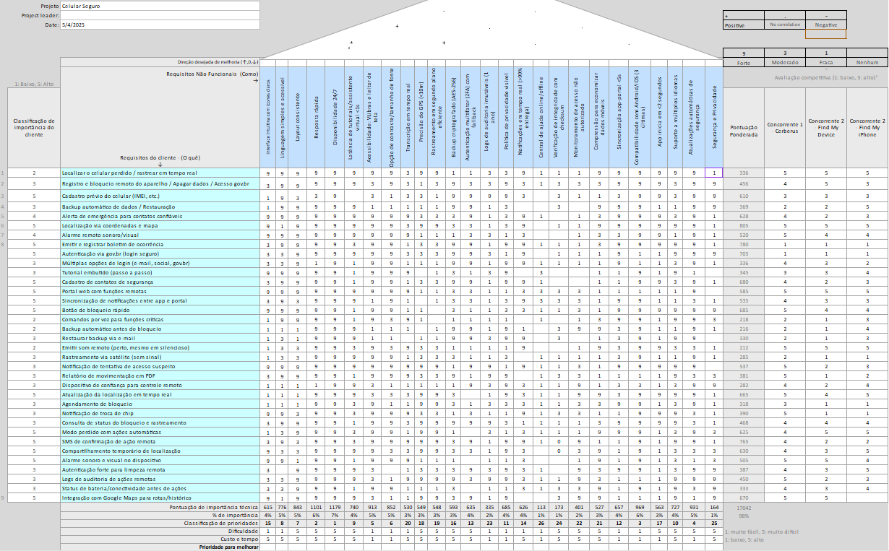

O [QFD](../qfdpp.pdf) (Quality Function Deployment – Desdobramento da Função Qualidade) é uma das ferramentas da qualidade criada na década de 60 pelo japonês Yoji Akao. Desdobramento da função qualidade: um nome um tanto técnico para um processo que, essencialmente, faz as empresas integrarem a Voz do Cliente (VOC) no desenvolvimento de produtos. [1]

O **iFrame 1** a seguir representam a análise dos requisitos do cliente "o quê" para com os requisitos não funcionais "como" para a definição de prioridade, sendo o maior valor como menos prioritário e o menor

  
    
<b>iFrame 1:</b> Matriz QFD

  

  

<iframe src="https://docs.google.com/spreadsheets/d/1mGqH9aXBEOleN6P2CAvTt_sWJA58jakpskyewBJyOeM/edit?usp=sharing" width="100%" height="800"></iframe>

_Fonte: [Felipe das Neves](https://github.com/FelipeFreire-gf) _

## **Referências Bibliográficas**

[1] “Como preencher a matriz QFD ou Casa da Qualidade”, Lucidchart, 02-nov-2023.

## **Bibliográfia**

> “Como preencher a matriz QFD ou Casa da Qualidade”, Lucidchart, 02-nov-2023.

## Histórico de Versões

| Versão | Data de produção   | Descrição da Alteração                               | Autor(es)             | Revisor(es)      | Data de Revisão |
| :----: | :----------------: | :--------------------------------------------------: | :-------------------: | :-------------:  |  :-----------: |
| 1.0 | 28/04/2025 | Desenvolvimento do tópico QFD | Felipe das Neves | Mateus Bastos, Vitor Bessa | 28/04/25 |
| 1.1 | 06/05/2025 | Inserção do iFrame e do pdf | Felipe das Neves | Mateus Bastos, Vitor Bessa | 06/05/25 |