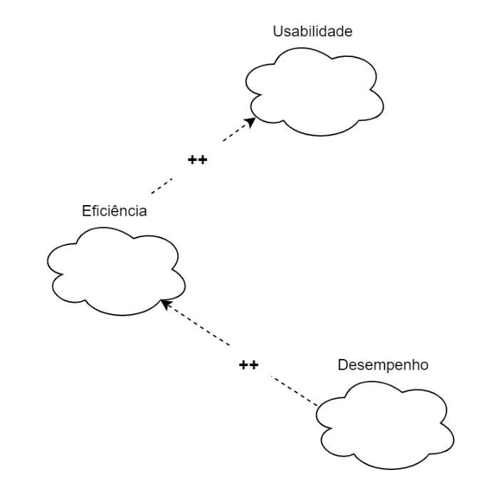

# NFR Framework
---

## Introdução

O NFR framework criado por (CHUNG et al., 2000), foi adotado por propor uma abordagem específica para o tratamento de Requisitos Não-Funcionais e fornecer uma execelente representação para expressar esses requisitos.

Este framework é utilizado neste trabalho para representar os requisitos não-funcionais conforme sua priorização neste [artefato](https://requisitos-de-software.github.io/2025.1-CelularSeguro/documento-elicitacao/requisitos_priorizados/), onde estes requisitos serão expressados através de um grafo SIG (Softgoal Interdependency Graph) uma forma de visualização do NFR framework.

---

## Metodologia

Cada integrante do projeto obteve dois requisitos não-funcionais obtido através das técnicas de [priorização](https://requisitos-de-software.github.io/2025.1-CelularSeguro/documento-elicitacao/introducao) e validados com um usuário do aplicativo, onde cada integrante fez de forma remota ou presencial. Houve também uma criterização a respeito de cada funcionalidade do aplicativo que cada integrante ficou responsável que pode ser analisada na tabela 1 a seguir:

Tabela 1: Separação das Funcionalidades do aplicativo por integrante

| Funcionalidade                | Integrante Responsável |
|-------------------------------|------------------------|
| Registrar Telefone            | Arthur                 |
| Registrar Pessoa de Confiança | Felipe                 |
| Emitir Alerta                 | Daniel                 |
| Celulares com Restrição       | Gabriel                |
| Registrar Boletim             | Mateus                 |
| Perfil                        | Leonardo               |
| Buscar Dispositivo            | Vitor                  |

Autor: <a href="https://github.com/FelipeFreire-gf" target="_blank">Felipe das Neves</a>

Aliada a essa especificação de trabalho de cada integrante, separamos pelas respecivas funcionalidades os NFRs gerados pelo framework. 

---

## Cartão de Especificação

Os cartões de especificação a seguir, Tabelas de 1 a 6, foram utilizados para definir os Requisitos Não-Funcionais a serem utilizados na confecção dos NFR Frameworks. 

Tabela 1: Cartão de Especificação 1

| Campo               | RNF01                                                                                                   |
|---------------------|--------------------------------------------------------------------------------------------------------|
| Nº Requisito        | RNF01                                                                                                  |
| Classificação       | Usabilidade                                                                                            |
| Descrição           | O sistema deve apresentar a confirmação de envio do boletim com linguagem clara e acessível, incluindo número de protocolo visível por no mínimo 10 segundos. |
| Justificativa       | Garantir que o usuário compreenda que o boletim foi enviado com sucesso e que possa anotar ou copiar o número de protocolo sem pressa, melhorando a experiência e a confiança no sistema. |
| Origem do Requisito | Entrevista com usuário (Arthur)                                                                        |
| Critério de Aceitação | Após o envio do boletim, o número de protocolo deve ser exibido em destaque, com opção de cópia e visibilidade mínima de 10 segundos. |
| Dependências        | Envio bem-sucedido do boletim de ocorrência                                                           |
| Prioridade          | Alta (4,2)                                                                                            |
| Conflitos           | Nenhum                                                                                                |
| História            | -    

Tabela 2: Cartão de Especificação 2

| Campo               | RNF02                                                                                                   |
|---------------------|--------------------------------------------------------------------------------------------------------|
| Nº Requisito        | RNF02                                                                                                  |
| Classificação       | Desempenho / Confiabilidade                                                                             |
| Descrição           | O sistema deve permitir o envio de anexos com limite máximo de 10 MB por arquivo, aceitando os formatos JPG, PNG e PDF. |
| Justificativa       | Evitar sobrecarga no sistema e garantir que os arquivos anexados sejam compatíveis e leves o suficiente para envio eficiente e seguro. |
| Origem do Requisito | Entrevista com usuário (Arthur) e análise técnica                                                      |
| Critério de Aceitação | O sistema deve bloquear arquivos que ultrapassem o limite ou estejam em formato não aceito, exibindo mensagem clara e impedindo o envio. |
| Dependências        | Funcionalidade de envio de boletim com anexos                                                          |
| Prioridade          | Média (3,8)                                                                                            |
| Conflitos           | Nenhum                                                                                                |
| História            | -   

As tabelas 3 e 4 são referentes a funcionalidade de Resgistrar pessoa de confiança. Critério do QFD para a criterização da prioridade, aliada os RNFs obtidos do questionário.

Tabela 3: Cartão de Especificação 3

| Nº Requisito: 3 (<a id="anchor_RF03" href="#RF03">RF03</a>)| Classificação: Funcional |
|---------------| ------------|
| Descrição: Para cada Pessoa de Confiança listada, deve haver uma opção acessível para iniciar o processo de remoção (ex: um ícone de lixeira, um menu de opções ao manter pressionado). |
| Justificativa: Permitir que o usuário mantenha sua lista de Pessoas de Confiança atualizada e relevante, removendo contatos que não são mais desejados ou apropriados para essa função, assegurando que apenas as pessoas corretas permaneçam com esse status. |
| Origem do Requisito: Definição da Funcionalidade 'Gerenciar Pessoas de Confiança' / User Story US36 |
| Critério de Aceitação: Para cada contato exibido na lista de Pessoas de Confiança, uma opção de remoção (ex: ícone de lixeira ou item em menu de contexto) deve estar acessível. Ao ser acionada, o sistema deve solicitar confirmação ao usuário e, se confirmada, o contato deve ser removido permanentemente do sistema e a lista atualizada. |
| Dependências: Pessoas já cadastradas na lista de confiança |
| Prioridade: Alta (4.1) |
| Conflitos: Nenhum conflito direto identificado. O risco de remoção acidental deve ser mitigado pela etapa de confirmação. |
| História: US36 |

Autor: <a href="https://github.com/FelipeFreire-gf" target="_blank">Felipe das Neves</a>

Tabela 4: Cartão de Especificação 4

| Nº Requisito: 4 (<a id="anchor_RNF04" href="#RNF04">RNF04</a>)| Classificação: Usabilidade, Acessibilidade e Funcionalidade |
|---------------| ------------|
| Descrição: O aplicativo deve oferecer um modo escuro (dark mode) para maior conforto visual.
| Justificativa:  Proporcionar uma melhor experiência de uso em ambientes com pouca luminosidade, reduzir o cansaço visual, atender às preferências de uma parcela de usuário, mesmo que esse requisito tenha sido verificado apenas para a funcionalidade: Registrar pessoa de confiança, tal requisito se extende ou sistema completo.
| Origem do Requisisto: [RNF05 Questionario](https://requisitos-de-software.github.io/2025.1-CelularSeguro/documento-elicitacao/Questionario/)
| Critério de Aceitação: O aplicativo deve possuir uma opção nas configurações que permita ao usuário alternar entre o tema claro (padrão) e o modo escuro. Todos os textos, ícones e elementos interativos devem manter boa legibilidade e contraste adequado no modo escuro, conforme as diretrizes de acessibilidade (ex: WCAG AA). A transição entre os modos deve ser suave e todas as telas do aplicativo devem ser compatíveis.
| Dependências: Definição da paleta de cores para o modo claro e escuro.
| Prioridade: Baixa (2.8)
| Conflitos: Nenhum
| História: -

Autor: <a href="https://github.com/FelipeFreire-gf" target="_blank">Felipe das Neves</a>

As tabelas 5 e 6 descrevem, respectivamente, o RNF de manter o layout da tela de Perfil consistente com o restante do app e o RNF de oferecer alto contraste e fonte ajustável, ambos priorizados para melhorar usabilidade e acessibilidade.

Tabela 5: Cartão de Especificação (Perfil – Layout Consistente)

| Nº Requisito: 5 (RNF05)    | Classificação: Usabilidade, Aparência |
| :------------------------- | :------------------------------------------------------------------------------------------------------------------------------------------------------------------------------------------------------------------------------------------------------------------------------------------------------------------------------------------------------------------------------------------------------------------------------------------- |
| **Descrição:**             | A tela de Perfil deve ter o mesmo visual e organização que as outras telas do aplicativo. Isso inclui posição de título, espaçamento, cores e tamanho de texto. |
| **Justificativa:**         | Usar o mesmo padrão em todas as telas faz com que o usuário saiba onde estão as informações e botões, evitando confusão e facilitando o uso. |
| **Origem:**                | Brainstorming ([BS38](https://requisitos-de-software.github.io/2025.1-CelularSeguro/documento-elicitacao/Brainstorming/#tabela-de-requisitos-nao-funcionais) ) – “Layout consistente seguindo heurísticas de Nielsen” |
| **Critério de Aceitação:** | 1. O título “Perfil” aparece com a mesma fonte e cor que os títulos de outras páginas. 2. Foto, nome, e-mail e botão “Editar Perfil gov.br” ocupam posições semelhantes às de outras telas. 3. Botões na tela de Perfil têm aparência e comportamento iguais aos da Home e Configurações (mesma cor e feedback ao clicar). 4. Espaços entre elementos seguem o guia de estilo do aplicativo (distâncias iguais às de outras telas). |
| **Dependências:**          | Guia de estilo do app (cores, fontes, espaçamentos) aprovado pela equipe de design. |
| **Prioridade:**            | Média (3,5) |
| **Conflitos:**             | Se for necessário adicionar novos elementos (gráficos, listas), será preciso ajustar o layout sem perder a consistência. |
| **História:**              | <a href="../Historias_de_usuario#us14">US14</a> – “Eu, como usuário, desejo acessar uma aba ‘Perfil’ para editar meus dados pessoais sem sair do aplicativo.” |

Fonte: [Leonardo de Melo](https://github.com/leozinlima)

---

Tabela 6: Cartão de Especificação (Perfil – Alto Contraste e Fonte Ajustável)

| Nº Requisito: 6 (RNF06)    | Classificação: Acessibilidade, Legibilidade |
| :------------------------- | :---------------------------------------------------------------------------------------------------------------------------------------------------------------------------------------------------------------------------------------------------------------------------------------------------------------------------------------------------------------------------------------------------------------------------------------------------------------------------------------------------------------------------------------------- |
| **Descrição:**             | A tela de Perfil deve oferecer opção de alto contraste e permitir aumentar ou reduzir o tamanho da fonte. |
| **Justificativa:**         | Isso ajuda quem tem dificuldade para enxergar letras pequenas ou usar o aplicativo em ambientes muito claros ou muito escuros. |
| **Origem:**                | Brainstorming ([BS43](https://requisitos-de-software.github.io/2025.1-CelularSeguro/documento-elicitacao/Brainstorming/#tabela-de-requisitos-nao-funcionais) ) – “Opção de contraste de cores e ajuste de tamanho de fonte” |
| **Critério de Aceitação:** | 1. Nas configurações, o usuário escolhe “Contraste Padrão” ou “Alto Contraste” e, imediatamente, a tela de Perfil muda as cores. 2. Nas configurações, o usuário escolhe “Fonte Pequena”, “Fonte Média” ou “Fonte Grande” e o texto do Perfil (nome, e-mail, botões) muda sem cortar nada. 3. No modo “Alto Contraste”, o texto e o fundo na tela de Perfil têm cores claramente diferentes para facilitar a leitura. 4. Ao mudar contraste ou fonte, a tela de Perfil atualiza em até 0,2 segundos, sem precisar fechar o aplicativo. |
| **Dependências:**          | Guia de cores para “Alto Contraste” e opções de tamanho de fonte definidas no guia de estilo. |
| **Prioridade:**            | Baixa (2,7) |
| **Conflitos:**             | Se alguns ícones não tiverem versão para alto contraste, será necessário trocar esses ícones. Ajustar fonte para “Grande” pode exigir mais espaço na tela. |
| **História:**              | <a href="../Historias_de_usuario#us14">US14</a> – “Eu, como usuário, desejo acessar uma aba ‘Perfil’ para editar meus dados pessoais sem sair do aplicativo.” |

Fonte: [Leonardo de Melo](https://github.com/leozinlima)

---

## NFR 0 - Geral

A Figura 1 a seguir demonstra o Softgoal Interdependency Graph para se ter uma visão geral.

<b>Figura 3</b> - SIG Geral

Fonte: (SILVA, 2019)

No entanto, como o foco é trabalhar apenas com Requisitos Não-Funcionais ainda não implementados pelo aplicativo, adaptou-se o SIG acima para a utilização dos tópicos necessários, conforme a figura 2:

<b>Figura 2</b> - SIG Geral Adaptado

Fonte: (SILVA, 2019)

## NFR 01 - Usabilidade

Os Requisitos utilizados para a confecção da Figura 3 estão presentes na Tabela 9:

### Requisitos Não-Funcionais - Usabilidade

### Propagação dos Impactos - Usabilidade

## NFR 02 - Eficiência

### Requisitos Não-Funcionais - Eficiência

### Propagação dos Impactos - Eficiência

## NFR 03 - Desempenho

### Requisitos Não-Funcionais - Desempenho

### Propagação dos Impactos - Desempenho

## Requisitos Não-Funcionais Utilizados para o Desenvolvimento do NFR

obs cada integrante complete a tabela com o seus requisitos

A Tabela 8 a seguir lista os Requisitos Não-Funcionais utilizados para o desenvolvimento do NFR Framework.

<b>Tabela 8</b> - Requisitos Não-Funcionais

| ID                                            | Descrição                         | Rastreabilidade                                                                                                                            | Implementação |
| :-------------------------------------------- | :-------------------------------- | :----------------------------------------------------------------------------------------------------------------------------------------- | :------------ |
| <a id="RNF03" href="#anchor_RNF01">RNF03</a> | Para cada Pessoa de Confiança listada, deve haver uma opção acessível para iniciar o processo de remoção    | [RNF08](https://requisitos-de-software.github.io/2025.1-CelularSeguro/documento-elicitacao/Questionario/#requisitos-nao-funcionais)      | Não           |
| <a id="RNF04" href="#anchor_RNF02">RNF04</a> | O aplicativo deve oferecer um modo escuro (dark mode) para maior conforto visual.    | [RNF05](https://requisitos-de-software.github.io/2025.1-CelularSeguro/documento-elicitacao/Questionario/#requisitos-nao-funcionais)                                     | Não           |

Autor: <a href="https://github.com/FelipeFreire-gf" target="_blank">Felipe das Neves</a>

---

A Tabela 9 lista os Requisitos Não-Funcionais elicitados pelo NFR Framework.

obs cada integrante complete a tabela com o seus requisitos

<b>Tabela 9</b> - Requisitos Não-Funcionais

|  ID  | Descrição |
|------|---------|
|NFR03| Para cada Pessoa de Confiança listada, deve haver uma opção acessível para iniciar o processo de remoção |
|NFR04| O aplicativo deve oferecer um modo escuro (dark mode) para maior conforto visual.|

Autor: <a href="https://github.com/FelipeFreire-gf" target="_blank">Felipe das Neves</a>

---

## Bibliografia

>  SILVA, Reinaldo Antônio. NFR4ES: Um Catálogo de Requisitos Não-Funcionais para Sistemas Embarcados. Centro de Informática UFPE, Recife, 2019. Disponível em: <https://repositorio.ufpe.br/handle/123456789/34150>. Acesso em: 31/05/2025.

> CHUNG, L., NIXON, B. A., YU, E., MYLOPOULOS, J. Non-functional requirementsin software engineering. Springer Science & Business Media: [S.l.], 2000. v. 5.

---

## Histórico de Versões

| Versão | Data de Produção | Descrição da Alteração | Autor(es) | Revisor(es) | Data de Revisão |
|:------:|:----------------:|:----------------------:|:---------:|:-----------:|:--------------:|
| 1.0 | 22/05/2025 | Versão inicial do documento | <a style="color:gold;" href="https://github.com/MateuSansete" target="_blank">Mateus Bastos</a> | <a style="color:gold;" href="https://github.com/gabriel-lima258" target="_blank">Gabriel Lima</a>, <a style="color:gold;" href="https://github.com/Bessazs" target="_blank">Vitor Bessa</a> | 22/05/2025 |
| 1.1    | 31/05/2025         | Desenvolvimento do Tópico Introdução, Metodologia, Carta de Especificação, NFR 0                            | <a style="color:gold;" href="https://github.com/FelipeFreire-gf" target="_blank">Felipe das Neves</a> e <a style="color:gold;" href="https://github.com/MateuSansete" target="_blank">Mateus Bastos</a>  | <a style="color:gold;" href="https://github.com/FelipeFreire-gf" target="_blank">Felipe das Neves</a> | 31/05/2025 |
