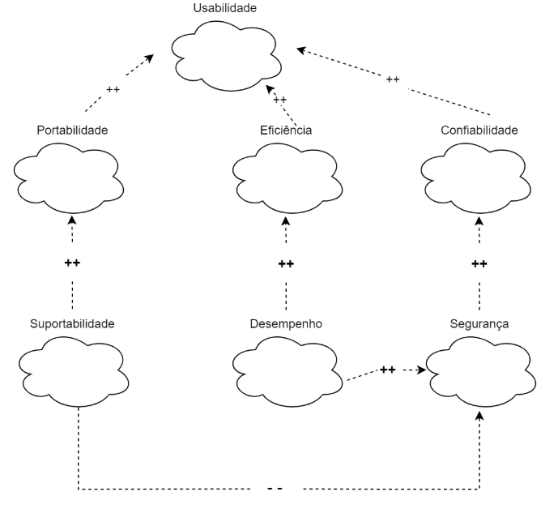
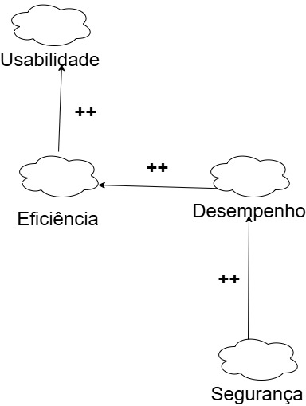
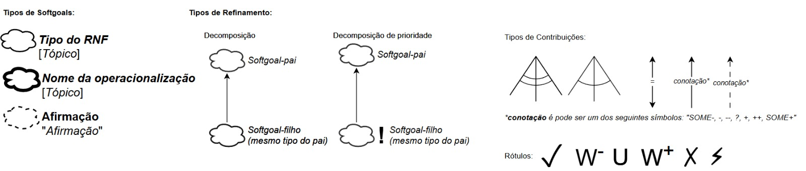
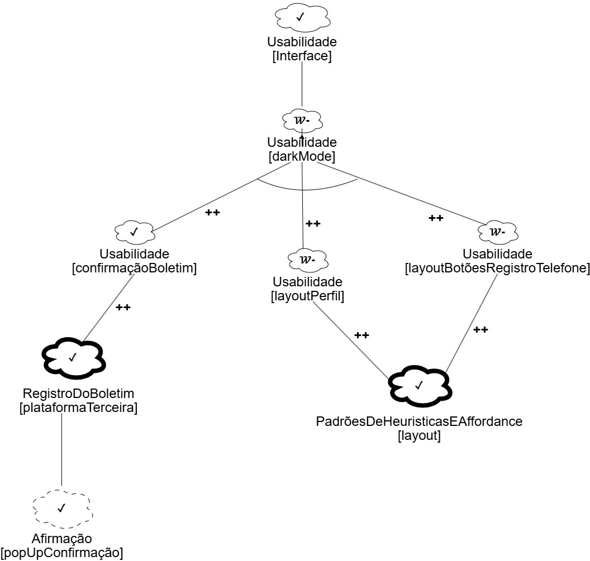
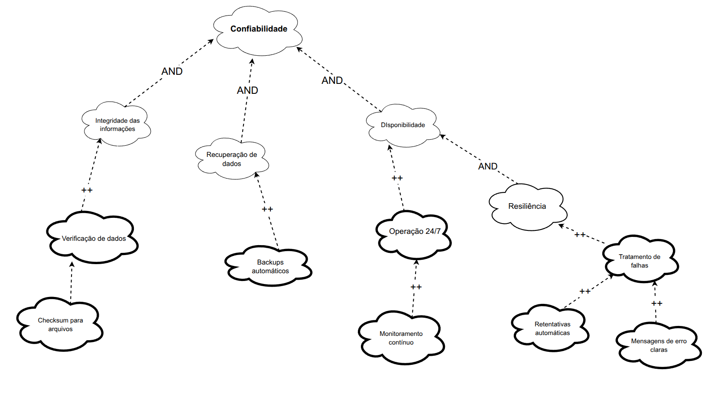
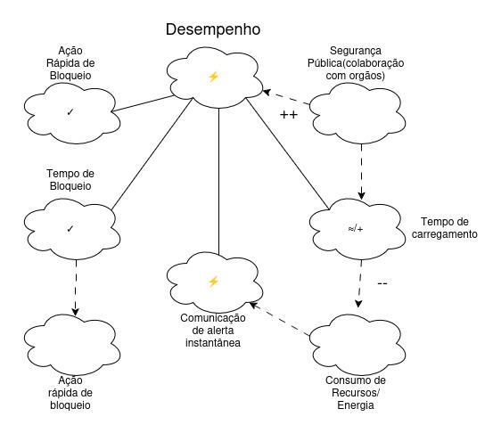
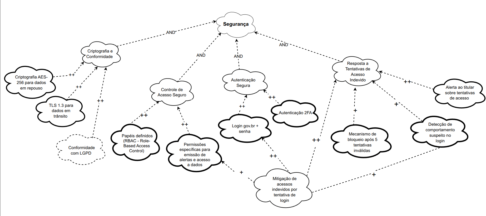

# NFR Framework
---

## Introdução

O NFR framework criado por (CHUNG et al., 2000), foi adotado por propor uma abordagem específica para o tratamento de Requisitos Não-Funcionais e fornecer uma execelente representação para expressar esses requisitos.

Este framework é utilizado neste trabalho para representar os requisitos não-funcionais conforme sua priorização neste [artefato](https://requisitos-de-software.github.io/2025.1-CelularSeguro/documento-elicitacao/requisitos_priorizados/), onde estes requisitos serão expressados através de um grafo SIG (Softgoal Interdependency Graph) uma forma de visualização do NFR framework.

---

## Softgoal Interdependency Graph

O **Softgoal Interdependency Graph (SIG)** é uma representação visual do funcionamento do NFR Framework. Ele serve para registrar graficamente o posicionamento da equipe de desenvolvimento em relação aos softgoals (objetivos não funcionais) e demonstrar, de forma clara, as interdependências entre eles.

---

### Tipos de Softgoal

Para entender o SIG, é essencial compreender o que é um NFR Softgoal: trata-se de um objetivo que não possui critérios de satisfação claramente definidos. Em outras palavras, é uma meta abstrata, cuja realização é avaliada posteriormente.

Esses softgoals podem assumir formas distintas:

- **Softgoals NFR**: são metas genéricas como segurança, usabilidade ou desempenho.
- **Softgoals de Operacionalização**: representam maneiras concretas de atingir um softgoal abstrato, podendo ser tratados como funcionalidades do sistema.
- **Softgoals de Afirmação**: são declarações em linguagem natural que reforçam ou justificam determinadas decisões no modelo.

A Figura 1 ilustra esses diferentes tipos de softgoal.

<b>Figura 1</b> - Tipos de Softgoal

<figure markdown class="usecaseElement">

{width: 300}

</figure>

 Fonte: (SILVA, 2019)

---

### Interdependências

As interdependências representam as conexões entre os softgoals e podem ser divididas em duas categorias principais: **decomposições** e **contribuições**.

#### Decomposições

Decomposições são divisões de softgoals em partes menores, podendo ocorrer em todos os níveis: softgoals NFR, de operacionalização ou de afirmação. Elas ajudam a esclarecer objetivos e detalhar soluções. Existem quatro tipos principais:

- **Decomposição NFR**: permite subdividir grandes metas em componentes mais simples e claros, facilitando a priorização.
- **Decomposição de Operacionalização**: especifica uma solução genérica em soluções mais detalhadas.
- **Decomposição de Afirmação**: reforça ou refuta argumentos utilizados no projeto.
- **Decomposição de Priorização**: especial, pois refina um softgoal em outro de mesma natureza, atribuindo, porém, diferentes prioridades.

<b>Figura 2</b> - Tipos de Decomposição

<figure markdown class="usecaseElement">

{width: 300}

</figure>

 Fonte: (SILVA, 2019)

---

#### Contribuições

No modelo NFR, os softgoals podem influenciar outros — essa influência pode ser positiva ou negativa, total ou parcial. Os principais tipos de contribuição são:

- **AND**: todos os sub-softgoals precisam ser satisfeitos para que o objetivo principal seja alcançado.
- **OR**: basta que um dos sub-softgoals seja satisfeito.
- **MAKE (++)**: contribuição fortemente positiva.
- **BREAK (--)**: contribuição fortemente negativa.
- **HELP (+)**: contribuição positiva parcial.
- **HURT (-)**: contribuição negativa parcial.
- **UNKNOWN (?)**: o tipo de contribuição é desconhecido.
- **EQUALS**: existe uma equivalência entre a satisfação dos softgoals.
- **SOME**: sabe-se a direção da contribuição, mas não sua intensidade.

---

### Propagação de Impactos

A propagação de impactos diz respeito à forma como alterações em um softgoal podem influenciar outros requisitos não funcionais interligados. Compreender essas relações é crucial para avaliar prioridades, resolver conflitos e tomar decisões mais embasadas.

Os impactos podem ser representados por:

- **✓ (satisfeito)**: contribuição positiva direta.
- **𝒲+ (fracamente satisfeito)**: impacto positivo, mas com menor intensidade.
- **X (negado)**: impacto negativo que inviabiliza outro requisito.
- **𝒲- (fracamente negado)**: impacto negativo moderado.
- **🗲 (conflitante)**: existe um conflito entre os objetivos, com efeitos positivos e negativos simultâneos.
- **u (indeterminado)**: não há informações suficientes para avaliar o impacto.

---

## Metodologia

Cada integrante do projeto obteve dois requisitos não-funcionais obtido através das técnicas de [priorização](https://requisitos-de-software.github.io/2025.1-CelularSeguro/documento-elicitacao/introducao) e validados com um usuário do aplicativo, onde cada integrante fez de forma remota ou presencial. Houve também uma criterização a respeito de cada funcionalidade do aplicativo que cada integrante ficou responsável que pode ser analisada na tabela 0 a seguir:

Tabela 0: Separação das Funcionalidades do aplicativo por integrante

| Funcionalidade                | Integrante Responsável |
|-------------------------------|------------------------|
| Registrar Telefone            | Arthur                 |
| Registrar Pessoa de Confiança | Felipe                 |
| Emitir Alerta                 | Daniel                 |
| Celulares com Restrição       | Gabriel                |
| Registrar Boletim             | Mateus                 |
| Perfil                        | Leonardo               |
| Buscar Dispositivo            | Vitor                  |

Autor: <a href="https://github.com/FelipeFreire-gf" target="_blank">Felipe das Neves</a>

Aliada a essa especificação de trabalho de cada integrante, separamos pelas respecivas funcionalidades os NFRs gerados pelo framework. 

### Tabela de Contribuição NFR Framework

Na modelagem de requisitos não funcionais por meio do NFR Framework, todos os membros da equipe desenvolveram 2 cartões de especificação com validação de seus usuários. Contudo, a estruturação do conteúdo no projeto foi feita exclusivamente por dois integrantes segundo a Tabela 1 a seguir.

#### Tabela 1 – Participação dos membros na construção do submenu NFR Framework

| Membro da Equipe | Contribuições |
|------------------|---------------|
| [Arthur Carvalho](https://github.com/arthurlleite) | Desenvolveu 2 cartões validados com o usuário |
| [Leonardo de Melo](https://github.com/leozinlima) | Desenvolveu 2 cartões validados com o usuário |
| [Gabriel Lima](https://github.com/gabriel-lima258) | Desenvolveu 2 cartões validados com o usuário |
| [Felipe das Neves](https://github.com/FelipeFreire-gf) | Desenvolveu 2 cartões validados com o usuário; Estruturou o submenu |
| [Daniel Rodrigues](https://github.com/zDrNz) | Desenvolveu 2 cartões validados com o usuário |
| [Mateus Bastos](https://github.com/MateuSansete) | Desenvolveu 2 cartões validados com o usuário; Estruturou o submenu |
| [Vitor Pereira](https://github.com/Bessazs) | Desenvolveu 2 cartões validados com o usuário |

**Fonte**: [Arthur Carvalho](https://github.com/arthurlleite)

---

## Cartão de Especificação

Os cartões de especificação a seguir, Tabelas de 1 a 6, foram utilizados para definir os Requisitos Não-Funcionais a serem utilizados na confecção dos NFR Frameworks. 

Tabela 1: Cartão de Especificação (Boletim de ocorrência - Usabilidade)

| Campo               | RNF01                                                                                                   |
|---------------------|--------------------------------------------------------------------------------------------------------|
| **Nº Requisito:**        | 1                                                                                                  |
| **Classificação:**       | Usabilidade                                                                                            |
| **Descrição:**           | O sistema deve apresentar a confirmação de envio do boletim com linguagem clara e acessível, incluindo número de protocolo visível por no mínimo 10 segundos. |
| **Justificativa:**       | Garantir que o usuário compreenda que o boletim foi enviado com sucesso e que possa anotar ou copiar o número de protocolo sem pressa, melhorando a experiência e a confiança no sistema. |
| **Origem do Requisito:** | Entrevista com usuário (Arthur)                                                                        |
| **Critério de Aceitação:** | Após o envio do boletim, o número de protocolo deve ser exibido em destaque, com opção de cópia e visibilidade mínima de 10 segundos. |
| **Dependências:**        | Envio bem-sucedido do boletim de ocorrência                                                           |
| **Prioridade:**          | Alta                                                                                            |
| **Conflitos:**           | Nenhum                                                                                                |
| **História:**            | 30/06/2025     

Tabela 2: Cartão de Especificação (Boletim de ocorrência - Desempenho e Confiabilidade)

| Campo               | RNF02                                                                                                   |
|---------------------|--------------------------------------------------------------------------------------------------------|
| **Nº Requisito:**         | 2                                                                                                  |
| **Classificação:**        | Desempenho / Confiabilidade                                                                             |
| **Descrição:**            | O sistema deve permitir o envio de anexos com limite máximo de 10 MB por arquivo, aceitando os formatos JPG, PNG e PDF. |
| **Justificativa:**        | Evitar sobrecarga no sistema e garantir que os arquivos anexados sejam compatíveis e leves o suficiente para envio eficiente e seguro. |
| **Origem do Requisito:**  | Entrevista com usuário (Arthur) e análise técnica                                                      |
| **Critério de Aceitação:** | O sistema deve bloquear arquivos que ultrapassem o limite ou estejam em formato não aceito, exibindo mensagem clara e impedindo o envio. |
| **Dependências:**         | Funcionalidade de envio de boletim com anexos                                                          |
| **Prioridade:**           | Média                                                                                            |
| **Conflitos:**            | Nenhum                                                                                                |
| **História:**             | 30/06/2025   

As tabelas 3 e 4 são referentes a funcionalidade de Resgistrar pessoa de confiança. Critério do QFD para a criterização da prioridade, aliada os RNFs obtidos do questionário.

Tabela 3: Cartão de Especificação (Pessoa de confiança - Funcionalidade)

| Campo               | RNF03                                                                                                   |
|---------------------|--------------------------------------------------------------------------------------------------------|
| **Nº Requisito:**          | 3                                                                                                 |
| **Classificação:**         | Funcionalidade                                                                       |
| **Descrição:** | Para cada Pessoa de Confiança listada, deve haver uma opção acessível para iniciar o processo de remoção (ex: um ícone de lixeira, um menu de opções ao manter pressionado). |
| **Justificativa:** | Permitir que o usuário mantenha sua lista de Pessoas de Confiança atualizada e relevante, removendo contatos que não são mais desejados ou apropriados para essa função, assegurando que apenas as pessoas corretas permaneçam com esse status. |
| **Origem do Requisito:** | Definição da Funcionalidade 'Gerenciar Pessoas de Confiança' / User Story US36 |
| **Critério de Aceitação:** | Para cada contato exibido na lista de Pessoas de Confiança, uma opção de remoção (ex: ícone de lixeira ou item em menu de contexto) deve estar acessível. Ao ser acionada, o sistema deve solicitar confirmação ao usuário e, se confirmada, o contato deve ser removido permanentemente do sistema e a lista atualizada. |
| **Dependências:** | Pessoas já cadastradas na lista de confiança |
| **Prioridade:** | Alta  |
| **Conflitos:** | Nenhum conflito direto identificado. O risco de remoção acidental deve ser mitigado pela etapa de confirmação. |
| **História:** |  <a href="../Historias_de_usuario#us36">US36</a> |

Autor: <a href="https://github.com/FelipeFreire-gf" target="_blank">Felipe das Neves</a>

Tabela 4: Cartão de Especificação (Acessibilidade - Dark Mode)

| Campo               | RNF04                                                                                                   |
|---------------------|--------------------------------------------------------------------------------------------------------|
| **Nº Requisito:**          | 4                                                                                                 |
| **Classificação:**         | Usabilidade / Acessibilidade / Funcionalidade                                                                        |
| **Descrição:** | O aplicativo deve oferecer um modo escuro (dark mode) para maior conforto visual.|
| **Justificativa:** |  Proporcionar uma melhor experiência de uso em ambientes com pouca luminosidade, reduzir o cansaço visual, atender às preferências de uma parcela de usuário, mesmo que esse requisito tenha sido verificado apenas para a funcionalidade: Registrar pessoa de confiança, tal requisito se extende ou sistema completo.|
| **Origem do Requisisto:** | Obtido da técnica de elicitação do questionário: [RNF05](https://requisitos-de-software.github.io/2025.1-CelularSeguro/documento-elicitacao/Questionario/)|
| **Critério de Aceitação:** | O aplicativo deve possuir uma opção nas configurações que permita ao usuário alternar entre o tema claro (padrão) e o modo escuro. Todos os textos, ícones e elementos interativos devem manter boa legibilidade e contraste adequado no modo escuro, conforme as diretrizes de acessibilidade (ex: WCAG AA). A transição entre os modos deve ser suave e todas as telas do aplicativo devem ser compatíveis.|
| **Dependências:** | Definição da paleta de cores para o modo claro e escuro. |
| **Prioridade:** | Baixa                                                                                 |
| **Conflitos:** | Nenhum                           |
| **História:** | 30/06/2025 |

Autor: <a href="https://github.com/FelipeFreire-gf" target="_blank">Felipe das Neves</a>

---

As tabelas 5 e 6 descrevem, respectivamente, o RNF de manter o layout da tela de Perfil consistente com o restante do app e o RNF de oferecer alto contraste e fonte ajustável, ambos priorizados para melhorar usabilidade e acessibilidade.

Tabela 5: Cartão de Especificação (Perfil – Layout Consistente)

| Campo               | RNF05                                                                                                   |
|---------------------|--------------------------------------------------------------------------------------------------------|
| **Nº Requisito:**          | 5                                                                                                 |
| **Classificação:**         | Usabilidade / Aparência                                                                          |
| **Descrição:**             | A tela de Perfil deve ter o mesmo visual e organização que as outras telas do aplicativo. Isso inclui posição de título, espaçamento, cores e tamanho de texto. |
| **Justificativa:**         | Usar o mesmo padrão em todas as telas faz com que o usuário saiba onde estão as informações e botões, evitando confusão e facilitando o uso. |
| **Origem:**                | [BS38](https://requisitos-de-software.github.io/2025.1-CelularSeguro/documento-elicitacao/Brainstorming/#tabela-de-requisitos-nao-funcionais) |
| **Critério de Aceitação:** | 1. O título “Perfil” aparece com a mesma fonte e cor que os títulos de outras páginas. 2. Foto, nome, e-mail e botão “Editar Perfil gov.br” ocupam posições semelhantes às de outras telas. 3. Botões na tela de Perfil têm aparência e comportamento iguais aos da Home e Configurações (mesma cor e feedback ao clicar). 4. Espaços entre elementos seguem o guia de estilo do aplicativo (distâncias iguais às de outras telas). |
| **Dependências:**          | Guia de estilo do app (cores, fontes, espaçamentos) aprovado pela equipe de design. |
| **Prioridade:**            | Média  |
| **Conflitos:**             | Se for necessário adicionar novos elementos (gráficos, listas), será preciso ajustar o layout sem perder a consistência. |
| **História:**              | <a href="../Historias_de_usuario#us14">US14</a>  |

Fonte: [Leonardo de Melo](https://github.com/leozinlima)

Tabela 6: Cartão de Especificação (Perfil – Alto Contraste e Fonte Ajustável)

| Campo               | RNF06                                                                                                   |
|---------------------|--------------------------------------------------------------------------------------------------------|
| **Nº Requisito:**       | 6                                                                                                 |
| **Classificação:**       | Acessibilidade / Legibilidade                                                                          |
| **Descrição:**             | A tela de Perfil deve oferecer opção de alto contraste e permitir aumentar ou reduzir o tamanho da fonte. |
| **Justificativa:**         | Isso ajuda quem tem dificuldade para enxergar letras pequenas ou usar o aplicativo em ambientes muito claros ou muito escuros. |
| **Origem:**                | [BS43](https://requisitos-de-software.github.io/2025.1-CelularSeguro/documento-elicitacao/Brainstorming/#tabela-de-requisitos-nao-funcionais) |
| **Critério de Aceitação:** | 1. Nas configurações, o usuário escolhe “Contraste Padrão” ou “Alto Contraste” e, imediatamente, a tela de Perfil muda as cores. 2. Nas configurações, o usuário escolhe “Fonte Pequena”, “Fonte Média” ou “Fonte Grande” e o texto do Perfil (nome, e-mail, botões) muda sem cortar nada. 3. No modo “Alto Contraste”, o texto e o fundo na tela de Perfil têm cores claramente diferentes para facilitar a leitura. 4. Ao mudar contraste ou fonte, a tela de Perfil atualiza em até 0,2 segundos, sem precisar fechar o aplicativo. |
| **Dependências:**          | Guia de cores para “Alto Contraste” e opções de tamanho de fonte definidas no guia de estilo. |
| **Prioridade:**            | Baixa |
| **Conflitos:**             | Se alguns ícones não tiverem versão para alto contraste, será necessário trocar esses ícones. Ajustar fonte para “Grande” pode exigir mais espaço na tela. |
| **História:**              | <a href="../Historias_de_usuario#us14">US14</a>  |

Fonte: [Leonardo de Melo](https://github.com/leozinlima)

---

As Tabelas 7 e 8 apresentam os requisitos não funcionais (RNF) de usabilidade e segurança no menu "Registrar Telefone", com foco em interface intuitiva e criptografia dos dados, priorizados para garantir uma experiência confiável ao usuário.

Tabela 7: Cartão de Especificação (Registrar Celular – Acessibilidade e Estrutras Claras)

| Campo               | RNF07                                                                                                   |
|---------------------|--------------------------------------------------------------------------------------------------------|
| **Nº Requisito:**       | 7                                                                                                  |
| **Classificação:**       | Usabilidade / Acessibilidade                                                                           |
| **Descrição:**           | O sistema deve apresentar menus e botões no módulo de Registro de Telefone com estrutura clara e uso de affordances visuais (ícones e feedback gráfico/textual) para indicar as ações disponíveis, como adicionar, editar ou remover um número , com a ideia principal focada no tempo de resposta para o usuário. |
| **Justificativa:**       | Facilitar o uso da funcionalidade por usuários de diferentes perfis (inclusive idosos e pessoas sob estresse), reduzindo ambiguidade visual,  evitando erros de uso ao registrar o telefone e ajustando o tempo de resposta visual mais criterioso. |
| **Origem do Requisito:** | [BS36](https://requisitos-de-software.github.io/2025.1-CelularSeguro/documento-elicitacao/Brainstorming/#tabela-de-requisitos-funcionais) |
| **Critério de Aceitação:** | O usuário deve conseguir realizar o cadastro ou exclusão de um telefone utilizando apenas os ícones e textos da interface, sem necessidade de tutorial, com confirmação visual imediata ao final de cada ação e com um tempo de resposta realtivamente bom ( entre 1.4 a 2.4 milesegundos). |
| **Dependências:**        | Tela de Registro de Telefone; Interface gráfica consistente                                             |
| **Prioridade:**          | Alta                                                                                               |
| **Conflitos:**           | Nenhum identificado                                                                                     |
| **História:**            | [US01](https://requisitos-de-software.github.io/2025.1-CelularSeguro/modelagem/#us01---cadastro-de-múltiplos-celulares), [US06](https://requisitos-de-software.github.io/2025.1-CelularSeguro/modelagem/#us06---validação-do-número-de-celular) |

Fonte: <a href="https://github.com/arthurlleite" target="_blank">Arthur Carvalho</a>

---

Tabela 8: Cartão de Especificação (Registrar Celular – Segurança e Criptografia)

| Campo               | RNF08                                                                                                   |
|---------------------|--------------------------------------------------------------------------------------------------------|
| **Nº Requisito:**   | 8                                                                                                      |
| **Classificação**   | Segurança / Confiabilidade                                                                             |
| **Descrição**       | O aplicativo deve garantir criptografia ponta-a-ponta (como AES-256) nos dados transmitidos e armazenados durante o processo de registro de telefone, incluindo o número, código de verificação e identificação do usuário. Nenhuma informação sensível deve ser transmitida em texto claro. |
| **Justificativa**       | Proteger os dados pessoais e garantir que o número de telefone cadastrado e validado não seja interceptado ou alterado por terceiros, alinhando-se à LGPD e às boas práticas de segurança da informação. |
| **Origem do Requisito** | [ADD15](https://requisitos-de-software.github.io/2025.1-CelularSeguro/documento-elicitacao/AnalisedeDocumentos/) |
| **Critério de Aceitação** | Toda a comunicação relacionada ao registro de telefone deve utilizar protocolo HTTPS com TLS atualizado. As informações sensíveis devem ser criptografadas e não podem ser recuperadas por interceptação direta da rede. |
| **Dependências**       | Integração com servidor seguro e sistema de autenticação                                               |
| **Prioridade**       | Alta                                                                                             |
| **Conflitos**       | Nenhum                                                                                                  |
| **História**       | [US06](https://requisitos-de-software.github.io/2025.1-CelularSeguro/modelagem/#us06---validação-do-número-de-celular) |

Fonte: <a href="https://github.com/arthurlleite" target="_blank">Arthur Carvalho</a>

As Tabelas 9 e 10 apresentam os requisitos não funcionais (RNF) de usabilidade e segurança no menu "Emitir Alerta".

Tabela 9: Cartão de Especificação (Emitir alerta-Alerta e Bloqueio)

| Campo                      | RNF09                                         |
| :------------------------- |                                                                  |
| **Nº Requisito:**          | 9                                                                                                            |
| **Classificação:**         | Desempenho                                                                                               |
| **Descrição:**             | O sistema deve comunicar alertas aos parceiros com o menor tempo possível, idealmente de forma instantânea. Além disso, bloqueios de sistema ou ações de segurança devem ser efetuados em até 2 minutos após a detecção do evento. |
| **Justificativa:**         | Em cenários críticos, como ameaças à segurança ou violação de dados, é essencial que o alerta seja comunicado imediatamente aos parceiros e que as ações preventivas (como bloqueios) ocorram em tempo adequado para mitigar riscos. |
| **Origem:**                | [OBS16](https://requisitos-de-software.github.io/2025.1-CelularSeguro/documento-elicitacao/AnalisedeDocumentos/#requisitos-naofuncionais-rnf) |
| **Critério de Aceitação:** | 1. Alertas devem ser enviados em até 1 segundo após o evento. 2. Bloqueios devem ocorrer em até 2 minutos da detecção automática ou comando humano. |
| **Dependências:**          | Detecção de evento, canal de comunicação ativo. |
| **Prioridade:**            | Alta |
| **Conflitos:**             | Potencial impacto em consumo de rede e uso de CPU |
| **História:**              | 01/06/2025 |

Fonte: [Daniel Rodrigues](https://github.com/zDrNz)

Tabela 10: Cartão de Especificação (Páginas-Tempo de Carregamento)

| Campo                      | RNF10                                         |
| :------------------------- |                                                                  |
| **Nº Requisito:**          | 10                                                                                                  |
| **Classificação:**             | Desempenho                                                                                               |
| **Descrição:**             | As páginas do sistema devem carregar completamente em até 2 segundos quando acessadas via conexão padrão 4G. |
| **Justificativa:**         | Um tempo de carregamento rápido melhora a experiência do usuário, reduz abandono e é essencial em contextos móveis onde a responsividade é crítica. |
| **Origem:**                | [OBS16](https://requisitos-de-software.github.io/2025.1-CelularSeguro/documento-elicitacao/Observacao/#tabela-de-requisitos-nao-funcionais)  |
| **Critério de Aceitação:** | 1. Em testes com rede 4G padrão, 95% das páginas devem carregar em até 2 segundos. |
| **Dependências:**          | Otimização de backend, compactação de conteúdo, rede 4G disponível |
| **Prioridade:**            | Alta |
| **Conflitos:**             | Pode entrar em conflito com carregamento de recursos pesados (como gráficos) |
| **História:**              | 01/06/2025 |

Fonte: [Daniel Rodrigues](https://github.com/zDrNz)

As Tabelas 11 e 12 apresentam os requisitos não funcionais (RNF) de usabilidade e segurança no menu "Buscar Aplicativo".

Tabela 11: Cartão de Especificação (Localização - Precisão da localização)

| Campo               | RNF11                                                                                                  |
|---------------------|--------------------------------------------------------------------------------------------------------|
| **Nº Requisito:**   | 11                                                                                                  |
| **Classificação:**  |  Segurança                                                                           |
| **Descrição:**      |  O sistema deve fornecer informações de localização do dispositivo com alta precisão, garantindo que os dados exibidos representem fielmente o posicionamento real do dispositivo no mapa.  
| **Justificativa:**  |  Garantir a precisão da localização é fundamental para que funcionalidades como rastrear, bloquear ou recuperar o dispositivo sejam eficazes. Isso contribui diretamente para a confiança do usuário no sistema, reduzindo frustrações causadas por erros de posicionamento e garantindo a usabilidade do serviço, especialmente em situações críticas, como perda ou roubo do dispositivo. |
| **Origem do Requisito:**  |  [BS04](https://requisitos-de-software.github.io/2025.1-CelularSeguro/documento-elicitacao/Brainstorming/#tabela-de-requisitos-funcionais), [QS01](https://requisitos-de-software.github.io/2025.1-CelularSeguro/documento-elicitacao/Questionario/#requisitos-elicitados), [ST6](https://requisitos-de-software.github.io/2025.1-CelularSeguro/documento-elicitacao/Storytelling/#tabela-de-requisitos-funcionais)   |
| **Critério de Aceitação:**  |  O sistema deve utilizar fontes de localização de alta precisão, como GPS, Wi-Fi e redes móveis, combinadas quando necessário. A margem de erro aceitável deve ser inferior a 10 metros em ambientes externos e tão precisa quanto possível em ambientes internos. A localização deve ser atualizada em tempo real ou com atraso máximo de 5 segundos. Além disso, o sistema deve informar claramente ao usuário se a precisão da localização está comprometida no momento. |
| **Dependências:**   |  Disponibilidade dos serviços de GPS, Wi-Fi e dados móveis no dispositivo e   Permissões de localização ativas no dispositivo. |
| **Prioridade:**     |  Alta                                                                                            |
| **Conflitos:**      |  Nenhum                                                                                                |
| **História:**       |  01/06/2025                                                                                           |

Fonte: [Vitor Bessa](https://github.com/Bessazs)

Tabela 12: Cartão de Especificação (Localização- Segurança)

| Campo               | RNF12                                                                                                  |
|---------------------|--------------------------------------------------------------------------------------------------------|
| **Nº Requisito:**   | 12                                                                                                  |
| **Classificação:**  |  Segurança                                                                         |
| **Descrição:**      |  Os dados de localização do dispositivo devem ser protegidos contra acessos não autorizados, utilizando criptografia tanto na transmissão quanto no armazenamento. |
| **Justificativa:**  | Informações de localização são altamente sensíveis, pois podem revelar a posição exata do usuário em tempo real. Proteger esses dados garante a privacidade, evita riscos de segurança pessoal e aumenta a confiança dos usuários no sistema. Além disso, estar em conformidade com leis de proteção de dados, como a LGPD, é essencial. |
| **Origem do Requisito:**  |  [BS04](https://requisitos-de-software.github.io/2025.1-CelularSeguro/documento-elicitacao/Brainstorming/#tabela-de-requisitos-funcionais), [QS01](https://requisitos-de-software.github.io/2025.1-CelularSeguro/documento-elicitacao/Questionario/#requisitos-elicitados), [ST6](https://requisitos-de-software.github.io/2025.1-CelularSeguro/documento-elicitacao/Storytelling/#tabela-de-requisitos-funcionais)   |
| **Critério de Aceitação:**  | - Todos os dados de localização devem ser criptografados em trânsito (durante a comunicação entre cliente e servidor) e em repouso (armazenados no servidor).   - O acesso às informações de localização deve ser restrito apenas aos usuários autenticados e autorizados.   - Caso haja tentativa de acesso não autorizado, o sistema deve bloquear a tentativa e registrar um log de segurança.   - O sistema deve fornecer ao usuário opções para gerenciar as permissões de compartilhamento da sua localização. |
| **Dependências:**   |  Implementação de protocolos de segurança e infraestrutura de backend compatível com armazenamento seguro (criptografia de banco de dados, gerenciamento de chaves). |
| **Prioridade:**     |  Alta                                                                                            |
| **Conflitos:**      |  Nenhum                                                                                                |
| **História:**       |  01/06/2025                                                                                           |

Fonte: [Vitor Bessa](https://github.com/Bessazs)

---

### Vídeo de Validação com o Usuário

<iframe width="560" height="315" src="https://www.youtube.com/embed/aKZyAkc5Bms" title="Vídeo de Validação - Registrar Telefone" frameborder="0" allow="accelerometer; autoplay; clipboard-write; encrypted-media; gyroscope; picture-in-picture; web-share" allowfullscreen></iframe>

Caso o vídeo não carregue, <a href="https://youtu.be/aKZyAkc5Bms" target="_blank">clique aqui para assistir no YouTube</a>.

---

### Termo de Compromisso Assinado

> **PDF – 01/06/2025 – Termo de Compromisso e Imagem Assinado**  
> Arquivo disponível em: [Cópia do Termo de Consentimento Celular Seguro (PDF)](https://github.com/Requisitos-de-Software/2025.1-CelularSeguro/blob/main/Docs/assets/pdf/verificacao/Copia_de_Termo_Consentimento_CelularSeguro_assinado%20(1).pdf)

## NFR 0 - Geral

A Figura 2 a seguir demonstra o Softgoal Interdependency Graph para se ter uma visão geral.

<b>Figura 2</b> - SIG Geral

Fonte: (SILVA, 2019)

No entanto, como o foco é trabalhar apenas com Requisitos Não-Funcionais ainda não implementados pelo aplicativo, adaptou-se o SIG acima para a utilização dos tópicos necessários, conforme a figura 3:

<b>Figura 3</b> - SIG Geral Adaptado

Fonte: (SILVA, 2019)

---

Legendas estão conforma a figura 4:

<b>Figura 4</b> - Legendas SIG 

Fonte: (SILVA, 2019)

## NFR 01 - Usabilidade

Diagrama de SIG de usabilidade, figura 5:

<b>Figura 5</b> SIG Usabilidade

Autor: Felipe das Neves

### Requisitos Não-Funcionais - Usabilidade

*Tabela 13* - Requisitos Não-Funcionais: Usabilidade

Tabela 13 - Requisitos Não-Funcionais: Usabilidade

| Código  | Nome                                                              | Descrição                                                                                                                                                                                                                            |
| :------ | :---------------------------------------------------------------- | :----------------------------------------------------------------------------------------------------------------------------------------------------------------------------------------------------------------------------------- |
| <a href="../Historias_de_usuario#us36">US36</a> | Confirmação Clara e Acessível de Envio                            | O sistema deve apresentar a confirmação de envio do boletim com linguagem clara e acessível, incluindo número de protocolo visível por no mínimo 10 segundos.                                                                        |
| <a href="documento-elicitacao/Questionario/#requisitos-nao-funcionais">RNF05</a> | Modo Escuro para Conforto Visual                                  | O aplicativo deve oferecer um modo escuro (dark mode) para maior conforto visual.                                                                                                                                                   |
| <a href="../Historias_de_usuario#us14">US14</a>  | Consistência Visual e Organizacional da Interface                 | A tela de Perfil deve ter o mesmo visual e organização que as outras telas do aplicativo. Isso inclui posição de título, espaçamento, cores e tamanho de texto.                                                                  |
| [US01](https://requisitos-de-software.github.io/2025.1-CelularSeguro/modelagem/#us01---cadastro-de-múltiplos-celulares), [US06](https://requisitos-de-software.github.io/2025.1-CelularSeguro/modelagem/#us06---validação-do-número-de-celular) | Clareza e Responsividade em Menus/Botões (Registro de Telefone) | O sistema deve apresentar menus e botões no módulo de Registro de Telefone com estrutura clara e uso de affordances visuais (ícones e feedback gráfico/textual) para indicar as ações disponíveis, com a ideia principal focada no tempo de resposta para o usuário. |

Fonte: Felipe das Neves

### Propagação dos Impactos - Usabilidade

A tabela 14 a seguir detalha os softgoals de Usabilidade e como os requisitos e operacionalizações específicas impactam esses objetivos.

*Tabela 14* - Propagação dos Impactos: Usabilidade

| NFR / Softgoal                                                        | Impacto | Avaliador                                                                                                |
| :-------------------------------------------------------------------- | :------ | :------------------------------------------------------------------------------------------------------- |
| Usabilidade [Aplicativo Celular Seguro]                               | ✓       | <a style="color:white blue;" href="https://github.com/FelipeFreire-gf" target="_blank">Felipe das Neves</a>      |
| FeedbackClaroEAcessivel [Interface]                         | ✓      | <a style="color:white blue;" href="https://github.com/FelipeFreire-gf" target="_blank">Felipe das Neves</a>      |
| LinguagemClaraEAcessivelNaConfirmacao [ConfirmaçãoBoletim]                  | ✓       | <a style="color:white blue;" href="https://github.com/FelipeFreire-gf" target="_blank">Felipe das Neves</a>      |
| NumeroProtocoloVisivelTempoSuficiente [plataformaTerceira]                  | ✓       | <a style="color:white blue;" href="https://github.com/FelipeFreire-gf" target="_blank">Felipe das Neves</a>      |
| ConfortoVisualEPreferencias [darkMode]                        | 𝒲-      | <a style="color:white blue;" href="https://github.com/FelipeFreire-gf" target="_blank">Felipe das Neves</a>      |
| ModoEscuroDisponivel [Interface]                                 | ✓       | <a style="color:white blue;" href="https://github.com/FelipeFreire-gf" target="_blank">Felipe das Neves</a>      |
| ConsistenciaVisualOrganizacional [LayoutBotõesRegistroTelefone]                | 𝒲-      | <a style="color:white blue;" href="https://github.com/FelipeFreire-gf" target="_blank">Felipe das Neves</a>      |
| PadronizacaoDaTelaDePerfil [layoutPerfil]                        | 𝒲-       | <a style="color:white blue;" href="https://github.com/FelipeFreire-gf" target="_blank">Felipe das Neves</a>      |
| PadrõesDeHeuristicaseAffordance [layout]                        | ✓       | <a style="color:white blue;" href="https://github.com/FelipeFreire-gf" target="_blank">Felipe das Neves</a>      |

Fonte: Felipe das Neves

## NFR 02 - Confiabilidade

A figura 6 a seguir demonstra o SIG de Confiabilidade:

<b>Figura 6</b> SIG Confiabilidade

Fonte: <a style="color:white blue;" href="https://github.com/MateuSansete" target="_blank">Mateus Bastos</a>

### Requisitos Não-Funcionais - Confiabilidade

Na Tabela 15 a seguir, são descritos os Requisitos Não-Funcionais relacionados à **Confiabilidade**, levando em consideração aspectos como envio de informações sem falhas, criptografia segura dos dados e acionamento confiável de alertas em situações emergenciais. Esses requisitos foram elaborados com base na modelagem do NFR Framework para o aplicativo *Celular Seguro*.

Tabela 15 - Requisitos Não-Funcionais: Confiabilidade

| Código | Nome                                   | Descrição                                                                 |
|--------|----------------------------------------|---------------------------------------------------------------------------|
| RNF02  | Enviar Anexos com Confiabilidade       | O sistema deve permitir o envio de arquivos (PDF, JPG, PNG) de até 10MB, sem falhas ou perdas de dados. |
| RNF08  | Garantir Segurança e Privacidade       | O sistema deve garantir a criptografia ponta-a-ponta dos dados transmitidos e armazenados (ex: AES-256). |
| RNF09  | Garantir Confiabilidade do Alerta      | O sistema deve garantir que o alerta de emergência seja enviado em até 1 segundo após a solicitação do usuário. |

Fonte: Mateus Bastos

### Propagação dos Impactos - Confiabilidade

Tabela 16 - Propagação dos Impactos: Confiabilidade

| NFR / Softgoal                     | Impacto                           | Avaliador  |
| :--------------------------------- | :-------------------------------- | :--------- |
| Confiabilidade                     | 𝒲+                                | <a style="color:white blue;" href="https://github.com/MateuSansete" target="_blank">Mateus Bastos</a> |
| Garantir envio de anexos confiável | 𝒲+                                | <a style="color:white blue;" href="https://github.com/MateuSansete" target="_blank">Mateus Bastos</a> |
| Garantir criptografia de dados     | 𝒲+                                | <a style="color:white blue;" href="https://github.com/MateuSansete" target="_blank">Mateus Bastos</a> |
| Garantir acionamento confiável     | 𝒲+                                | <a style="color:white blue;" href="https://github.com/MateuSansete" target="_blank">Mateus Bastos</a> |
| Prevenção de falhas no envio       | 𝒲+                                | <a style="color:white blue;" href="https://github.com/MateuSansete" target="_blank">Mateus Bastos</a> |
| Comunicação de alertas em até 1s   | ✓                                 | <a style="color:white blue;" href="https://github.com/MateuSansete" target="_blank">Mateus Bastos</a> |
| Criptografia ponta-a-ponta (AES-256) | ✓                                 | <a style="color:white blue;" href="https://github.com/MateuSansete" target="_blank">Mateus Bastos</a> |
| Uso de protocolo HTTPS/TLS         | ✓                                 | <a style="color:white blue;" href="https://github.com/MateuSansete" target="_blank">Mateus Bastos</a> |
| Reação ao evento em até 2 minutos  | ✓                                 | <a style="color:white blue;" href="https://github.com/MateuSansete" target="_blank">Mateus Bastos</a> |
| Arquivos até 10MB (JPG, PNG, PDF)  | ✓                                 | <a style="color:white blue;" href="https://github.com/MateuSansete" target="_blank">Mateus Bastos</a> |
| Falha no envio acima de 10MB       |  X                                |    <a style="color:white blue;" href="https://github.com/MateuSansete" target="_blank">Mateus Bastos</a>       |

Fonte: Mateus Bastos

## NFR 03 - Desempenho

A figura 7 a seguir demonstra o SIG de Desempenho:

<b>Figura 7</b> - SIG Desempenho 

Fonte: Daniel Rodrigues

### Requisitos Não-Funcionais - Desempenho

Na Tabela 17, estão listados os RNF presentes no NFR Famework de Desempenho:

<b>Tabela 17</b> - Requisitos Não-Funcionais 

| RNF (Fonte) | Descrição | Classificação | Origem |
|-------------|---------|-------|-------|
| Tempo de Resposta  |  O sistema deve possuir uma limitação superior do tempo de processamento de uma requisição. | Desempenho | Desempenho |
| Infraestrutura  | O sistema deve possuir uma infraestrutura para processar os dados. | Desempenho | Tempo de Resposta |
| Servidores  | O sistema deve possuir servidores para perdurar os dados. | Desempenho | Infraestrutura |
| Manutenção em tempo real  | O sistema deve ser capaz de realizar a manutenção dos servidores e de outros aspectos da infraestrutura. | Desempenho | Servidores e Infraestrutura |

Fonte: Daniel Rodrigues

### Propagação dos Impactos - Desempenho

Na Tabela 18, está presente a avaliação da propagação dos impactos referentes à Figura x.

<b>Tabela 18</b> - Impactos Desempenho

| NFR                        | Impacto| Avaliador         |
|----------------------------------|-------------|------------------------|
| Desempenho                       | ⚡          | [Daniel Rodrigues](https://github.com/zDrNz) |
| Envio de Alertas Imediato        | ⚡          | [Daniel Rodrigues](https://github.com/zDrNz) |
| Bloqueio em até 2 minutos        | ✓           | [Daniel Rodrigues](https://github.com/zDrNz) |
| Carregamento em até 2s (4G)      | ⚡          | [Daniel Rodrigues](https://github.com/zDrNz) |
| Precisão da Detecção             | ↘/-         | [Daniel Rodrigues](https://github.com/zDrNz) |
| Segurança                        | ↘/+         | [Daniel Rodrigues](https://github.com/zDrNz) |
| Infraestrutura Móvel             | ↘/+         | [Daniel Rodrigues](https://github.com/zDrNz) |
| Consumo de Bateria               | ✗           | [Daniel Rodrigues](https://github.com/zDrNz) |
| Processamento Offline            | ↘/-         | [Daniel Rodrigues](https://github.com/zDrNz) |
| Usabilidade em Redes Lentas      | ✗           | [Daniel Rodrigues](https://github.com/zDrNz) |
| Manutenção em Tempo Real         | ✓           | [Daniel Rodrigues](https://github.com/zDrNz) |
| Escalabilidade (Crescimento)     | ↘/+         | [Daniel Rodrigues](https://github.com/zDrNz) |

Fonte: Daniel Rodrigues

## NFR 04 - Segurança

### Requisitos Não-Funcionais - Segurança

A figura 8 a seguir demonstra o SIG de Segurança:

Os Requisitos utilizados para a confecção da Figura 8 estão presentes na Tabela 19:

Tabela 19 – Requisitos Não-Funcionais - Segurança

| ID     | Nome                         | Descrição                                                             |
|--------|------------------------------|------------------------------------------------------------------------|
| RNF08  | Criptografia AES-256         | Dados sensíveis dos boletins devem ser protegidos com criptografia forte |
| RNF10  | Emissão Restrita de Alertas  | Apenas usuários autenticados podem emitir alertas                    |
| RNF11  | Proteção contra Invasões     | Tentativas simultâneas de login são bloqueadas automaticamente       |

Fonte: Mateus Bastos

### Propagação dos Impactos - Segurança

Na Tabela 20, está presente a avaliação da propagação dos impactos referentes à Figura 8 (SIG da Segurança).

Tabela 20 – Impactos Segurança

| NFR                          | Impacto | Avaliador      |
|-----------------------------|---------|----------------|
| Segurança                   | 𝒲+      | <a style="color:white blue;" href="https://github.com/MateuSansete" target="_blank">Mateus Bastos</a> |
| Criptografia AES-256        | 𝒲+      | <a style="color:white blue;" href="https://github.com/MateuSansete" target="_blank">Mateus Bastos</a> |
| Emissão Restrita de Alertas | 𝒲+      | <a style="color:white blue;" href="https://github.com/MateuSansete" target="_blank">Mateus Bastos</a> |
| Proteção contra Invasões    | 𝒲+      | <a style="color:white blue;" href="https://github.com/MateuSansete" target="_blank">Mateus Bastos</a> |
| Garantia de Autenticação    | ✓       | <a style="color:white blue;" href="https://github.com/MateuSansete" target="_blank">Mateus Bastos</a> |
| Bloqueio de Ataques         | ✓       | <a style="color:white blue;" href="https://github.com/MateuSansete" target="_blank">Mateus Bastos</a> |
| Prevenção de Vazamento      | ✓       | <a style="color:white blue;" href="https://github.com/MateuSansete" target="_blank">Mateus Bastos</a> |
| Tentativas de Login         | X       | <a style="color:white blue;" href="https://github.com/MateuSansete" target="_blank">Mateus Bastos</a> |

Fonte: Mateus Bastos

## Requisitos Não-Funcionais Utilizados para o Desenvolvimento do NFR

A Tabela 21 a seguir lista os Requisitos Não-Funcionais aplicáveis à tela Registar Pessoa de Confiança.

<b>Tabela 8</b> - Requisitos Não-Funcionais

| ID                                            | Descrição                         | Rastreabilidade                                                                                                                            | Implementação |
| :-------------------------------------------- | :-------------------------------- | :----------------------------------------------------------------------------------------------------------------------------------------- | :------------ |
| <a id="RNF03" href="#anchor_RNF01">RNF03</a> | Para cada Pessoa de Confiança listada, deve haver uma opção acessível para iniciar o processo de remoção    | [RNF08](https://requisitos-de-software.github.io/2025.1-CelularSeguro/documento-elicitacao/Questionario/#requisitos-nao-funcionais)      | Não           |
| <a id="RNF04" href="#anchor_RNF02">RNF04</a> | O aplicativo deve oferecer um modo escuro (dark mode) para maior conforto visual.    | [RNF05](https://requisitos-de-software.github.io/2025.1-CelularSeguro/documento-elicitacao/Questionario/#requisitos-nao-funcionais)                                     | Não           |

Autor: <a href="https://github.com/FelipeFreire-gf" target="_blank">Felipe das Neves</a>

---

A Tabela 22 a seguir lista os Requisitos Não-Funcionais aplicáveis à tela de Perfil.

<b>Tabela 9</b> - Requisitos Não-Funcionais (Tela de Perfil)

| ID                                           | Descrição                                                                                                                                            | Rastreabilidade                                                                                                                                                                                          | Implementação |
| :------------------------------------------- | :--------------------------------------------------------------------------------------------------------------------------------------------------- | :------------------------------------------------------------------------------------------------------------------------------------------------------------------------------------------------------- | :------------ |
| <a id="RNF05" href="#rnf05">RNF05</a> | A tela de Perfil deve ter o mesmo visual e organização que as outras telas do aplicativo (posição de título, espaçamento, cores e tamanho de texto). | [BS38](https://requisitos-de-software.github.io/2025.1-CelularSeguro/documento-elicitacao/Brainstorming/#tabela-de-requisitos-nao-funcionais)       | Não           |
| <a id="RNF06" href="#rnf06">RNF06</a> | A tela de Perfil deve oferecer opção de alto contraste e permitir aumentar ou reduzir o tamanho da fonte.                                            | [BS43](https://requisitos-de-software.github.io/2025.1-CelularSeguro/documento-elicitacao/Brainstorming/#tabela-de-requisitos-nao-funcionais) | Não           |

Fonte: [Leonardo de Melo](https://github.com/leozinlima)

---

## Bibliografia

>  SILVA, Reinaldo Antônio. NFR4ES: Um Catálogo de Requisitos Não-Funcionais para Sistemas Embarcados. Centro de Informática UFPE, Recife, 2019. Disponível em: <https://repositorio.ufpe.br/handle/123456789/34150>. Acesso em: 31/05/2025.

> CHUNG, L., NIXON, B. A., YU, E., MYLOPOULOS, J. Non-functional requirementsin software engineering. Springer Science & Business Media: [S.l.], 2000. v. 5.

---

## Histórico de Versões

| Versão | Data de Produção | Descrição da Alteração | Autor(es) | Revisor(es) | Data de Revisão |
|:------:|:----------------:|:----------------------:|:---------:|:-----------:|:--------------:|
| 1.0 | 22/05/2025 | Versão inicial do documento | <a style="color:gold;" href="https://github.com/MateuSansete" target="_blank">Mateus Bastos</a> | <a style="color:gold;" href="https://github.com/gabriel-lima258" target="_blank">Gabriel Lima</a>, <a style="color:gold;" href="https://github.com/Bessazs" target="_blank">Vitor Bessa</a> | 22/05/2025 |
| 1.1    | 31/05/2025         | Desenvolvimento do Tópico Introdução, Metodologia, Carta de Especificação, NFR 0                            | <a style="color:gold;" href="https://github.com/FelipeFreire-gf" target="_blank">Felipe das Neves</a> e <a style="color:gold;" href="https://github.com/MateuSansete" target="_blank">Mateus Bastos</a>  | <a style="color:gold;" href="https://github.com/FelipeFreire-gf" target="_blank">Felipe das Neves</a> | 31/05/2025 |
| 1.2    | 01/06/2025         | Adição de tabelas  | <a style="color:gold;" href="https://github.com/leozinlima" target="_blank">Leonardo de Melo</a>  | <a style="color:gold;" href="https://github.com/Bessazs" target="_blank">Vitor Bessa</a> | 01/06/2025 |
| 1.3    | 01/06/2025         | Desenvolvimento do Softgoal Interdependency Graph  | <a style="color:gold;" href="https://github.com/gabriel-lima258" target="_blank">Gabriel Lima</a>  | <a style="color:gold;" href="https://github.com/FelipeFreire-gf" target="_blank">Felipe das Neves</a> | 01/06/2025 |
| 1.4    | 01/06/2025         | Desenvolvimento das tabelas 7 e 8 do Cartão de especificação  | <a style="color:gold;" href="https://github.com/arthurlleite" target="_blank">Arthur Carvalho</a>  | <a style="color:gold;" href="https://github.com/FelipeFreire-gf" target="_blank">Felipe das Neves</a> | 01/06/2025 |
| 1.5    | 01/06/2025         | Desenvolvimento das tabelas 9 e 10 do Cartão de especificação e Desempenho | <a style="color:gold;" href="https://github.com/zDrNz" target="_blank">Daniel Rodrigues</a>  | <a style="color:gold;" href="https://github.com/FelipeFreire-gf" target="_blank">Felipe das Neves</a> | 01/06/2025 |
| 1.6    | 01/06/2025         | Desenvolvimento das tabelas 11 e 12 do Cartão de especificação e padronização  | <a style="color:gold;" href="https://github.com/Bessazs" target="_blank">Vitor Bessa</a>  |  <a style="color:gold;" href="https://github.com/gabriel-lima258" target="_blank">Gabriel Lima</a> | 01/06/2025 |
| 1.7    | 01/06/2025         | Padronização das tabelas e figuras  | <a style="color:gold;" href="https://github.com/FelipeFreire-gf" target="_blank">Felipe das Neves</a>  | <a style="color:gold;" href="https://github.com/FelipeFreire-gf" target="_blank">Mateus Bastos</a> | 01/06/2025 |

