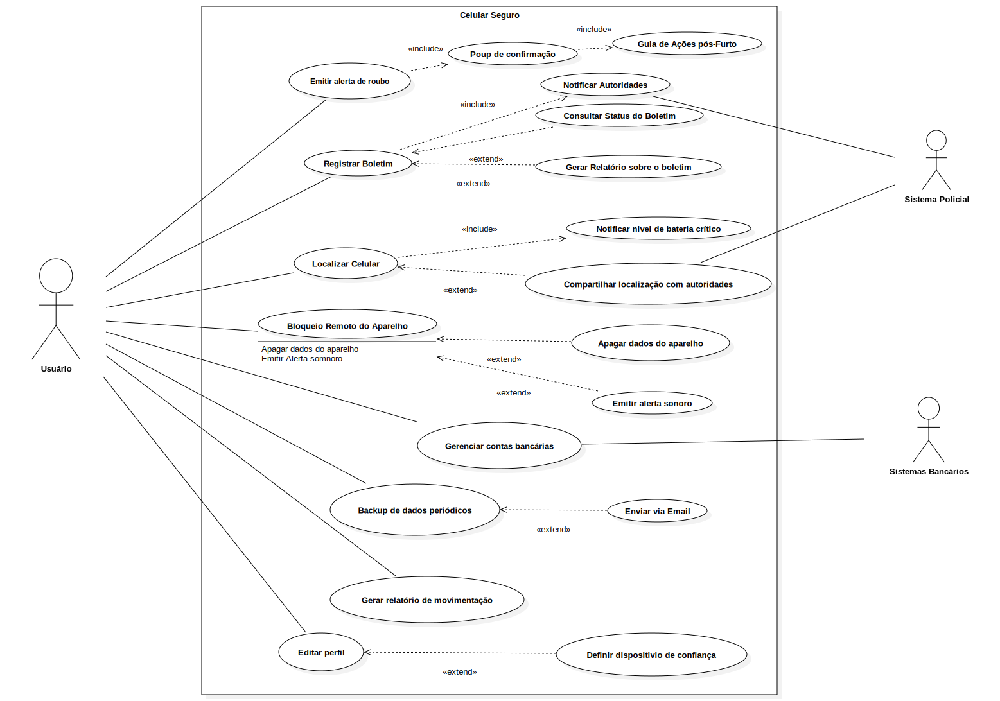

Versão 2.0

# Casos de Uso

---

## Introdução
Um caso de uso é uma descrição detalhada de como um sistema será utilizado por seus usuários em um determinado contexto ou situação. Ele descreve as interações entre os atores (usuários ou sistemas externos) e o sistema, especificando os passos necessários para atingir um objetivo específico. Cada caso de uso foca em uma funcionalidade ou tarefa que o sistema deve realizar, detalhando as ações dos usuários e as respostas esperadas do sistema. Este tipo de modelagem é essencial no desenvolvimento de software, pois ajuda a mapear os requisitos funcionais, garantindo que o sistema atenda às necessidades dos usuários finais [2].

Além disso, os casos de uso permitem uma visão clara das funcionalidades do sistema, oferecendo uma maneira estruturada de documentar o comportamento esperado do sistema durante a interação com o usuário. Eles servem como base para o desenvolvimento do sistema, auxiliando na análise e design, e são usados para validar os requisitos e guiar a implementação.

!!! Warning "Atenção!"
    O conteúdo deste tópico **poderá sofrer alterações** ao longo da Disciplina de Requisitos de Software. Portanto, as tabelas serão organizadas iniciando pela versão mais recente e finalizando com a versão mais antiga.

---

## Integrantes que atuaram no desenvolvimento do artefato

Esta tabela inicial terá somente os artefatos de alta relevância que cada integrante do projeto desenvolveu. O versionamento **completo** encontra-se ao final do artefato.

_Desenvolvimento do Artefato_

| Nome | Função |
| :--- | :--- |
| [Leonardo de Melo](https://github.com/leozinlima) | Responsável por desenvolver o artefato e: [[ Elementos do Diagrama de Caso de Uso ]](https://requisitos-de-software.github.io/2025.1-CelularSeguro/documento-modelagem/caso-de-uso/#elementos-do-diagrama-de-caso-de-uso) e [[ Especialização dos casos de uso ]](https://requisitos-de-software.github.io/2025.1-CelularSeguro/documento-modelagem/caso-de-uso/#emitir-alerta-de-roubo)|
| [Mateus Bastos](https://github.com/MateuSansete) | Responsável por desenvolver : [[ Introdução ]](https://requisitos-de-software.github.io/2025.1-CelularSeguro/documento-modelagem/caso-de-uso/#introducao) e [[ Metodologia ]](https://requisitos-de-software.github.io/2025.1-CelularSeguro/documento-modelagem/caso-de-uso/#metodologia)|
| [Vitor Bessa](https://github.com/Bessazs) | Responsável por desenvolver : [[ Diagrama de Casos de Uso]](https://requisitos-de-software.github.io/2025.1-CelularSeguro/documento-modelagem/caso-de-uso/#diagrama-de-casos-de-uso)|
| [Felipe das Neves](https://github.com/FelipeFreire-gf) | Revisor do Artefato |

*Legenda:* 

**Nome** – participante da técnica. 

**Função** – papel desempenhado na priorização.

!!! Tip "Observação"
    Frizando claramente que as contribuições de cada integrante ainda que mínimas são ainda sim muito relevantes no desenvolvimento do artefo, considere verificar o histórico de versão. 

---

## Metodologia

Para representar as interações entre os usuários e o sistema Celular Seguro.gov, foi utilizada a técnica de modelagem UML por meio de diagramas de caso de uso. Essa abordagem permite descrever o comportamento esperado do sistema, sem especificar a ordem em que as ações ocorrem. [[ 1 ]](#ref1).

O diagrama de caso de uso mostra graficamente como diferentes atores (usuários, sistemas externos ou organizações) interagem com os casos de uso, que representam processos ou funcionalidades relevantes para o sistema. Cada ator pode representar um papel específico e pode participar de múltiplos casos de uso. Uma associação entre ator e caso de uso indica sua participação ativa no processo descrito.

A definição do limite do sistema também é uma etapa fundamental, pois determina o que é considerado interno ou externo à aplicação modelada. Dentro desses limites, os casos de uso representam conjuntos significativos de eventos que ocorrem quando o ator utiliza o sistema para atingir um objetivo, como registrar um celular, bloquear o aparelho, ou acompanhar o andamento de uma solicitação.

Essa modelagem foi baseada em cenários realistas e generalizados de uso, permitindo compreender as principais funcionalidades esperadas da aplicação e facilitando a validação e a comunicação entre os membros da equipe de desenvolvimento.

---

## Elementos do Diagrama de Caso de Uso

  

    Tabela 1: Elementos do Diagrama de Caso de Uso 
    
      Legenda dos elementos utilizados em diagramas de caso de uso, com seus símbolos correspondentes.
    
  

| Componente | Propósito | Ícone
|------|------|:-------:
| Atuador | Representa qualquer pessoa ou sistema externo que interage com o software. | <figure class="usecaseElement" style="width: 20%; display: flex;"></figure>
| Elipse (Função) | Denota uma ação ou serviço que o sistema oferece em resposta a solicitações dos atuadores; o nome da funcionalidade fica dentro da elipse. | <figure class="usecaseElement" style="width: 40%; display: flex;"></figure>
| Contorno (Limite do Sistema) | Define o perímetro do sistema sob análise, envolvendo todos os casos de uso e atuadores externos relacionados. | <figure class="usecaseElement" style="width: 40%; display: flex;"></figure>
| Conector (Relações) | Mostra as ligações entre atuadores e casos de uso, indicando quem participa de cada função ou como casos de uso se relacionam entre si. | <figure class="usecaseElement" style="width: 40%; display: flex;"></figure>

**Autor do tabela 1:** <a  href="https://github.com/leozinlima" target="_blank">Leonardo de Melo</a>, <a href="https://github.com/MateuSansete" target="_blank">Mateus Bastos</a>, <a  href="https://github.com/Bessazs" target="_blank">Vitor Bessa</a>

No diagrama de caso de uso, também é possível detalhar:

- Requisitos externos: funcionalidades que o sistema deve oferecer para atender demandas de usuários ou outros sistemas.  
- Capacidades do sistema: ações internamente disponíveis que permitem satisfazer essas demandas.  
- Restrições de ambiente: condições ou interfaces que o sistema exige do contexto onde opera para cumprir suas funções.

---

## Diagrama de Casos de Uso

  

    Figura 1 – Diagrama de Caso de Uso do Celular Seguro 
    
      Visão geral dos casos de uso do sistema Celular Seguro, destacando o ator principal, os casos de uso essenciais (emitir alerta de roubo, registrar boletim, localizar celular, bloqueio remoto e backup de dados por e-mail) e as relações de inclusão («include») e extensão («extend») que conectam funcionalidades auxiliares.
    
  

**Autor da figura 1:** <a  href="https://github.com/leozinlima" target="_blank">Leonardo de Melo</a>, <a  href="https://github.com/MateuSansete" target="_blank">Mateus Bastos</a>, <a  href="https://github.com/Bessazs" target="_blank">Vitor Bessa</a>

---

## Especialização dos casos de uso

##  Emitir alerta de roubo

  

    Tabela 2: Caso de Uso UC01 – Emitir Alerta de Roubo 
    
      Detalhamento do caso de uso UC01 para emissão de alerta de roubo, especificando fluxos principal, alternativo e de exceção.
    
  

| UC01                  | Informações                                                                                                 |
|:----------------------|:------------------------------------------------------------------------------------------------------------|
| **Descrição**         | O usuário é capaz de emitir um alerta imediato de roubo do dispositivo.                                     |
| **Ator**              | Usuário                                                                                                     |
| **Pré-condições**     | Usuário autenticado; dispositivo previamente registrado no sistema.                                         |
| **Ação**              | O usuário emite um alerta de roubo via aplicativo.                                                          |
| **Fluxo principal**   | 1. O usuário acessa o app. 2. Seleciona “Emitir Alerta de Roubo”. 3. Sistema exibe popup de confirmação. 4. Usuário confirma. 5. Sistema registra alerta, aciona “Registrar Boletim” e “Notificar Autoridades”. |
| **Fluxo alternativo** | 1. O usuário cancela no popup de confirmação. 2. Sistema retorna ao painel.   3. Usuário perde a conexão de dados antes de confirmar; sistema salva alerta em modo offline e sincroniza ao reconectar.                           |
| **Fluxo de exceção**  | 1. Falha na notificação às autoridades. 2. Sistema exibe mensagem de erro e registra falha. 3. Erro de banco de dados ao registrar o alerta; sistema exibe mensagem “Erro interno, tente novamente” e enfileira o alerta para nova tentativa.             |
| **Pós-condições**     | Alerta de roubo registrado; boletim iniciado; autoridades notificadas.                                      |
| **Data de Criação**   | 13/05/2025                                                                                                  |
| **Rastreabilidade**   | [OBS09](https://requisitos-de-software.github.io/2025.1-CelularSeguro/documento-elicitacao/Observacao/#tabela-de-requisitos-funcionais)                                                                                       |

**Autor do tabela 2:** <a  href="https://github.com/leozinlima" target="_blank">Leonardo de Melo</a>, <a  href="https://github.com/MateuSansete" target="_blank">Mateus Bastos</a>, <a  href="https://github.com/Bessazs" target="_blank">Vitor Bessa</a>

----

##  Registrar Boletim

  

    Tabela 3: Caso de Uso UC02 – Registrar Boletim 
    
      Detalhamento do caso de uso UC02 para registro formal de boletim de ocorrência detalhando o roubo.
    
  

| UC02                 | Informações                                                                                 |
|:---------------------|:--------------------------------------------------------------------------------------------|
| **Descrição**        | O usuário registra formalmente um boletim de ocorrência detalhando o roubo.                 |
| **Ator**             | Usuário                                                                                     |
| **Pré-condições**    | Usuário autenticado com login gov.br; dispositivo com conexão ativa.                        |
| **Ação**             | O usuário preenche o formulário e envia o boletim.                                          |
| **Fluxo principal**  | 1. Usuário seleciona “Registrar Boletim”. 2. Sistema exibe formulário. 3. Usuário preenche os campos e envia. 4. Sistema valida e exibe protocolo. |
| **Fluxo alternativo**| 1. Usuário tenta enviar sem preencher todos os campos. 2. Sistema bloqueia envio e exibe aviso. 3.Usuário preenche formulário e sai da tela; ao retornar, sistema exibe dados salvos em rascunho. |
| **Fluxo de exceção** | 1. Erro no servidor ao registrar. 2. Sistema exibe mensagem de falha. 3. Timeout na validação de captcha; sistema solicita recarregar o captcha e reenviar.                    |
| **Pós-condições**     | Boletim registrado com número de protocolo.                                                 |
| **Data de Criação**   | 13/05/2025                                                                                 |
| **Rastreabilidade**   | [QS02](https://requisitos-de-software.github.io/2025.1-CelularSeguro/documento-elicitacao/Questionario/#requisitos-elicitados), [QS09](https://requisitos-de-software.github.io/2025.1-CelularSeguro/documento-elicitacao/Questionario/#requisitos-elicitados), [OBS8](https://requisitos-de-software.github.io/2025.1-CelularSeguro/documento-elicitacao/Observacao/#tabela-de-requisitos-funcionais)                                                                                |

**Autor do tabela 3:** <a  href="https://github.com/leozinlima" target="_blank">Leonardo de Melo</a>, <a  href="https://github.com/MateuSansete" target="_blank">Mateus Bastos</a>, <a  href="https://github.com/Bessazs" target="_blank">Vitor Bessa</a>

---

##  Localizar Celular

  

    Tabela 4: Caso de Uso UC03 – Localizar Celular 
    
      Detalhamento do caso de uso UC03 para localizar a posição atual ou última conhecida do dispositivo.
    
  

| UC03                 | Informações                                                                                     |
|:---------------------|:------------------------------------------------------------------------------------------------|
| **Descrição**        | Permite ao usuário localizar a posição atual ou última conhecida do dispositivo.                |
| **Ator**             | Usuário                                                                                          |
| **Pré-condições**    | Boletim registrado; dispositivo com rastreamento ativado e online.                              |
| **Ação**             | O usuário solicita a localização do aparelho.                                                    |
| **Fluxo principal**  | 1. Usuário acessa “Localizar Celular”. 2. Sistema verifica pré-condições. 3. Solicita coordenadas ao provedor. 4. Exibe mapa com marcador da localização. |
| **Fluxo alternativo**| 1. Dispositivo offline. 2. Sistema exibe última localização conhecida. 3. Provedor de localização retorna coordenadas imprecisas; sistema solicita ao usuário escolher entre “usar dados aproximados” ou “tentar novamente”.                       |
| **Fluxo de exceção** | 1. Erro na API de localização. 2. Sistema exibe mensagem de indisponibilidade. 3. Falha de autenticação junto ao provedor externo; sistema exibe “Sessão expirada, faça login novamente” e interrompe o caso de uso.               |
| **Pós-condições**    | Localização exibida no mapa ou mensagem de erro apresentada.                                     |
| **Data de Criação**  | 13/05/2025                                                                                       |
| **Rastreabilidade**  | [BS04](https://requisitos-de-software.github.io/2025.1-CelularSeguro/documento-elicitacao/Brainstorming/#tabela-de-requisitos-funcionais), [QS01](https://requisitos-de-software.github.io/2025.1-CelularSeguro/documento-elicitacao/Questionario/#requisitos-elicitados), [ST6](https://requisitos-de-software.github.io/2025.1-CelularSeguro/documento-elicitacao/Storytelling/#tabela-de-requisitos-funcionais)|

**Autor do tabela 4:** <a  href="https://github.com/leozinlima" target="_blank">Leonardo de Melo</a>, <a  href="https://github.com/MateuSansete" target="_blank">Mateus Bastos</a>, <a  href="https://github.com/Bessazs" target="_blank">Vitor Bessa</a>

---

##  Bloqueio Remoto do Aparelho

  

    Tabela 5: Caso de Uso UC04 – Bloqueio Remoto do Aparelho 
    
      Detalhamento do caso de uso UC04 para bloqueio remoto do aparelho, especificando fluxos principal, alternativo e de exceção.
    
  

| UC04                 | Informações                                                                                   |
|:---------------------|:----------------------------------------------------------------------------------------------|
| **Descrição**        | O usuário bloqueia o aparelho remotamente para impedir seu uso.                                |
| **Ator**             | Usuário                                                                                        |
| **Pré-condições**    | Boletim registrado; dispositivo localizado anteriormente.                                      |
| **Ação**             | O usuário envia comando de bloqueio remoto.                                                   |
| **Fluxo principal**  | 1. Usuário acessa “Bloqueio Remoto”. 2. Sistema solicita confirmação. 3. Usuário confirma. 4. Sistema envia comando à operadora e registra ação. |
| **Fluxo alternativo**| 1. Usuário cancela confirmação. 2. Sistema retorna ao painel. 3. Operadora não responde imediatamente; sistema avisa “Bloqueio em andamento” e permite ao usuário consultar status posteriormente.                               |
| **Fluxo de exceção** | 1. Falha na comunicação com operadora. 2. Sistema exibe mensagem de erro. 3. Token de autorização inválido; sistema solicita nova autenticação do usuário antes de reenviar o comando.                  |
| **Pós-condições**    | Dispositivo bloqueado ou falha registrada.                                                    |
| **Data de Criação**  | 13/05/2025                                                                                    |
| **Rastreabilidade**  | [BS15](https://requisitos-de-software.github.io/2025.1-CelularSeguro/documento-elicitacao/Brainstorming/#tabela-de-requisitos-funcionais)                                                                                   |

**Autor do tabela 5:** <a  href="https://github.com/leozinlima" target="_blank">Leonardo de Melo</a>, <a  href="https://github.com/MateuSansete" target="_blank">Mateus Bastos</a>, <a  href="https://github.com/Bessazs" target="_blank">Vitor Bessa</a>

---

##  Backup de Dados via Email

  

    Tabela 6: Caso de Uso UC05 – Backup de Dados via Email 
    
      Detalhamento do caso de uso UC05 para envio de backup de dados por email com link seguro.
    
  

| UC05                 | Informações                                                                                   |
|:---------------------|:----------------------------------------------------------------------------------------------|
| **Descrição**        | O usuário solicita envio de backup de dados por email com link seguro.                         |
| **Ator**             | Usuário                                                                                       |
| **Pré-condições**    | Usuário autenticado; backup disponível.                                                       |
| **Ação**             | O usuário seleciona um backup e envia por email.                                              |
| **Fluxo principal**  | 1. Usuário acessa “Backup de Dados”. 2. Sistema mostra backups disponíveis. 3. Usuário seleciona e clica em “Enviar”. 4. Sistema envia email com link seguro. |
| **Fluxo alternativo**| 1. Email inválido ou não cadastrado. 2. Sistema exibe aviso para atualização do cadastro. 3. Usuário seleciona múltiplos backups em sequência; sistema enfileira cada envio e exibe confirmação para cada um.  |
| **Fluxo de exceção** | 1. Erro no envio do email. 2. Sistema exibe falha e orienta nova tentativa. 3. Servidor de email retorna resposta “quota excedida”; sistema sugere ao usuário limpar backups antigos e tentar novamente.                |
| **Pós-condições**    | Email enviado com sucesso ou falha registrada.                                                |
| **Data de Criação**  | 13/05/2025                                                                                    |
| **Rastreabilidade**  | [BS18](https://requisitos-de-software.github.io/2025.1-CelularSeguro/documento-elicitacao/Brainstorming/#tabela-de-requisitos-funcionais)                                                                                    |

**Autor do tabela 6:** <a  href="https://github.com/leozinlima" target="_blank">Leonardo de Melo</a>, <a  href="https://github.com/MateuSansete" target="_blank">Mateus Bastos</a>, <a  href="https://github.com/Bessazs" target="_blank">Vitor Bessa</a>

---

##  Gerar Relatório de Movimentação em PDF

  

    Tabela 7: Caso de Uso UC06 – Gerar Relatório de Movimentação em PDF 
    
      Detalhamento do caso de uso UC06 para geração de relatório de movimentação e download em PDF.
    
  

| UC06                 | Informações                                                                                                                        |
|:---------------------|:-----------------------------------------------------------------------------------------------------------------------------------|
| **Descrição**        | Permite ao usuário gerar um relatório de movimentação de dados e fazer o download em formato PDF.                                 |
| **Ator**             | Usuário                                                                                                                            |
| **Pré-condições**    | Usuário autenticado; existem registros de movimentação disponíveis no sistema.                                                     |
| **Ação**             | O usuário seleciona o período ou filtros e solicita a geração do relatório.                                                        |
| **Fluxo principal**  | 1. Usuário acessa “Relatórios” no menu. 2. Seleciona “Movimentação”. 3. Define intervalo de datas e filtros. 4. Clica em “Gerar PDF”. 5. Sistema valida parâmetros, compila os dados e disponibiliza link de download. 6. Usuário faz o download do arquivo PDF. |
| **Fluxo alternativo**| 1. Parâmetros inválidos (datas invertidas ou filtros inconsistentes). 2. Sistema exibe aviso “Verifique os filtros e tente novamente”. 3. Usuário cancela geração após selecionar filtros; sistema retorna ao formulário de filtros sem gerar PDF. |
| **Fluxo de exceção** | 1. Erro durante a compilação do relatório ou geração do PDF. 2. Sistema exibe “Falha ao gerar relatório, tente mais tarde”. 3. Falha de permissão de leitura em um dos bancos de dados; sistema exibe “Dados indisponíveis” e gera relatório parcial.     |
| **Pós-condições**    | Arquivo PDF com relatório de movimentação disponível para download ou mensagem de erro apresentada.                                |
| **Data de Criação**  | 15/05/2025                                                                                                                         |
| **Rastreabilidade**  | [BS22](https://requisitos-de-software.github.io/2025.1-CelularSeguro/documento-elicitacao/Brainstorming/#tabela-de-requisitos-funcionais)                                                                                                                               |

**Autor do tabela 7:** <a  href="https://github.com/leozinlima" target="_blank">Leonardo de Melo</a>, <a  href="https://github.com/MateuSansete" target="_blank">Mateus Bastos</a>, <a  href="https://github.com/Bessazs" target="_blank">Vitor Bessa</a>

---

##  Definir Dispositivo de Confiança

  

    Tabela 8: Caso de Uso UC07 – Definir Dispositivo de Confiança 
    
      Detalhamento do caso de uso UC07 para cadastrar um dispositivo autorizado como secundário para controle remoto.
    
  

| UC07                  | Informações                                                                                                                                          |
|:----------------------|:-----------------------------------------------------------------------------------------------------------------------------------------------------|
| **Descrição**         | Permite ao usuário registrar um “dispositivo de confiança” que possa receber comandos remotos secundários.                                            |
| **Ator**              | Usuário                                                                                                                                              |
| **Pré-condições**     | Usuário autenticado; dispositivo principal ativo e sincronizado com o sistema.                                                                       |
| **Ação**              | O usuário escolhe um dispositivo já registrado (ex.: tablet, outro celular) e marca como confiável para receber ordens remotas.                      |
| **Fluxo principal**   | 1. Usuário acessa “Configurações de Segurança”. 2. Seleciona “Dispositivos de Confiança”. 3. Sistema exibe lista de dispositivos vinculados. 4. Usuário escolhe dispositivo secundário e clica em “Definir como Confiável”. 5. Sistema envia código de verificação ao dispositivo secundário. 6. Usuário insere o código no app principal. 7. Sistema valida o código e marca o dispositivo como confiável. |
| **Fluxo alternativo** | 1. Dispositivo não aparece na lista (não vinculado). 2. Sistema exibe aviso “Vincule o dispositivo antes de defini-lo como confiável”. 3. Código de verificação demora a chegar; sistema oferece opção “reenviar código” após 30 segundos.               |
| **Fluxo de exceção**  | 1. Código de verificação inválido ou expirado. 2. Sistema exibe “Código incorreto ou expirado” e oferece opção de reenviar código. 3. Falha de comunicação com dispositivo secundário; sistema exibe “Não foi possível enviar código, tente novamente” e mantém sessão ativa.               |
| **Pós-condições**     | Dispositivo secundário passa a receber comandos remotos autorizados.                                                                                  |
| **Data de Criação**   | 15/05/2025                                                                                                                                            |
| **Rastreabilidade**   | [BS23](https://requisitos-de-software.github.io/2025.1-CelularSeguro/documento-elicitacao/Brainstorming/#tabela-de-requisitos-funcionais)                                                                                                                                                  |

**Autor do tabela 8:** <a  href="https://github.com/leozinlima" target="_blank">Leonardo de Melo</a>, <a  href="https://github.com/MateuSansete" target="_blank">Mateus Bastos</a>, <a  href="https://github.com/Bessazs" target="_blank">Vitor Bessa</a>

---

## Limpeza Remota com Autenticação Forte

  

    Tabela 9: Caso de Uso UC08 – Limpeza Remota com Autenticação Forte 
    
      Detalhamento do caso de uso UC08 para execução de limpeza remota somente após verificação de identidade reforçada.
    
  

| UC08                 | Informações                                                                                                                                                    |
|:---------------------|:---------------------------------------------------------------------------------------------------------------------------------------------------------------|
| **Descrição**        | Executar limpeza completa do dispositivo de forma remota somente após autenticação de múltiplos fatores (MFA).                                                  |
| **Ator**             | Usuário                                                                                                                                                        |
| **Pré-condições**    | Boletim registrado; dispositivo localizado e online; usuário autenticado; métodos de MFA configurados (SMS, app autenticador ou biometria).                   |
| **Ação**             | O usuário solicita o comando de limpeza remota e fornece credenciais adicionais de segurança.                                                                  |
| **Fluxo principal**  | 1. Usuário acessa “Limpeza Remota” no painel. 2. Sistema avisa sobre necessidade de autenticação forte. 3. Usuário insere código MFA ou utiliza biometria. 4. Sistema valida MFA. 5. Sistema envia comando de wipe ao fornecedor do OS. 6. Fornecedor confirma início da limpeza. 7. Sistema exibe “Limpeza iniciada” e registra data/hora. |
| **Fluxo alternativo**| 1. Usuário insere credencial MFA inválida. 2. Sistema exibe “Código incorreto” e permite nova tentativa até X vezes. 3. Após X falhas, aborta operação e notifica usuário. |
| **Fluxo de exceção** | 1. Dispositivo offline ao tentar enviar comando. 2. Sistema armazena solicitação e notifica usuário de pendência. 3. Erro técnico na API de wipe. 4. Sistema exibe “Falha ao iniciar limpeza, tente novamente” e registra erro. |
| **Pós-condições**    | Comando de limpeza enviado ou pendente; registro de tentativa de limpeza com status de sucesso ou falha.                                                        |
| **Data de Criação**  | 15/05/2025                                                                                                                                                     |
| **Rastreabilidade**  | [BS32](https://requisitos-de-software.github.io/2025.1-CelularSeguro/documento-elicitacao/Brainstorming/#tabela-de-requisitos-funcionais)                                                                                                                                                           |

**Autor do tabela 9:** <a  href="https://github.com/leozinlima" target="_blank">Leonardo de Melo</a>, <a  href="https://github.com/MateuSansete" target="_blank">Mateus Bastos</a>, <a  href="https://github.com/Bessazs" target="_blank">Vitor Bessa</a>

---

##  Editar Perfil via Aba

  

    Tabela 10: Caso de Uso UC09 – Editar Perfil via Aba 
    
      Detalhamento do caso de uso UC09 para edição de perfil do usuário através de uma aba dedicada no aplicativo.
    
  

| UC09                 | Informações                                                                                                              |
|:---------------------|:-------------------------------------------------------------------------------------------------------------------------|
| **Descrição**        | Permite ao usuário alterar seus dados pessoais (nome, foto, contato etc.) através de uma aba de perfil no aplicativo.    |
| **Ator**             | Usuário                                                                                                                  |
| **Pré-condições**    | Usuário autenticado; conexão com a internet; perfil existente no sistema.                                                 |
| **Ação**             | O usuário acessa a aba “Meu Perfil” e atualiza as informações desejadas.                                                  |
| **Fluxo principal**  | 1. Usuário abre o menu e seleciona “Meu Perfil”. 2. Sistema exibe formulário com os dados atuais. 3. Usuário edita campos e clica em “Salvar”. 4. Sistema valida entradas e atualiza o perfil. 5. Sistema confirma “Perfil atualizado com sucesso”. |
| **Fluxo alternativo**| 1. Usuário navega para outra aba sem salvar. 2. Sistema pergunta “Deseja descartar alterações?”. 3. Usuário confirma ou retorna ao formulário. |
| **Fluxo de exceção** | 1. Dados inválidos (formato de e-mail incorreto, campos obrigatórios vazios). 2. Sistema exibe mensagem de erro específica e não salva. 3. Erro ao carregar avatar do servidor; sistema exibe placeholder e permite nova tentativa de upload. |
| **Pós-condições**    | Perfil do usuário atualizado no sistema; alterações refletidas nas próximas sessões.                                      |
| **Data de Criação**  | 15/05/2025                                                                                                               |
| **Rastreabilidade**  | [OBS12](https://requisitos-de-software.github.io/2025.1-CelularSeguro/documento-elicitacao/Observacao/#tabela-de-requisitos-funcionais)                                                                                                                     |

**Autor do tabela 10:** <a  href="https://github.com/leozinlima" target="_blank">Leonardo de Melo</a>, <a  href="https://github.com/MateuSansete" target="_blank">Mateus Bastos</a>, <a  href="https://github.com/Bessazs" target="_blank">Vitor Bessa</a>

---

##  Gerenciar Contas Bancárias Vinculadas

  

    Tabela 11: Caso de Uso UC10 – Gerenciar Contas Bancárias Vinculadas 
    
      Detalhamento do caso de uso UC10 para visualização e cancelamento de contas bancárias associadas ao aparelho.
    
  

| UC10                 | Informações                                                                                                                     |
|:---------------------|:--------------------------------------------------------------------------------------------------------------------------------|
| **Descrição**        | Permite ao usuário consultar detalhes ou cancelar a vinculação de contas bancárias associadas ao aparelho.                     |
| **Ator**             | Usuário                                                                                                                         |
| **Pré-condições**    | Usuário autenticado; existe ao menos uma conta bancária vinculada ao aparelho.                                                  |
| **Ação**             | O usuário acessa a área de “Contas Bancárias” e opta por visualizar ou desvincular uma conta.                                   |
| **Fluxo principal**  | 1. Usuário seleciona “Contas Bancárias” no menu de configurações. 2. Sistema lista todas as contas vinculadas. 3. Usuário clica em uma conta para ver detalhes. 4. Sistema exibe informações da conta. 5. Usuário seleciona “Cancelar Vinculação”. 6. Sistema solicita confirmação. 7. Usuário confirma e sistema remove a conta vinculada, exibindo mensagem de sucesso. |
| **Fluxo alternativo**| 1. Usuário visualiza detalhes e opta por não cancelar. 2. Sistema retorna à lista de contas sem alterações. 3. Usuário seleciona múltiplas contas para desvincular; sistema confirma desvinculação em lote.                  |
| **Fluxo de exceção** | 1. Erro ao obter lista de contas ou detalhes (timeout, falha de API). 2. Sistema exibe “Não foi possível carregar as contas, tente novamente”. 3. Usuário tenta novamente mais tarde. |
| **Pós-condições**    | Conta bancária desvinculada com sucesso, ou visualização concluída sem alterações.                                             |
| **Data de Criação**  | 15/05/2025                                                                                                                      |
| **Rastreabilidade**  | [QS03](https://requisitos-de-software.github.io/2025.1-CelularSeguro/documento-elicitacao/Questionario/#requisitos-elicitados)                                                                                                                      |

**Autor do tabela 11:** <a  href="https://github.com/leozinlima" target="_blank">Leonardo de Melo</a>, <a  href="https://github.com/MateuSansete" target="_blank">Mateus Bastos</a>, <a  href="https://github.com/Bessazs" target="_blank">Vitor Bessa</a>

---

##  Guia de Ações Pós-Furto

  

    Tabela 12: Caso de Uso UC11 – Guia de Ações Pós-Furto 
    
      Detalhamento do caso de uso UC11 para apresentar ao usuário o passo a passo de procedimentos após furto ou roubo do aparelho.
    
  

| UC11                 | Informações                                                                                                          |
|:---------------------|:---------------------------------------------------------------------------------------------------------------------|
| **Descrição**        | O aplicativo fornece um guia interativo com orientações detalhadas sobre o que fazer após o furto ou roubo do aparelho. |
| **Ator**             | Usuário                                                                                                               |
| **Pré-condições**    | Usuário autenticado; boletim de ocorrência registrado; conexão à internet.                                            |
| **Ação**             | O usuário acessa a seção “Guia Pós-Furto” para visualizar instruções passo a passo.                                   |
| **Fluxo principal**  | 1. Usuário abre o menu e seleciona “Guia Pós-Furto”. 2. Sistema carrega a lista de etapas recomendadas. 3. Usuário navega pelas etapas (contatar polícia, bloquear chip, limpar dados etc.). 4. Sistema exibe explicação detalhada de cada etapa e links diretos para ações (Registrar Boletim, Bloqueio Remoto, Limpeza Remota). 5. Caso de uso finalizado quando o usuário completa todas as etapas ou sai da seção. |
| **Fluxo alternativo**| 1. Usuário inicia o guia mas perde a conexão. 2. Sistema exibe versão offline simplificada com passos básicos. 3. Usuário retoma conexão para conteúdo completo. |
| **Fluxo de exceção** | 1. Falha ao carregar o conteúdo do guia (erro de API). 2. Sistema exibe mensagem “Não foi possível carregar as instruções, tente novamente mais tarde”. 3. Falha na leitura de configuração local; sistema exibe “Conteúdo temporariamente indisponível” e oferece link para download manual. |
| **Pós-condições**    | Guia exibido; acesso rápido às funcionalidades de urgência disponível; registro de acesso ao guia para auditoria.    |
| **Data de Criação**  | 15/05/2025                                                                                                            |
| **Rastreabilidade**  | [QS04](https://requisitos-de-software.github.io/2025.1-CelularSeguro/documento-elicitacao/Questionario/#requisitos-elicitados)                                                                                                                  |

**Autor do tabela 12:** <a  href="https://github.com/leozinlima" target="_blank">Leonardo de Melo</a>, <a  href="https://github.com/MateuSansete" target="_blank">Mateus Bastos</a>, <a  href="https://github.com/Bessazs" target="_blank">Vitor Bessa</a>

---

##  Cadastrar Pessoa de Confiança

  

    Tabela 13: Caso de Uso UC12 – Cadastrar Pessoa de Confiança 
    
      Detalhamento do caso de uso UC12 para permitir ao usuário cadastrar contatos autorizados a emitir alertas em situações de emergência.
    
  

| UC12                  | Informações                                                                                                                                                          |
|:----------------------|:---------------------------------------------------------------------------------------------------------------------------------------------------------------------|
| **Descrição**         | O aplicativo permite ao usuário definir “pessoas de confiança” que possam enviar alertas em seu nome durante emergências.                                             |
| **Ator**              | Usuário                                                                                                                                                             |
| **Pré-condições**     | Usuário autenticado; lista de contatos do dispositivo disponível; autorização de acesso aos contatos concedida pelo usuário.                                         |
| **Ação**              | O usuário seleciona contatos da sua agenda e cadastra-os como confiáveis para emissão de alertas remotos.                                                            |
| **Fluxo principal**   | 1. Usuário acessa “Configurações de Emergência”. 2. Seleciona “Pessoas de Confiança”. 3. Sistema exibe lista de contatos. 4. Usuário marca os contatos desejados e clica em “Salvar”. 5. Sistema confirma “Contatos de confiança cadastrados com sucesso”. |
| **Fluxo alternativo** | 1. Usuário não seleciona nenhum contato e tenta salvar. 2. Sistema exibe aviso “Selecione ao menos um contato para continuar”. 3. Usuário importa grupo de contatos por CSV; sistema valida e apresenta lista para confirmação.                                     |
| **Fluxo de exceção**  | 1. Falha na leitura da lista de contatos (permissão negada pelo sistema operacional). 2. Sistema exibe “Permissão de acesso aos contatos negada” e orienta a habilitar nas configurações. 3. Erro de parsing no CSV importado; sistema exibe “Arquivo inválido” e sugestão de template. |
| **Pós-condições**     | Contatos selecionados armazenados como pessoas de confiança; podem ser usados para envio de alertas em casos de emergência.                                           |
| **Data de Criação**   | 15/05/2025                                                                                                                                                           |
| **Rastreabilidade**   | [ADD04](https://requisitos-de-software.github.io/2025.1-CelularSeguro/documento-elicitacao/AnalisedeDocumentos/#requisitos-funcionais-rf_1)                                                                                                                                                           |

**Autor do tabela 13:** <a  href="https://github.com/leozinlima" target="_blank">Leonardo de Melo</a>, <a  href="https://github.com/MateuSansete" target="_blank">Mateus Bastos</a>, <a  href="https://github.com/Bessazs" target="_blank">Vitor Bessa</a>

---

##  Backup Periódico de Dados

  

    Tabela 14: Caso de Uso UC13 – Backup Periódico de Dados 
    
      Detalhamento do caso de uso UC13 para realização automática de backup periódico dos dados do dispositivo.
    
  

| UC13                 | Informações                                                                                                                                                                     |
|:---------------------|:--------------------------------------------------------------------------------------------------------------------------------------------------------------------------------|
| **Descrição**        | Como usuário, desejo que o sistema realize backups automáticos e periódicos dos dados do meu celular (contatos, fotos etc.) para garantir recuperação em caso de roubo ou perda. |
| **Ator**             | Usuário                                                                                                                                                                         |
| **Pré-condições**    | Usuário autenticado; espaço de armazenamento disponível no servidor; permissão de backup concedida.                                                                            |
| **Ação**             | O sistema agenda e executa backups periódicos conforme configuração do usuário.                                                                                                 |
| **Fluxo principal**  | 1. Usuário acessa “Configurações de Backup”. 2. Define frequência (diária, semanal etc.) e tipo de dados a serem incluídos. 3. Clica em “Ativar Backup Automático”. 4. Sistema agenda tarefas de backup. 5. Em cada execução, sistema realiza backup e notifica o usuário. 6. Caso de uso finalizado. |
| **Fluxo alternativo**| 1. Usuário cancela configuração de backup automático. 2. Sistema desativa backups programados e confirma “Backup automático desativado”. 3. Usuário altera frequência de backup já existente; sistema atualiza cronograma sem necessidade de desativar e reativar.                                       |
| **Fluxo de exceção** | 1. Falha ao acessar dados (erro de permissão ou I/O). 2. Sistema registra erro, notifica usuário “Falha no backup, verifique permissões” e mantém agendamento. 3. Espaço em disco insuficiente; sistema notifica o usuário e pausa backups até liberação de espaço.             |
| **Pós-condições**    | Backups periódicos executados com sucesso ou registro de falhas mantendo histórico de tentativas.                                                                               |
| **Data de Criação**  | 15/05/2025                                                                                                                                                                      |
| **Rastreabilidade**  | [ST4](https://requisitos-de-software.github.io/2025.1-CelularSeguro/documento-elicitacao/Storytelling/#tabela-de-requisitos-funcionais)                                                                                                                                                                        |

**Autor do tabela 14:** <a  href="https://github.com/leozinlima" target="_blank">Leonardo de Melo</a>, <a  href="https://github.com/MateuSansete" target="_blank">Mateus Bastos</a>, <a  href="https://github.com/Bessazs" target="_blank">Vitor Bessa</a>

---

##  Feedback Visual ao Usuário

  

    Tabela 15: Caso de Uso UC14 – Feedback Visual ao Usuário 
    
      Detalhamento do caso de uso UC14 para exibir confirmação visual após ações críticas no aplicativo.
    
  

| UC14                 | Informações                                                                                           |
|:---------------------|:------------------------------------------------------------------------------------------------------|
| **Descrição**        | O aplicativo deve fornecer confirmação visual (feedback) ao usuário após realizar ações importantes.  |
| **Ator**             | Usuário                                                                                               |
| **Pré-condições**    | Usuário autenticado; ação executável (registro, envio, bloqueio etc.) concluída pelo sistema.         |
| **Ação**             | O sistema exibe elemento visual (banner, toast, modal) indicando sucesso ou falha da operação.         |
| **Fluxo principal**  | 1. Usuário executa ação crítica (ex.: enviar boletim, bloquear dispositivo). 2. Sistema processa a solicitação. 3. Sistema exibe feedback visual de sucesso. 4. Feedback permanece visível por tempo predefinido ou até dismiss. |
| **Fluxo alternativo**| 1. Ação é concluída com aviso informativo (ex.: dados salvos com observações). 2. Sistema exibe feedback informativo em vez de sucesso genérico. 3. Usuário ignora feedback e realiza outra ação; sistema salva estado da ação anterior e exibe feedback ao retornar. |
| **Fluxo de exceção** | 1. Operação falha (erro de rede, validação, servidor). 2. Sistema exibe feedback visual de erro e orienta nova tentativa. 3. Erro ao renderizar componente de feedback; sistema exibe fallback textual e registra erro para auditoria. |
| **Pós-condições**    | Usuário visualmente informado sobre o resultado da ação; interface retorna ao estado padrão.         |
| **Data de Criação**  | 15/05/2025                                                                                            |
| **Rastreabilidade**  | [Q12](https://requisitos-de-software.github.io/2025.1-CelularSeguro/documento-elicitacao/Questionario/#requisitos-elicitados)                                                                                                  |

**Autor do tabela 15:** <a  href="https://github.com/leozinlima" target="_blank">Leonardo de Melo</a>, <a  href="https://github.com/MateuSansete" target="_blank">Mateus Bastos</a>, <a  href="https://github.com/Bessazs" target="_blank">Vitor Bessa</a>

---

## Bibliografia

> <a name="ref1">[ 1 ]</a> **MICROSOFT.** Criar um diagrama de caso de uso UML. Disponível em: [https://support.microsoft.com/pt-br/topic/criar-um-diagrama-de-caso-de-uso-uml-92cc948d-fc74-466c-9457-e82d62ee1298](https://support.microsoft.com/pt-br/topic/criar-um-diagrama-de-caso-de-uso-uml-92cc948d-fc74-466c-9457-e82d62ee1298). Acesso em 14 de Maio.

> <a name="ref2"> [2] </a>**IBM** Diagrams: Use Case. Disponível em: [https://www.ibm.com/docs/pt-br/rsm/7.5.0?topic=diagrams-use-case](https://www.ibm.com/docs/pt-br/rsm/7.5.0?topic=diagrams-use-case) Acesso em: 13 maio 2025.

> <a name="ref2"> [3] </a> **MINISTÉRIO DA CIÊNCIA, TECNOLOGIA, INOVAÇÕES E COMUNICAÇÕES.** [Especificação de Caso de Uso: UC<000> - <Nome do Caso de Uso>. Versão 1.0. Autor: MCTIC - CGSI. Nome do Arquivo: [SIGLA] UC[000][Nome_do_caso_de_uso].docx. Brasília, 2025.](../assets/pdf/caso-de-uso/SiglaProjeto_EspecificacaoCasoUso.pdf)

---

## Histórico de Versões 

| Versão | Data de produção   | Descrição da Alteração                               | Autor(es)             | Revisor(es)      | Data de Revisão |
| :----: | :----------------: | :--------------------------------------------------: | :-------------------: | :-------------:  |  :-----------: |
| 1.0    | 09/05/2025         | Criação do documento                                 | <a  href="https://github.com/gabriel-lima258" target="_blank">Gabriel Lima</a>    | <a  href="https://github.com/MateuSansete" target="_blank">Mateus Bastos</a> | 09/05/2025 |
| 1.1    | 13/05/2025         | Inicialização do Casos de Uso                        | <a  href="https://github.com/leozinlima" target="_blank">Leonardo de Melo</a>, <a  href="https://github.com/MateuSansete" target="_blank">Mateus Bastos</a>, <a  href="https://github.com/Bessazs" target="_blank">Vitor Bessa</a> | <a  href="https://github.com/gabriel-lima258" target="_blank">Gabriel Lima</a>, <a  href="https://github.com/FelipeFreire-gf" target="_blank">Felipe das Neves</a> | 13/05/2025 |
| 1.2    | 13/05/2025         | Ajuste nos Casos de Uso e adição de novos detalhes   | <a  href="https://github.com/Bessazs" target="_blank">Vitor Bessa</a>, <a  href="https://github.com/leozinlima" target="_blank">Leonardo de Melo</a>, <a  href="https://github.com/MateuSansete" target="_blank">Mateus Bastos</a> | <a  href="https://github.com/gabriel-lima258" target="_blank">Gabriel Lima</a>, <a  href="https://github.com/FelipeFreire-gf" target="_blank">Felipe das Neves</a> | 13/05/2025 |
| 1.3    | 14/05/2025         | Adição das referências                               | <a  href="https://github.com/MateuSansete" target="_blank">Mateus Bastos</a>    | <a  href="https://github.com/Bessazs" target="_blank">Vitor Bessa</a>, <a  href="https://github.com/leozinlima" target="_blank">Leonardo de Melo</a> | 14/05/2025 |
| 1.4    | 15/05/2025         | Inclusão de novas tabelas UC's                               | <a  href="https://github.com/leozinlima" target="_blank">Leonardo de Melo</a>    | <a  href="https://github.com/Bessazs" target="_blank">Vitor Bessa</a>, <a  href="https://github.com/MateuSansete" target="_blank">Mateus Bastos</a> | 15/05/2025 |
| 1.5    | 05/07/2025 | Inserção da tabela de contribuição| <a style="color:gold;" href="https://github.com/FelipeFreire-gf" target="_blank">Felipe das Neves</a> | <a style="color:gold;" href="https://github.com/MateuSansete" target="_blank">Mateus Bastos</a>| 05/07/2025|
| 1.6    | 06/07/2025 | Correção do diagrama de caso de Uso| <a style="color:gold;" href="https://github.com/bessazs" target="_blank">Vítor Bessa</a> | <a style="color:gold;" href="https://github.com/MateuSansete" target="_blank">Mateus Bastos</a>| 05/07/2025|