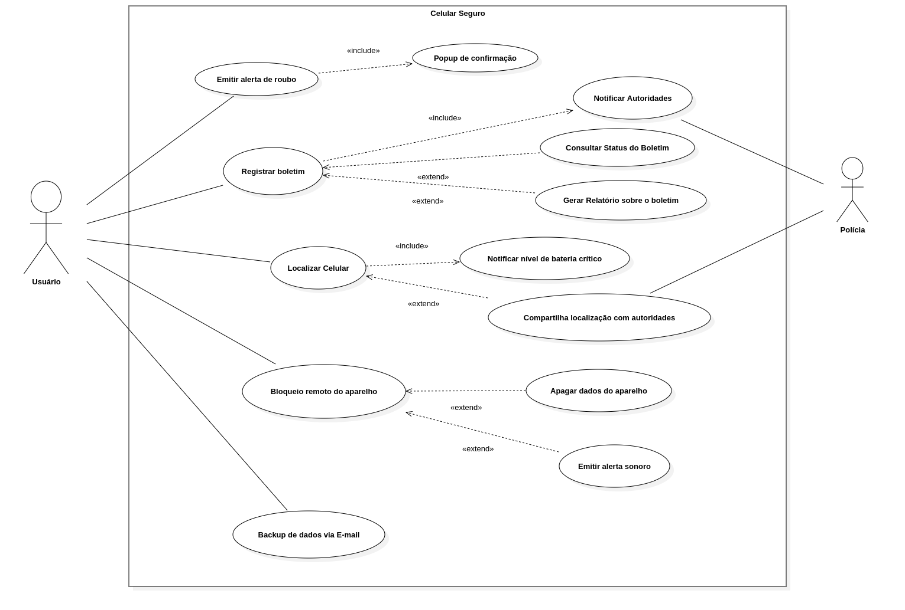

# Casos de Uso

---

## Introdução
Um caso de uso é uma descrição detalhada de como um sistema será utilizado por seus usuários em um determinado contexto ou situação. Ele descreve as interações entre os atores (usuários ou sistemas externos) e o sistema, especificando os passos necessários para atingir um objetivo específico. Cada caso de uso foca em uma funcionalidade ou tarefa que o sistema deve realizar, detalhando as ações dos usuários e as respostas esperadas do sistema. Este tipo de modelagem é essencial no desenvolvimento de software, pois ajuda a mapear os requisitos funcionais, garantindo que o sistema atenda às necessidades dos usuários finais [2].

Além disso, os casos de uso permitem uma visão clara das funcionalidades do sistema, oferecendo uma maneira estruturada de documentar o comportamento esperado do sistema durante a interação com o usuário. Eles servem como base para o desenvolvimento do sistema, auxiliando na análise e design, e são usados para validar os requisitos e guiar a implementação.

---

# Metodologia

Para representar as interações entre os usuários e o sistema Celular Seguro.gov, foi utilizada a técnica de modelagem UML por meio de diagramas de caso de uso. Essa abordagem permite descrever o comportamento esperado do sistema, sem especificar a ordem em que as ações ocorrem. [[ 1 ]](#ref1).

O diagrama de caso de uso mostra graficamente como diferentes atores (usuários, sistemas externos ou organizações) interagem com os casos de uso, que representam processos ou funcionalidades relevantes para o sistema. Cada ator pode representar um papel específico e pode participar de múltiplos casos de uso. Uma associação entre ator e caso de uso indica sua participação ativa no processo descrito.

A definição do limite do sistema também é uma etapa fundamental, pois determina o que é considerado interno ou externo à aplicação modelada. Dentro desses limites, os casos de uso representam conjuntos significativos de eventos que ocorrem quando o ator utiliza o sistema para atingir um objetivo, como registrar um celular, bloquear o aparelho, ou acompanhar o andamento de uma solicitação.

Essa modelagem foi baseada em cenários realistas e generalizados de uso, permitindo compreender as principais funcionalidades esperadas da aplicação e facilitando a validação e a comunicação entre os membros da equipe de desenvolvimento.

---

  

    Tabela 1: Elementos do Diagrama de Caso de Uso 
    
      Legenda dos elementos utilizados em diagramas de caso de uso, com seus símbolos correspondentes.
    
  

| Componente | Propósito | Ícone
|------|------|:-------:
| Atuador | Representa qualquer pessoa ou sistema externo que interage com o software. | <figure class="usecaseElement" style="width: 20%; display: flex;"></figure>
| Elipse (Função) | Denota uma ação ou serviço que o sistema oferece em resposta a solicitações dos atuadores; o nome da funcionalidade fica dentro da elipse. | <figure class="usecaseElement" style="width: 40%; display: flex;"></figure>
| Contorno (Limite do Sistema) | Define o perímetro do sistema sob análise, envolvendo todos os casos de uso e atuadores externos relacionados. | <figure class="usecaseElement" style="width: 40%; display: flex;"></figure>
| Conector (Relações) | Mostra as ligações entre atuadores e casos de uso, indicando quem participa de cada função ou como casos de uso se relacionam entre si. | <figure class="usecaseElement" style="width: 40%; display: flex;"></figure>

**Autor do tabela 1:** <a  href="https://github.com/leozinlima" target="_blank">Leonardo de Melo</a>, <a href="https://github.com/MateuSansete" target="_blank">Mateus Bastos</a>, <a  href="https://github.com/Bessazs" target="_blank">Vitor Bessa</a>

No diagrama de caso de uso, também é possível detalhar:

- Requisitos externos: funcionalidades que o sistema deve oferecer para atender demandas de usuários ou outros sistemas.  
- Capacidades do sistema: ações internamente disponíveis que permitem satisfazer essas demandas.  
- Restrições de ambiente: condições ou interfaces que o sistema exige do contexto onde opera para cumprir suas funções.

---

## Diagrama de Casos de Uso

  

    Figura 1: Diagrama de Caso de Uso – Celular Seguro 
    
      Visão geral dos casos de uso do sistema Celular Seguro, mostrando o ator principal, os casos de uso principais (emitir alerta de roubo, registrar boletim, localizar celular, bloqueio remoto e backup de dados via e-mail) e as funcionalidades auxiliares relacionadas por meio das relações «include» e «extend».
    
  

**Autor da figura 1:** <a  href="https://github.com/leozinlima" target="_blank">Leonardo de Melo</a>, <a  href="https://github.com/MateuSansete" target="_blank">Mateus Bastos</a>, <a  href="https://github.com/Bessazs" target="_blank">Vitor Bessa</a>

---

## Especialização dos casos de uso

## Emitir alerta de roubo

  

    Tabela 2: Caso de Uso UC01 – Emitir Alerta de Roubo 
    
      Detalhamento do caso de uso UC01 para emissão de alerta de roubo, especificando fluxos principal, alternativo e de exceção.
    
  

| UC01                  | Informações                                                                                                 |
|:----------------------|:------------------------------------------------------------------------------------------------------------|
| **Descrição**         | O usuário é capaz de emitir um alerta imediato de roubo do dispositivo.                                     |
| **Ator**              | Usuário                                                                                                     |
| **Pré-condições**     | Usuário autenticado; dispositivo previamente registrado no sistema.                                         |
| **Ação**              | O usuário emite um alerta de roubo via aplicativo.                                                          |
| **Fluxo principal**   | 1. O usuário acessa o app. 2. Seleciona “Emitir Alerta de Roubo”. 3. Sistema exibe popup de confirmação. 4. Usuário confirma. 5. Sistema registra alerta, aciona “Registrar Boletim” e “Notificar Autoridades”. |
| **Fluxo alternativo** | 1. O usuário cancela no popup de confirmação. 2. Sistema retorna ao painel.                             |
| **Fluxo de exceção**  | 1. Falha na notificação às autoridades. 2. Sistema exibe mensagem de erro e registra falha.             |
| **Pós-condições**     | Alerta de roubo registrado; boletim iniciado; autoridades notificadas.                                      |
| **Data de Criação**   | 13/05/2025                                                                                                  |
| **Rastreabilidade**   | [OBS09](https://requisitos-de-software.github.io/2025.1-CelularSeguro/documento-elicitacao/Observacao/#tabela-de-requisitos-funcionais)                                                                                       |

**Autor do tabela 2:** <a  href="https://github.com/leozinlima" target="_blank">Leonardo de Melo</a>, <a  href="https://github.com/MateuSansete" target="_blank">Mateus Bastos</a>, <a  href="https://github.com/Bessazs" target="_blank">Vitor Bessa</a>

----

## Registrar Boletim

  

    Tabela 3: Caso de Uso UC02 – Registrar Boletim 
    
      Detalhamento do caso de uso UC02 para registro formal de boletim de ocorrência detalhando o roubo.
    
  

| UC02                 | Informações                                                                                 |
|:---------------------|:--------------------------------------------------------------------------------------------|
| **Descrição**        | O usuário registra formalmente um boletim de ocorrência detalhando o roubo.                 |
| **Ator**             | Usuário                                                                                     |
| **Pré-condições**    | Usuário autenticado com login gov.br; dispositivo com conexão ativa.                        |
| **Ação**             | O usuário preenche o formulário e envia o boletim.                                          |
| **Fluxo principal**  | 1. Usuário seleciona “Registrar Boletim”. 2. Sistema exibe formulário. 3. Usuário preenche os campos e envia. 4. Sistema valida e exibe protocolo. |
| **Fluxo alternativo**| 1. Usuário tenta enviar sem preencher todos os campos. 2. Sistema bloqueia envio e exibe aviso. |
| **Fluxo de exceção** | 1. Erro no servidor ao registrar. 2. Sistema exibe mensagem de falha.                    |
| **Pós-condições**     | Boletim registrado com número de protocolo.                                                |
| **Data de Criação**   | 13/05/2025                                                                                 |
| **Rastreabilidade**   | [QS02](https://requisitos-de-software.github.io/2025.1-CelularSeguro/documento-elicitacao/Questionario/#requisitos-elicitados), [QS09](https://requisitos-de-software.github.io/2025.1-CelularSeguro/documento-elicitacao/Questionario/#requisitos-elicitados), [OBS8](https://requisitos-de-software.github.io/2025.1-CelularSeguro/documento-elicitacao/Observacao/#tabela-de-requisitos-funcionais)                                                                                |

**Autor do tabela 3:** <a  href="https://github.com/leozinlima" target="_blank">Leonardo de Melo</a>, <a  href="https://github.com/MateuSansete" target="_blank">Mateus Bastos</a>, <a  href="https://github.com/Bessazs" target="_blank">Vitor Bessa</a>

---

  

    Tabela 4: Caso de Uso UC03 – Localizar Celular 
    
      Detalhamento do caso de uso UC03 para localizar a posição atual ou última conhecida do dispositivo.
    
  

##  Localizar Celular

| UC03                 | Informações                                                                                     |
|:---------------------|:------------------------------------------------------------------------------------------------|
| **Descrição**        | Permite ao usuário localizar a posição atual ou última conhecida do dispositivo.                |
| **Ator**             | Usuário                                                                                          |
| **Pré-condições**    | Boletim registrado; dispositivo com rastreamento ativado e online.                              |
| **Ação**             | O usuário solicita a localização do aparelho.                                                    |
| **Fluxo principal**  | 1. Usuário acessa “Localizar Celular”. 2. Sistema verifica pré-condições. 3. Solicita coordenadas ao provedor. 4. Exibe mapa com marcador da localização. |
| **Fluxo alternativo**| 1. Dispositivo offline. 2. Sistema exibe última localização conhecida.                       |
| **Fluxo de exceção** | 1. Erro na API de localização. 2. Sistema exibe mensagem de indisponibilidade.               |
| **Pós-condições**    | Localização exibida no mapa ou mensagem de erro apresentada.                                     |
| **Data de Criação**  | 13/05/2025                                                                                       |
| **Rastreabilidade**  | [BS04](https://requisitos-de-software.github.io/2025.1-CelularSeguro/documento-elicitacao/Brainstorming/#tabela-de-requisitos-funcionais), [QS01](https://requisitos-de-software.github.io/2025.1-CelularSeguro/documento-elicitacao/Questionario/#requisitos-elicitados), [ST6](https://requisitos-de-software.github.io/2025.1-CelularSeguro/documento-elicitacao/Storytelling/#tabela-de-requisitos-funcionais)|

**Autor do tabela 4:** <a  href="https://github.com/leozinlima" target="_blank">Leonardo de Melo</a>, <a  href="https://github.com/MateuSansete" target="_blank">Mateus Bastos</a>, <a  href="https://github.com/Bessazs" target="_blank">Vitor Bessa</a>

---

  

    Tabela 5: Caso de Uso UC04 – Bloqueio Remoto do Aparelho 
    
      Detalhamento do caso de uso UC04 para bloqueio remoto do aparelho, especificando fluxos principal, alternativo e de exceção.
    
  

## Bloqueio Remoto do Aparelho

| UC04                 | Informações                                                                                   |
|:---------------------|:----------------------------------------------------------------------------------------------|
| **Descrição**        | O usuário bloqueia o aparelho remotamente para impedir seu uso.                                |
| **Ator**             | Usuário                                                                                        |
| **Pré-condições**    | Boletim registrado; dispositivo localizado anteriormente.                                      |
| **Ação**             | O usuário envia comando de bloqueio remoto.                                                   |
| **Fluxo principal**  | 1. Usuário acessa “Bloqueio Remoto”. 2. Sistema solicita confirmação. 3. Usuário confirma. 4. Sistema envia comando à operadora e registra ação. |
| **Fluxo alternativo**| 1. Usuário cancela confirmação. 2. Sistema retorna ao painel.                               |
| **Fluxo de exceção** | 1. Falha na comunicação com operadora. 2. Sistema exibe mensagem de erro.                  |
| **Pós-condições**    | Dispositivo bloqueado ou falha registrada.                                                    |
| **Data de Criação**  | 13/05/2025                                                                                    |
| **Rastreabilidade**  | [BS15](https://requisitos-de-software.github.io/2025.1-CelularSeguro/documento-elicitacao/Brainstorming/#tabela-de-requisitos-funcionais)                                                                                   |

**Autor do tabela 5:** <a  href="https://github.com/leozinlima" target="_blank">Leonardo de Melo</a>, <a  href="https://github.com/MateuSansete" target="_blank">Mateus Bastos</a>, <a  href="https://github.com/Bessazs" target="_blank">Vitor Bessa</a>

---

##  Backup de Dados via Email

  

    Tabela 6: Caso de Uso UC05 – Backup de Dados via Email 
    
      Detalhamento do caso de uso UC05 para envio de backup de dados por email com link seguro.
    
  

| UC05                 | Informações                                                                                   |
|:---------------------|:----------------------------------------------------------------------------------------------|
| **Descrição**        | O usuário solicita envio de backup de dados por email com link seguro.                         |
| **Ator**             | Usuário                                                                                       |
| **Pré-condições**    | Usuário autenticado; backup disponível.                                                       |
| **Ação**             | O usuário seleciona um backup e envia por email.                                              |
| **Fluxo principal**  | 1. Usuário acessa “Backup de Dados”. 2. Sistema mostra backups disponíveis. 3. Usuário seleciona e clica em “Enviar”. 4. Sistema envia email com link seguro. |
| **Fluxo alternativo**| 1. Email inválido ou não cadastrado. 2. Sistema exibe aviso para atualização do cadastro.  |
| **Fluxo de exceção** | 1. Erro no envio do email. 2. Sistema exibe falha e orienta nova tentativa.                |
| **Pós-condições**    | Email enviado com sucesso ou falha registrada.                                                |
| **Data de Criação**  | 13/05/2025                                                                                    |
| **Rastreabilidade**  | [BS18](https://requisitos-de-software.github.io/2025.1-CelularSeguro/documento-elicitacao/Brainstorming/#tabela-de-requisitos-funcionais)                                                                                    |

**Autor do tabela 6:** <a  href="https://github.com/leozinlima" target="_blank">Leonardo de Melo</a>, <a  href="https://github.com/MateuSansete" target="_blank">Mateus Bastos</a>, <a  href="https://github.com/Bessazs" target="_blank">Vitor Bessa</a>

---

## Bibliografia

> <a name="ref1">[ 1 ]</a> **MICROSOFT.** Criar um diagrama de caso de uso UML. Disponível em: [https://support.microsoft.com/pt-br/topic/criar-um-diagrama-de-caso-de-uso-uml-92cc948d-fc74-466c-9457-e82d62ee1298](https://support.microsoft.com/pt-br/topic/criar-um-diagrama-de-caso-de-uso-uml-92cc948d-fc74-466c-9457-e82d62ee1298). Acesso em 14 de Maio.

> <a name="ref2"> [2] </a>**IBM** Diagrams: Use Case. Disponível em: [https://www.ibm.com/docs/pt-br/rsm/7.5.0?topic=diagrams-use-case](https://www.ibm.com/docs/pt-br/rsm/7.5.0?topic=diagrams-use-case) Acesso em: 13 maio 2025.

> <a name="ref2"> [3] </a> **MINISTÉRIO DA CIÊNCIA, TECNOLOGIA, INOVAÇÕES E COMUNICAÇÕES.** [Especificação de Caso de Uso: UC<000> - <Nome do Caso de Uso>. Versão 1.0. Autor: MCTIC - CGSI. Nome do Arquivo: [SIGLA] UC[000][Nome_do_caso_de_uso].docx. Brasília, 2025.](../assets/pdf/caso-de-uso/SiglaProjeto_EspecificacaoCasoUso.pdf)

---

## Histórico de Versões 

| Versão | Data de produção   | Descrição da Alteração                               | Autor(es)             | Revisor(es)      | Data de Revisão |
| :----: | :----------------: | :--------------------------------------------------: | :-------------------: | :-------------:  |  :-----------: |
| 1.0    | 09/05/2025         | Criação do documento                                 | <a  href="https://github.com/gabriel-lima258" target="_blank">Gabriel Lima</a>    | <a  href="https://github.com/MateuSansete" target="_blank">Mateus Bastos</a> | 09/05/2025 |
| 1.1    | 13/05/2025         | Inicialização do Casos de Uso                        | <a  href="https://github.com/leozinlima" target="_blank">Leonardo de Melo</a>, <a  href="https://github.com/MateuSansete" target="_blank">Mateus Bastos</a>, <a  href="https://github.com/Bessazs" target="_blank">Vitor Bessa</a> | <a  href="https://github.com/gabriel-lima258" target="_blank">Gabriel Lima</a>, <a  href="https://github.com/FelipeFreire-gf" target="_blank">Felipe das Neves</a> | 13/05/2025 |
| 1.2    | 13/05/2025         | Ajuste nos Casos de Uso e adição de novos detalhes   | <a  href="https://github.com/Bessazs" target="_blank">Vitor Bessa</a>, <a  href="https://github.com/leozinlima" target="_blank">Leonardo de Melo</a>, <a  href="https://github.com/MateuSansete" target="_blank">Mateus Bastos</a> | <a  href="https://github.com/gabriel-lima258" target="_blank">Gabriel Lima</a>, <a  href="https://github.com/FelipeFreire-gf" target="_blank">Felipe das Neves</a> | 13/05/2025 |
| 1.3    | 14/05/2025         | Adição das referências                               | <a  href="https://github.com/MateuSansete" target="_blank">Mateus Bastos</a>    | <a  href="https://github.com/Bessazs" target="_blank">Vitor Bessa</a>, <a  href="https://github.com/leozinlima" target="_blank">Leonardo de Melo</a> | 14/05/2025 |
