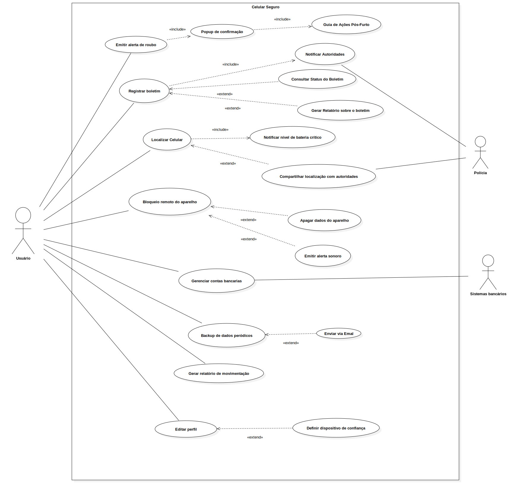

# Casos de Uso

---

## Introdução
Um caso de uso se refere a uma descrição detalhada de como o sistema será utilizado em uma determinada situação ou contexto. Ele descreve as interações entre os usuários e o sistema, apresentando os passos necessários para alcançar um objetivo específico. O objetivo dos casos de uso é auxiliar no processo de desenvolvimento de um sistema, fornecendo uma visão clara dos requisitos funcionais do sistema, descrevendo as ações que os usuários podem realizar e as respostas do sistema a essas ações.

---

# Metodologia

O diagrama de caso de uso é uma representação visual que resume as interações entre os usuários e um sistema, destacando suas funcionalidades e comportamentos. Ele é composto por atores, que representam os usuários ou sistemas externos, e casos de uso, que descrevem as ações realizadas pelos usuários e as respostas esperadas do sistema.

Para a modelagem dos casos de uso do aplicativo Celular Seguro.gov, foi utilizada a persona primária João da Silva, um motoboy de 36 anos que depende do celular para realizar suas entregas. João já passou por situações de roubo e, por isso, precisa de um sistema rápido e confiável que lhe permita bloquear ou rastrear seu aparelho em caso de furto. A partir da análise das dores e necessidades desse perfil de usuário, foi possível levantar os principais objetivos que ele busca alcançar com o uso da plataforma.

---

  

    Tabela 1: Elementos do Diagrama de Caso de Uso 
    
      Legenda dos elementos utilizados em diagramas de caso de uso, com seus símbolos correspondentes.
    
  

| Nome | Função | Elemento
|------|------|:-------:
| Ator | Representam os diferentes tipos de usuários externos que interagem com o sistema | <figure class="usecaseElement" style="width: 20%; display: flex;"></figure>
| Elipse (Caso de Uso) | É usada para representar os casos de uso no diagrama. Um caso de uso descreve uma funcionalidade ou uma ação específica que o sistema pode realizar em resposta às interações dos atores. A elipse contém o nome do caso de uso | <figure class="usecaseElement" style="width: 40%; display: flex;"></figure>
| Retângulo (Sistema) | Usado para representar o sistema ou o bloco em análise. Ele envolve os casos de uso e atores relacionados | <figure class="usecaseElement" style="width: 40%; display: flex;"></figure>
| Flecha (Relações) | As flechas são usadas para representar as relações ou interações entre atores e casos de uso | <figure class="usecaseElement" style="width: 40%; display: flex;"></figure>

**Autor do tabela 1:** <a  href="https://github.com/leozinlima" target="_blank">Leonardo de Melo</a>, <a href="https://github.com/MateuSansete" target="_blank">Mateus Bastos</a>, <a  href="https://github.com/Bessazs" target="_blank">Vitor Bessa</a>

Além disso, no diagrama de casos de uso é possível especificar:

- Os requisitos externos de um sistema, ou seja, as funcionalidades necessárias que o sistema deve oferecer para atender às necessidades dos usuários.
- As funcionalidades disponíveis no sistema, ou seja, o que o sistema é capaz de fazer para satisfazer as necessidades dos usuários.
- Os requisitos impostos pelo sistema ao ambiente em que está inserido, definindo como o sistema interage com o ambiente para realizar suas funções.

---

## Diagrama de Casos de Uso

A figura 1 demonstra o diagrama de casos de uso.

  

    Figura 1: Diagrama de Caso de Uso – Celular Seguro 
    
      Visão geral dos casos de uso do sistema Celular Seguro, mostrando o ator principal, os casos de uso principais (emitir alerta de roubo, registrar boletim, localizar celular, bloqueio remoto e backup de dados via e-mail) e as funcionalidades auxiliares relacionadas por meio das relações «include» e «extend».
    
  

<figure class="usecaseElement" style="width: 40%; display: flex;"></figure>

**Autor da figura 1:** <a  href="https://github.com/leozinlima" target="_blank">Leonardo de Melo</a>, <a  href="https://github.com/MateuSansete" target="_blank">Mateus Bastos</a>, <a  href="https://github.com/Bessazs" target="_blank">Vitor Bessa</a>

---

## Especialização dos casos de uso

---
## Emitir alerta de roubo

  

    Tabela 2: Caso de Uso UC01 – Emitir Alerta de Roubo 
    
      Detalhamento do caso de uso UC01 para emissão de alerta de roubo, especificando fluxos principal, alternativo e de exceção.
    
  

| UC01                  | Informações                                                                                                 |
|:----------------------|:------------------------------------------------------------------------------------------------------------|
| **Descrição**         | O usuário é capaz de emitir um alerta imediato de roubo do dispositivo.                                     |
| **Ator**              | Usuário                                                                                                     |
| **Pré-condições**     | Usuário autenticado; dispositivo previamente registrado no sistema.                                         |
| **Ação**              | O usuário emite um alerta de roubo via aplicativo.                                                          |
| **Fluxo principal**   | 1. O usuário acessa o app. 2. Seleciona “Emitir Alerta de Roubo”. 3. Sistema exibe popup de confirmação. 4. Usuário confirma. 5. Sistema registra alerta, aciona “Registrar Boletim” e “Notificar Autoridades”. |
| **Fluxo alternativo** | 1. O usuário cancela no popup de confirmação. 2. Sistema retorna ao painel.                             |
| **Fluxo de exceção**  | 1. Falha na notificação às autoridades. 2. Sistema exibe mensagem de erro e registra falha.             |
| **Pós-condições**     | Alerta de roubo registrado; boletim iniciado; autoridades notificadas.                                      |
| **Data de Criação**   | 13/05/2025                                                                                                  |
| **Rastreabilidade**   | [OBS09](https://requisitos-de-software.github.io/2025.1-CelularSeguro/documento-elicitacao/Observacao/#tabela-de-requisitos-funcionais)                                                                                       |

**Autor do tabela 2:** <a  href="https://github.com/leozinlima" target="_blank">Leonardo de Melo</a>, <a  href="https://github.com/MateuSansete" target="_blank">Mateus Bastos</a>, <a  href="https://github.com/Bessazs" target="_blank">Vitor Bessa</a>

----

## Registrar Boletim

  

    Tabela 3: Caso de Uso UC02 – Registrar Boletim 
    
      Detalhamento do caso de uso UC02 para registro formal de boletim de ocorrência detalhando o roubo.
    
  

| UC02                 | Informações                                                                                 |
|:---------------------|:--------------------------------------------------------------------------------------------|
| **Descrição**        | O usuário registra formalmente um boletim de ocorrência detalhando o roubo.                 |
| **Ator**             | Usuário                                                                                     |
| **Pré-condições**    | Usuário autenticado com login gov.br; dispositivo com conexão ativa.                        |
| **Ação**             | O usuário preenche o formulário e envia o boletim.                                          |
| **Fluxo principal**  | 1. Usuário seleciona “Registrar Boletim”. 2. Sistema exibe formulário. 3. Usuário preenche os campos e envia. 4. Sistema valida e exibe protocolo. |
| **Fluxo alternativo**| 1. Usuário tenta enviar sem preencher todos os campos. 2. Sistema bloqueia envio e exibe aviso. |
| **Fluxo de exceção** | 1. Erro no servidor ao registrar. 2. Sistema exibe mensagem de falha.                    |
| **Pós-condições**     | Boletim registrado com número de protocolo.                                                |
| **Data de Criação**   | 13/05/2025                                                                                 |
| **Rastreabilidade**   | [QS02](https://requisitos-de-software.github.io/2025.1-CelularSeguro/documento-elicitacao/Questionario/#requisitos-elicitados), [QS09](https://requisitos-de-software.github.io/2025.1-CelularSeguro/documento-elicitacao/Questionario/#requisitos-elicitados), [OBS8](https://requisitos-de-software.github.io/2025.1-CelularSeguro/documento-elicitacao/Observacao/#tabela-de-requisitos-funcionais)                                                                                |

**Autor do tabela 3:** <a  href="https://github.com/leozinlima" target="_blank">Leonardo de Melo</a>, <a  href="https://github.com/MateuSansete" target="_blank">Mateus Bastos</a>, <a  href="https://github.com/Bessazs" target="_blank">Vitor Bessa</a>

---

  

    Tabela 4: Caso de Uso UC03 – Localizar Celular 
    
      Detalhamento do caso de uso UC03 para localizar a posição atual ou última conhecida do dispositivo.
    
  

##  Localizar Celular

| UC03                 | Informações                                                                                     |
|:---------------------|:------------------------------------------------------------------------------------------------|
| **Descrição**        | Permite ao usuário localizar a posição atual ou última conhecida do dispositivo.                |
| **Ator**             | Usuário                                                                                          |
| **Pré-condições**    | Boletim registrado; dispositivo com rastreamento ativado e online.                              |
| **Ação**             | O usuário solicita a localização do aparelho.                                                    |
| **Fluxo principal**  | 1. Usuário acessa “Localizar Celular”. 2. Sistema verifica pré-condições. 3. Solicita coordenadas ao provedor. 4. Exibe mapa com marcador da localização. |
| **Fluxo alternativo**| 1. Dispositivo offline. 2. Sistema exibe última localização conhecida.                       |
| **Fluxo de exceção** | 1. Erro na API de localização. 2. Sistema exibe mensagem de indisponibilidade.               |
| **Pós-condições**    | Localização exibida no mapa ou mensagem de erro apresentada.                                     |
| **Data de Criação**  | 13/05/2025                                                                                       |
| **Rastreabilidade**  | [BS04](https://requisitos-de-software.github.io/2025.1-CelularSeguro/documento-elicitacao/Brainstorming/#tabela-de-requisitos-funcionais), [QS01](https://requisitos-de-software.github.io/2025.1-CelularSeguro/documento-elicitacao/Questionario/#requisitos-elicitados), [ST6](https://requisitos-de-software.github.io/2025.1-CelularSeguro/documento-elicitacao/Storytelling/#tabela-de-requisitos-funcionais)|

**Autor do tabela 4:** <a  href="https://github.com/leozinlima" target="_blank">Leonardo de Melo</a>, <a  href="https://github.com/MateuSansete" target="_blank">Mateus Bastos</a>, <a  href="https://github.com/Bessazs" target="_blank">Vitor Bessa</a>

---

  

    Tabela 5: Caso de Uso UC04 – Bloqueio Remoto do Aparelho 
    
      Detalhamento do caso de uso UC04 para bloqueio remoto do aparelho, especificando fluxos principal, alternativo e de exceção.
    
  

## Bloqueio Remoto do Aparelho

| UC04                 | Informações                                                                                   |
|:---------------------|:----------------------------------------------------------------------------------------------|
| **Descrição**        | O usuário bloqueia o aparelho remotamente para impedir seu uso.                                |
| **Ator**             | Usuário                                                                                        |
| **Pré-condições**    | Boletim registrado; dispositivo localizado anteriormente.                                      |
| **Ação**             | O usuário envia comando de bloqueio remoto.                                                   |
| **Fluxo principal**  | 1. Usuário acessa “Bloqueio Remoto”. 2. Sistema solicita confirmação. 3. Usuário confirma. 4. Sistema envia comando à operadora e registra ação. |
| **Fluxo alternativo**| 1. Usuário cancela confirmação. 2. Sistema retorna ao painel.                               |
| **Fluxo de exceção** | 1. Falha na comunicação com operadora. 2. Sistema exibe mensagem de erro.                  |
| **Pós-condições**    | Dispositivo bloqueado ou falha registrada.                                                    |
| **Data de Criação**  | 13/05/2025                                                                                    |
| **Rastreabilidade**  | [BS15](https://requisitos-de-software.github.io/2025.1-CelularSeguro/documento-elicitacao/Brainstorming/#tabela-de-requisitos-funcionais)                                                                                   |

**Autor do tabela 5:** <a  href="https://github.com/leozinlima" target="_blank">Leonardo de Melo</a>, <a  href="https://github.com/MateuSansete" target="_blank">Mateus Bastos</a>, <a  href="https://github.com/Bessazs" target="_blank">Vitor Bessa</a>

---

##  Backup de Dados via Email

  

    Tabela 6: Caso de Uso UC05 – Backup de Dados via Email 
    
      Detalhamento do caso de uso UC05 para envio de backup de dados por email com link seguro.
    
  

| UC05                 | Informações                                                                                   |
|:---------------------|:----------------------------------------------------------------------------------------------|
| **Descrição**        | O usuário solicita envio de backup de dados por email com link seguro.                         |
| **Ator**             | Usuário                                                                                       |
| **Pré-condições**    | Usuário autenticado; backup disponível.                                                       |
| **Ação**             | O usuário seleciona um backup e envia por email.                                              |
| **Fluxo principal**  | 1. Usuário acessa “Backup de Dados”. 2. Sistema mostra backups disponíveis. 3. Usuário seleciona e clica em “Enviar”. 4. Sistema envia email com link seguro. |
| **Fluxo alternativo**| 1. Email inválido ou não cadastrado. 2. Sistema exibe aviso para atualização do cadastro.  |
| **Fluxo de exceção** | 1. Erro no envio do email. 2. Sistema exibe falha e orienta nova tentativa.                |
| **Pós-condições**    | Email enviado com sucesso ou falha registrada.                                                |
| **Data de Criação**  | 13/05/2025                                                                                    |
| **Rastreabilidade**  | [BS18](https://requisitos-de-software.github.io/2025.1-CelularSeguro/documento-elicitacao/Brainstorming/#tabela-de-requisitos-funcionais)                                                                                    |

**Autor do tabela 6:** <a  href="https://github.com/leozinlima" target="_blank">Leonardo de Melo</a>, <a  href="https://github.com/MateuSansete" target="_blank">Mateus Bastos</a>, <a  href="https://github.com/Bessazs" target="_blank">Vitor Bessa</a>

---

## Bibliografia

---

## Histórico de Versões 

| Versão | Data de produção   | Descrição da Alteração                               | Autor(es)             | Revisor(es)      | Data de Revisão |
| :----: | :----------------: | :--------------------------------------------------: | :-------------------: | :-------------:  |  :-----------: |
| 1.0    | 09/05/2025         | Criação do documento                                 | <a  href="https://github.com/gabriel-lima258" target="_blank">Gabriel Lima</a>    | <a  href="https://github.com/MateuSansete" target="_blank">Mateus Bastos</a> | 09/05/2025 |
| 1.1    | 13/05/2025         | Inicialização do Casos de Uso                        | <a  href="https://github.com/leozinlima" target="_blank">Leonardo de Melo</a>, <a  href="https://github.com/MateuSansete" target="_blank">Mateus Bastos</a>, <a  href="https://github.com/Bessazs" target="_blank">Vitor Bessa</a> | <a  href="https://github.com/gabriel-lima258" target="_blank">Gabriel Lima</a>, <a  href="https://github.com/FelipeFreire-gf" target="_blank">Felipe das Neves</a> | 13/05/2025 |
| 1.2    | 13/05/2025         | Ajuste nos Casos de Uso e adição de novos detalhes   | <a  href="https://github.com/Bessazs" target="_blank">Vitor Bessa</a>, <a  href="https://github.com/leozinlima" target="_blank">Leonardo de Melo</a>, <a  href="https://github.com/MateuSansete" target="_blank">Mateus Bastos</a> | <a  href="https://github.com/gabriel-lima258" target="_blank">Gabriel Lima</a>, <a  href="https://github.com/FelipeFreire-gf" target="_blank">Felipe das Neves</a> | 13/05/2025 |
