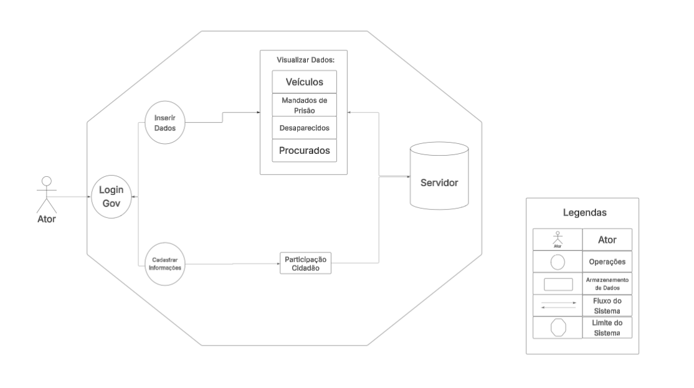
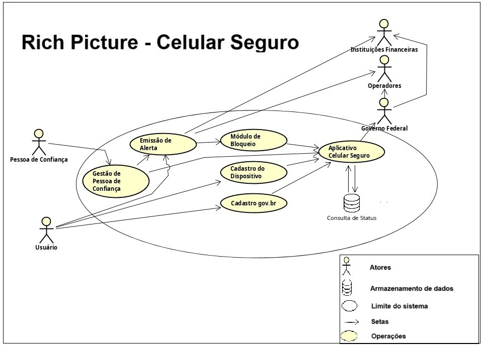
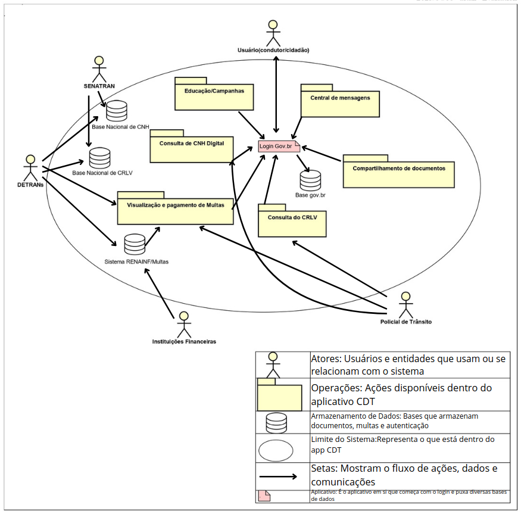
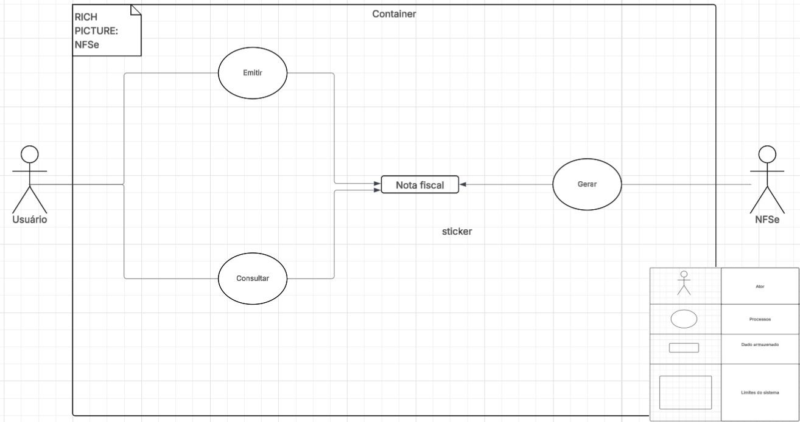
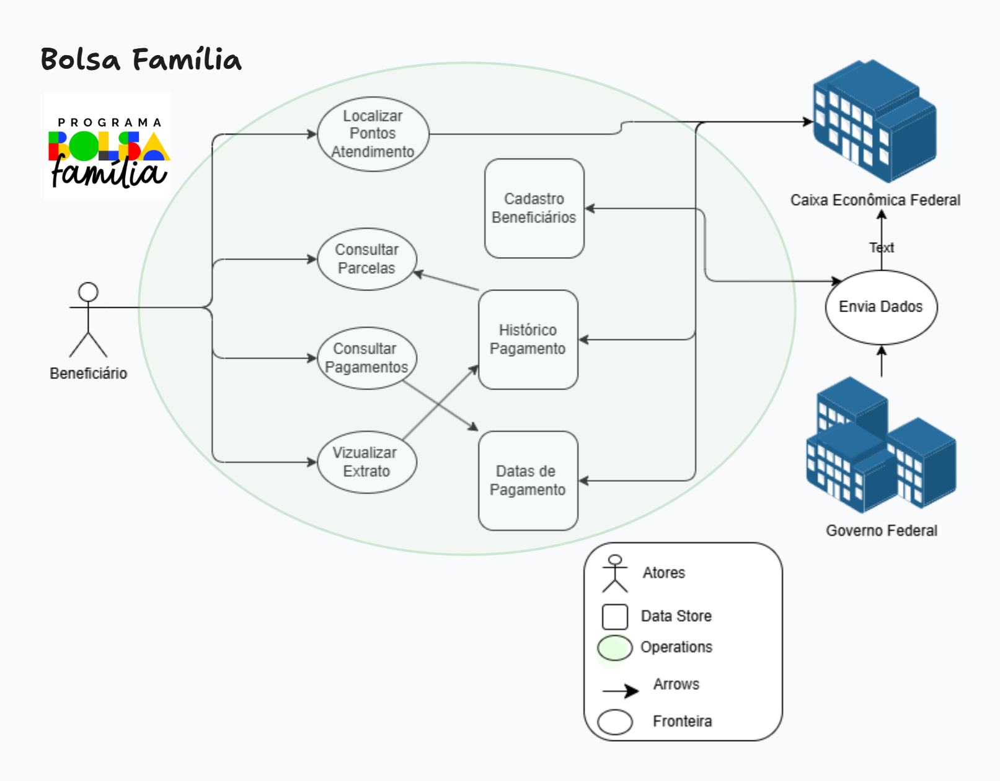
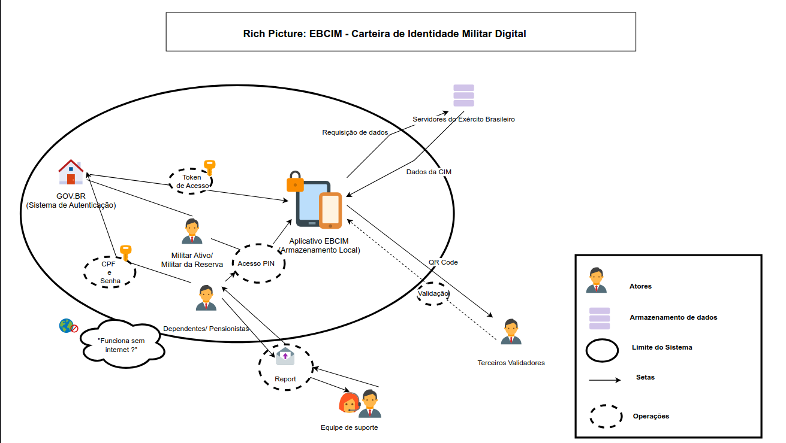
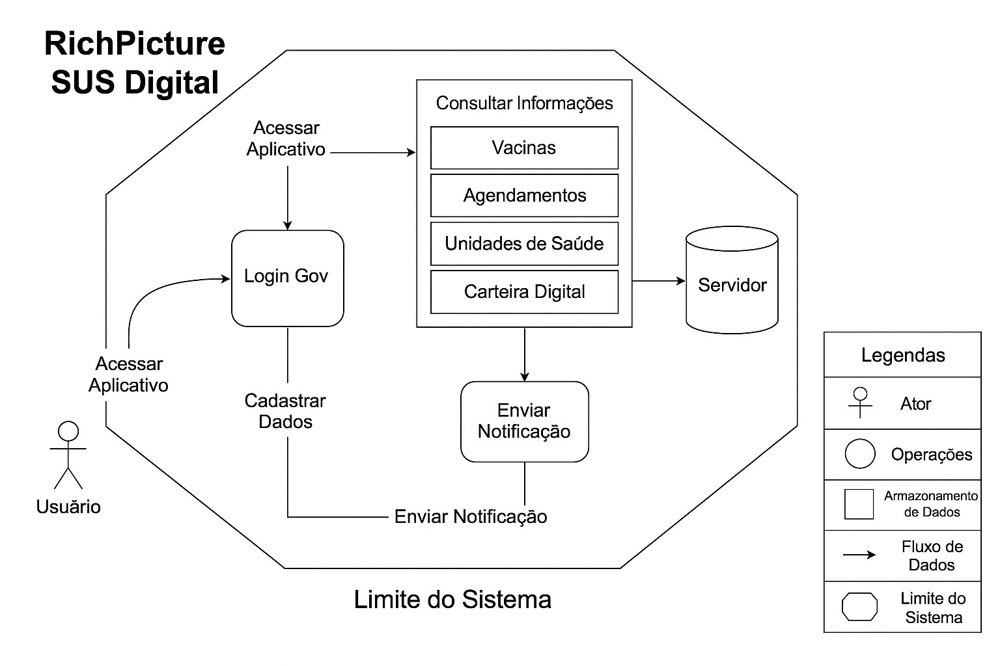

Versão 2.0

# Aplicativos Analisados

---

Esta seção apresenta a análise de sete aplicativos relevantes para o projeto, destacando suas funcionalidades essenciais, o público-alvo, os pontos positivos e as limitações percebidas. Cada bloco abaixo reúne uma descrição enxuta e um rich picture ilustrativo.

!!! Warning "Atenção!"
    O conteúdo deste tópico **poderá sofrer alterações** ao longo da Disciplina de Requisitos de Software. Portanto, as tabelas serão organizadas iniciando pela versão mais recente e finalizando com a versão mais antiga.

## Integrantes que atuaram no desenvolvimento do artefato

Esta tabela inicial terá somente os artefatos de alta relevância que cada integrante do projeto desenvolveu. O versionamento **completo** encontra-se ao final do artefato.

_Tabela de Contribuição_

| Nome | Função |
| :--- | :--- |
| [Felipe das Neves](https://github.com/FelipeFreire-gf) | Autor da: [[ Figura 1 ]](https://requisitos-de-software.github.io/2025.1-CelularSeguro/documento-pre-rastreabilidade/aplicativos_analisados/#sinesp-cidadao)|
| [Leonardo de Melo](https://github.com/leozinlima) | Autor da: [[ Figura 2 ]](https://requisitos-de-software.github.io/2025.1-CelularSeguro/documento-pre-rastreabilidade/aplicativos_analisados/#celular-seguro)|
| [Arthur Leite](https://github.com/arthurlleite) | Autor da: [[ Figura 3 ]](https://requisitos-de-software.github.io/2025.1-CelularSeguro/documento-pre-rastreabilidade/aplicativos_analisados/#carteira-digital-de-transito-cdt)|
| [Vitor Pereira](https://github.com/arthurlleite) | Autor da: [[ Figura 4 ]](https://requisitos-de-software.github.io/2025.1-CelularSeguro/documento-pre-rastreabilidade/aplicativos_analisados/#nfse-mobile)|
| [Gabriel Lima](https://github.com/gabriel-lima258) | Autor da: [[ Figura 5 ]](https://requisitos-de-software.github.io/2025.1-CelularSeguro/documento-pre-rastreabilidade/aplicativos_analisados/#bolsa-familia-app)|
| [Mateus Bastos](https://github.com/MateuSansete)  | Autor da: [[ Figura 6 ]](https://requisitos-de-software.github.io/2025.1-CelularSeguro/documento-pre-rastreabilidade/aplicativos_analisados/#carteira-de-identidade-militar-digital-ebcim)|
| [Daniel Rodrigues](https://github.com/MateuSansete)  | Autor da: [[ Figura 7 ]](https://requisitos-de-software.github.io/2025.1-CelularSeguro/documento-pre-rastreabilidade/aplicativos_analisados/#sus-digital)|
| [Leonardo de Melo](https://github.com/leozinlima), [Arthur Leite](https://github.com/arthurlleite) e [Mateus Bastos](https://github.com/MateuSansete)  | Revisores do Artefato |

*Legenda:* 

**Nome** – participante da técnica. 

**Função** – papel desempenhado na priorização. 

!!! Tip "Observação"
    Frizando claramente que as contribuições de cada integrante ainda que mínimas são ainda sim muito relevantes no desenvolvimento do artefo, considere verificar o histórico de versão. 

---

## Sinesp Cidadão

  

    Figura&nbsp;1:&nbsp;Rich&nbsp;picture&nbsp;–&nbsp;Sinesp&nbsp;Cidadão 
    
      Consulta de veículos roubados, mandados e desaparecidos em base oficial.
    
  

**Descrição:**  
Aplicativo governamental que permite aos cidadãos consultar informações de segurança pública, como veículos roubados, mandados de prisão e registros de pessoas desaparecidas.

**Principais Pontos:**  
- **Funcionalidades:** Consulta de placas de veículos, busca de mandados de prisão e registros de pessoas desaparecidas.  
- **Público-alvo:** Cidadãos interessados em verificar dados oficiais de segurança.  
- **Pontos Positivos:** Dados oficiais e atualizados, interface simples e acesso rápido.  
- **Limitações:** Funcionalidades exclusivamente de consulta; depende de conexão com a internet e conhecimento prévio (ex.: placa).

**Autor do Rich Picture:** <a style= href="https://github.com/FelipeFreire-gf" target="_blank">Felipe das Neves</a>

---

## Celular Seguro

  

    Figura&nbsp;2:&nbsp;Rich&nbsp;picture&nbsp;–&nbsp;Celular&nbsp;Seguro 
    
      Alerta de roubo/perda e bloqueio automático de linha, aparelho e apps.
    
  

**Descrição:**  
Aplicativo do governo destinado a registrar alertas de roubo, furto ou perda de celulares, bloqueando automaticamente a linha, o dispositivo e aplicativos bancários vinculados via cadastro gov.br.

**Principais Pontos:**  
- **Funcionalidades:** Registro de alertas e notificação automática para bloqueio de serviços vinculados.  
- **Público-alvo:** Usuários de smartphones preocupados com segurança e proteção de dados.  
- **Pontos Positivos:** Integração com operadoras, bancos e plataforma gov.br; alta confiabilidade e agilidade.  
- **Limitações:** Necessidade de cadastro prévio no gov.br; funcionamento pleno depende de conexão com a internet.

**Autor do Rich Picture:** <a style= href="https://github.com/leozinlima" target="_blank">Leonardo de Melo</a>

---

## Carteira Digital de Trânsito (CDT)

  

    Figura&nbsp;3:&nbsp;Rich&nbsp;picture&nbsp;–&nbsp;Carteira&nbsp;Digital&nbsp;de&nbsp;Trânsito 
    
      CNH e CRLV digitais, multas e alertas integrados ao DETRAN.
    
  

**Descrição:**  
Aplicativo que digitaliza a CNH e o CRLV, facilitando o acesso e a consulta de documentos de trânsito, além de oferecer informações sobre multas e alertas de vencimento.

**Principais Pontos:**  
- **Funcionalidades:** Armazenamento e consulta digital dos documentos, alertas e compartilhamento via QR Code ou PDF.  
- **Público-alvo:** Motoristas que buscam praticidade para acesso e gerenciamento dos documentos de trânsito.  
- **Pontos Positivos:** Eliminação da necessidade dos documentos físicos; integração com DETRAN/DENATRAN; interface moderna.  
- **Limitações:** Dependência de conexão para atualizações; eventuais problemas na aceitação do formato digital em algumas situações.

**Autor do Rich Picture:** <a style= href="https://github.com/arthurlleite" target="_blank">Arthur Carvalho</a>

---

## NFSe Mobile

  

    Figura&nbsp;4:&nbsp;Rich&nbsp;picture&nbsp;–&nbsp;NFSe&nbsp;Mobile 
    
      Emissão e consulta de nota fiscal de serviço direto com a prefeitura.
    
  

**Descrição:**  
Aplicativo voltado para a emissão e consulta de Notas Fiscais de Serviço eletrônicas, facilitando obrigações fiscais de prestadores de serviço e pequenas empresas.

**Principais Pontos:**  
- **Funcionalidades:** Emissão, consulta e compartilhamento de NFSe; acesso ao histórico de notas.  
- **Público-alvo:** Prestadores de serviço, microempreendedores e contadores.  
- **Pontos Positivos:** Agilidade na emissão e redução da burocracia; otimiza processos fiscais.  
- **Limitações:** Funcionalidade direcionada para um público específico; depende de cadastro municipal e de conexão constante.

**Autor do Rich Picture:** <a style= href="https://github.com/Bessazs" target="_blank">Vitor Pereira</a>

---

## Bolsa Família (App)

  

    Figura&nbsp;5:&nbsp;Rich&nbsp;picture&nbsp;–&nbsp;Bolsa&nbsp;Família 
    
      Visualização de parcelas, extratos e calendário do benefício.
    
  

**Descrição:**  
Aplicativo que possibilita aos beneficiários do programa Bolsa Família consultar seus benefícios, calendário de pagamentos, extratos e localizar pontos de atendimento da Caixa.

**Principais Pontos:**  
- **Funcionalidades:** Consulta de parcelas, visualização de histórico e extratos, e localização de agências.  
- **Público-alvo:** Famílias beneficiárias do programa social, geralmente de baixa renda.  
- **Pontos Positivos:** Acesso rápido e claro às informações do benefício, autonomia e redução da necessidade de atendimento presencial.  
- **Limitações:** Requer acesso ao smartphone e internet; interface simples pode limitar a oferta de funcionalidades avançadas.

**Autor do Rich Picture:** <a style= href="https://github.com/gabriel-lima258" target="_blank">Gabriel Lima</a>

---

## Carteira de Identidade Militar Digital (EBCIM)

  

    Figura&nbsp;6:&nbsp;Rich&nbsp;picture&nbsp;–&nbsp;Identidade&nbsp;Militar&nbsp;Digital 
    
      Documento militar digital validado por QR Code, acessível offline.
    
  

**Descrição:**  
Aplicativo que disponibiliza a carteira de identidade militar em formato digital, oferecendo acesso offline e validação por QR Code, facilitando a rotina de militares e seus dependentes.

**Principais Pontos:**  
- **Funcionalidades:** Exibição digital do documento com dados oficiais; autenticação via gov.br e PIN; verificação por QR Code.  
- **Público-alvo:** Militares das Forças Armadas e seus dependentes/pensionistas.  
- **Pontos Positivos:** Substituição do documento físico; segurança reforçada e acesso offline para visualização.  
- **Limitações:** Uso restrito ao público militar; validação completa pode depender de conexão online.

**Autor do Rich Picture:** <a style= href="https://github.com/MateuSansete" target="_blank">Mateus Bastos</a>

---

## SUS Digital

  

    Figura&nbsp;7:&nbsp;Rich&nbsp;picture&nbsp;–&nbsp;SUS&nbsp;Digital 
    
      Histórico clínico, vacinas e exames centralizados na RNDS.
    
  

**Descrição:**  
Aplicativo oficial do Ministério da Saúde que centraliza informações e serviços do SUS, permitindo ao cidadão acessar seu histórico de saúde, dados de vacinação, resultados de exames e outros serviços de forma digital.

**Principais Pontos:**  
- **Funcionalidades:** Acesso ao histórico clínico, dados de vacinação e resultados de exames; localização de unidades de saúde e acesso a serviços digitais do SUS.  
- **Público-alvo:** Cidadãos usuários do SUS.  
- **Pontos Positivos:** Centralização dos dados de saúde em um só aplicativo; facilita o acompanhamento da saúde com múltiplos serviços integrados; dados seguros e integrados pela RNDS (Rede Nacional de Dados em Saúde).  
- **Limitações:** Requer autenticação via gov.br e conexão com a internet; disponibilidade das informações depende do registro pelos serviços de saúde.

**Autor do Rich Picture:** <a style= href="https://github.com/zDrNz" target="_blank">Daniel Rodrigues</a>

---

## Legenda dos Rich Pictures

  

    Tabela&nbsp;1:&nbsp;Legenda&nbsp;dos&nbsp;Rich&nbsp;Pictures 
    
      Descreve o significado de cada ícone (atores, operações, dados, fluxos e limites)
      usado nos Rich&nbsp;Pictures, para leitura instantânea dos diagramas.
    
  

| **Componente**             | **Símbolo**                          | **Descrição**                                                                                                                                          |
|----------------------------|--------------------------------------|--------------------------------------------------------------------------------------------------------------------------------------------------------|
| **Atores**                 |      | Representam as pessoas (ou grupos) que interagem com o sistema, direta ou indiretamente. Ex: usuários, gestores, clientes. |
| **Operações**              |  | Representam as ações executadas no sistema, geralmente iniciadas por atores. Ex: “Excluir cliente”. |
| **Armazenamento de dados** |    | São os repositórios de dados (como tabelas ou arquivos). Ex: “Clientes”. |
| **Setas (fluxo de dados)** |      | Indicam o fluxo de informação entre atores, operações e dados. |
| **Limites do sistema**     |  | Delimitam o que está sob responsabilidade do sistema analisado. |

**Autor da Legenda dos Rich Pictures:** <a style= href="https://github.com/leozinlima" target="_blank">Leonardo de Melo</a>

---

## Tabela Comparativa dos Aplicativos

  

    Tabela&nbsp;2:&nbsp;Tabela&nbsp;Comparativa&nbsp;dos&nbsp;Aplicativos 
    
      Apresenta lado a lado as funcionalidades, mecanismos de segurança, integração governamental, usabilidade e público-alvo de cada aplicativo.
    
  

| **Aplicativo**                   | **Funcionalidades (resumo)**                                            | **Segurança (dados e acesso)**               | **Integração (Gov)**                          | **Usabilidade**                              | **Público Principal**                                 |
|----------------------------------|------------------------------------------------------------------------|----------------------------------------------|-----------------------------------------------|----------------------------------------------|-------------------------------------------------------|
| **Sinesp Cidadão**               | Consulta de dados (veículos, pessoas, prisões)                          | Dados oficiais, acesso rápido                | Dados do Sinesp/MJ                            | Interface simples e objetiva                 | Cidadãos interessados em segurança pública            |
| **Celular Seguro**               | Registro de alertas e bloqueio                                           | Autenticação via gov.br e notificações       | Integra gov.br, operadoras e bancos           | Passos guiados e intuitivos                  | Usuários de smartphones com risco de furto            |
| **Carteira Digital de Trânsito** | Digitaliza CNH/CRLV, consulta multas                                     | Autenticação segura; QR Code                 | Integra DETRAN/DENATRAN                       | Interface moderna e menus bem organizados    | Motoristas e condutores                               |
| **NFSe Mobile**                  | Emissão e consulta de notas fiscais                                      | Login seguro com credenciais municipais      | Integra sistemas municipais (ISS/NFSe)        | Focado em processos fiscais                  | Prestadores de serviço e microempreendedores          |
| **Bolsa Família (App)**          | Consulta de benefício e localização de agências                          | Proteção de dados pessoais                   | Integra Caixa e Cadastro Único                | Simples e direto                             | Famílias beneficiárias do programa                    |
| **Identidade Militar Digital**   | Exibe identidade com QR Code e acesso offline                            | Autenticação gov.br e PIN, dados cifrados    | Integra Exército e gov.br                     | Interface limpa e focada                     | Militares e dependentes                               |
| **SUS Digital**                  | Acesso a histórico clínico, vacinas e exames; busca de unidades de saúde | Autenticação via gov.br; dados seguros (RNDS)| Integra Ministério da Saúde (RNDS)            | Interface moderna e seções bem estruturadas  | Cidadãos usuários do SUS                              |

**Autor da Tabela Comparativa dos Aplicativos:** <a style= href="https://github.com/leozinlima" target="_blank">Leonardo de Melo</a>

---

## Bibliografia

>BRASIL. Ministério da Justiça. Sinesp Cidadão. Disponível em: <https://www.gov.br/mj/pt-br/assuntos/sua-seguranca/seguranca-publica/sinesp-1>. Acesso em: 10 abr. 2025.

>PDF (23 abr. 2025): [Sinesp Cidadão](https://raw.githubusercontent.com/Requisitos-de-Software/2025.1-CelularSeguro/main/Docs/assets/pdf/AppSinesp.pdf)

>BRASIL. Ministério das Comunicações. Celular Seguro. Disponível em: <https://www.gov.br/celularseguro>. Acesso em: 10 abr. 2025.

>PDF (23 abr. 2025): [Celular Seguro](https://raw.githubusercontent.com/Requisitos-de-Software/2025.1-CelularSeguro/main/Docs/assets/pdf/AppCelularSeguro.pdf)

>BRASIL. Ministério da Infraestrutura. Carteira Digital de Trânsito. Disponível em: <https://www.gov.br/pt-br/servicos/obter-carteira-digital-de-transito>. Acesso em: 10 abr. 2025.

>PDF (23 abr. 2025): [Carteira Digital de Trânsito](https://raw.githubusercontent.com/Requisitos-de-Software/2025.1-CelularSeguro/main/Docs/assets/pdf/AppCarteiraTransito.pdf)

>PREFEITURA MUNICIPAL. NFSe Mobile. Disponível em: <https://www.gov.br/nfse/pt-br>. Acesso em: 10 abr. 2025.

>PDF (23 abr. 2025): [NFSe Mobile](https://raw.githubusercontent.com/Requisitos-de-Software/2025.1-CelularSeguro/main/Docs/assets/pdf/AppNFSe.pdf)

>CAIXA ECONÔMICA FEDERAL. Bolsa Família (App). Disponível em: <https://www.caixa.gov.br/atendimento/aplicativos/bolsa-familia/Paginas/default.aspx>. Acesso em: 10 abr. 2025.

>PDF (23 abr. 2025): [Bolsa Família](https://raw.githubusercontent.com/Requisitos-de-Software/2025.1-CelularSeguro/main/Docs/assets/pdf/AppBolsaFamilia.pdf)

>EXÉRCITO BRASILEIRO. Carteira de Identidade Militar Digital (EBCIM). Disponível em: <https://portal-ebcim.eb.mil.br/>. Acesso em: 10 abr. 2025.

>PDF (23 abr. 2025): [Carteira de Identidade Militar Digital](https://raw.githubusercontent.com/Requisitos-de-Software/2025.1-CelularSeguro/main/Docs/assets/pdf/AppEBCIM.pdf)

>BRASIL. Ministério da Saúde. SUS Digital (Meu SUS Digital). Disponível em: <https://www.gov.br/saude/pt-br/composicao/seidigi/meususdigital>. Acesso em: 11 abr. 2025.

>PDF (23 abr. 2025): [Meu SUS Digital](https://raw.githubusercontent.com/Requisitos-de-Software/2025.1-CelularSeguro/main/Docs/assets/pdf/AppMeuSUS.pdf)

---

## Histórico de Versões

| Versão | Data de Produção | Descrição da Alteração                                                                 | Autor(es)                                                                                                                      | Revisor(es)                                                                                                                  | Data de Revisão |
| :----: | :--------------: | :-------------------------------------------------------------------------------------: | :----------------------------------------------------------------------------------------------------------------------------: | :--------------------------------------------------------------------------------------------------------------------------: | :-------------: |
| 1.0    | 09/04/2025       | Estruturação inicial da seção “Aplicativos Analisados” com modelo descritivo e Rich Pictures | <a style="color:gold;" href="https://github.com/leozinlima" target="_blank">Leonardo de Melo</a>                               | <a style="color:gold;" href="https://github.com/arthurlleite" target="_blank">Arthur Carvalho</a>, <a style="color:gold;" href="https://github.com/Bessazs" target="_blank">Vitor Pereira</a> | 09/04/2025     |
| 1.1    | 10/04/2025       | Inclusão dos 6 primeiros aplicativos com descrições padronizadas e autoria das Rich Pictures | <a style="color:gold;" href="https://github.com/leozinlima" target="_blank">Leonardo de Melo</a>                               | <a style="color:gold;" href="https://github.com/arthurlleite" target="_blank">Arthur Carvalho</a>, <a style="color:gold;" href="https://github.com/Bessazs" target="_blank">Vitor Pereira</a> | 10/04/2025     |
| 1.2    | 10/04/2025       | Adição da tabela comparativa entre os aplicativos analisados                            | <a style="color:gold;" href="https://github.com/leozinlima" target="_blank">Leonardo de Melo</a>                               | <a style="color:gold;" href="https://github.com/arthurlleite" target="_blank">Arthur Carvalho</a>, <a style="color:gold;" href="https://github.com/Bessazs" target="_blank">Vitor Pereira</a> | 10/04/2025     |
| 1.3    | 11/04/2025       | Inclusão do aplicativo SUS Digital com Rich Picture, análise e atualização na comparação | <a style="color:gold;" href="https://github.com/leozinlima" target="_blank">Leonardo de Melo</a>                               | <a style="color:gold;" href="https://github.com/arthurlleite" target="_blank">Arthur Carvalho</a>                                                   | 23/04/2025     |
| 1.4    | 13/04/2025       | Inserção das referências bibliográficas de todos os aplicativos analisados              | <a style="color:gold;" href="https://github.com/leozinlima" target="_blank">Leonardo de Melo</a>                               | <a style="color:gold;" href="https://github.com/arthurlleite" target="_blank">Arthur Carvalho</a>                                                   | 23/04/2025     |
| 1.5    | 17/04/2025       | Correção do título da bibliografia e adição do tópico de legenda dos Rich Pictures      | <a style="color:gold;" href="https://github.com/leozinlima" target="_blank">Leonardo de Melo</a>                               | <a style="color:gold;" href="https://github.com/arthurlleite" target="_blank">Arthur Carvalho</a>                                                   | 23/04/2025     |
| 1.6    | 23/04/2025       | Padronização do Histórico de Versões e da Bibliografia                                 | <a style="color:gold;" href="https://github.com/arthurlleite" target="_blank">Arthur Carvalho</a>                             | <a style="color:gold;" href="https://github.com/arthurlleite" target="_blank">Arthur Carvalho</a>                                                   | 23/04/2025     |
| 1.7    | 23/04/2025       | Inserção dos PDFs na bibliografia com data de 23 de abril de 2025                       | <a style="color:gold;" href="https://github.com/leozinlima" target="_blank">Leonardo de Melo</a>                               | <a style="color:gold;" href="https://github.com/leozinlima" target="_blank">Leonardo de Melo</a>                                                  | 23/04/2025     |
| 1.8| 08/05/2025| Padronização do Histórico de Versões| <a style="color:gold;" href="https://github.com/arthurlleite" target="_blank">Arthur Carvalho</a>| <a style="color:gold;" href="https://github.com/arthurlleite" target="_blank">Arthur Carvalho</a>| 08/05/2025|
| 1.9    | 04/07/2025 | Inserção da tabela de contribuição| <a style="color:gold;" href="https://github.com/FelipeFreire-gf" target="_blank">Felipe das Neves</a> | <a style="color:gold;" href="https://github.com/MateuSansete" target="_blank">Mateus Bastos</a>| 04/07/2025|
| 2.0    | 04/07/2025 | Inserção da tabela de contribuição| <a style="color:gold;" href="https://github.com/FelipeFreire-gf" target="_blank">Felipe das Neves</a> | <a style="color:gold;" href="https://github.com/MateuSansete" target="_blank">Mateus Bastos</a>| 04/07/2025|