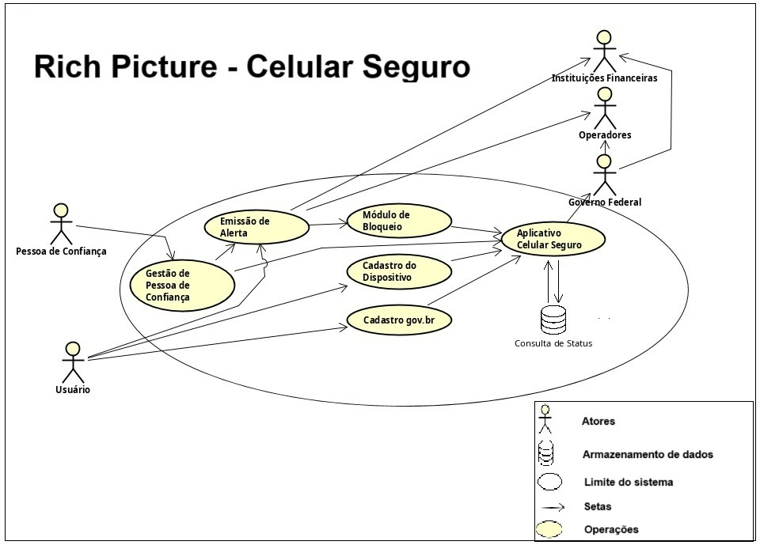

# Aplicativos Analisados
---

Esta seção apresenta a análise de seis aplicativos relevantes para o projeto, destacando suas funcionalidades essenciais, o público-alvo, os pontos positivos e as limitações percebidas. Cada bloco abaixo reúne uma descrição enxuta e um rich picture ilustrativo.

---

## Sinesp Cidadão

**Descrição:**  
Aplicativo governamental que permite aos cidadãos consultar informações de segurança pública, como veículos roubados, mandados de prisão e registros de pessoas desaparecidas.

**Principais Pontos:**  
- **Funcionalidades:** Consulta de placas de veículos, busca de mandados de prisão e registros de pessoas desaparecidas.  
- **Público-alvo:** Cidadãos interessados em verificar dados oficiais de segurança.  
- **Pontos Positivos:** Dados oficiais e atualizados, interface simples e acesso rápido.  
- **Limitações:** Funcionalidades exclusivamente de consulta; depende de conexão com a internet e conhecimento prévio (ex.: placa).

**Autor do Rich Picture:** Felipe das Neves

---

## Celular Seguro

**Descrição:**  
Aplicativo do governo destinado a registrar alertas de roubo, furto ou perda de celulares, bloqueando automaticamente a linha, o dispositivo e aplicativos bancários vinculados via cadastro gov.br.

**Principais Pontos:**  
- **Funcionalidades:** Registro de alertas e notificação automática para bloqueio de serviços vinculados.  
- **Público-alvo:** Usuários de smartphones preocupados com segurança e proteção de dados.  
- **Pontos Positivos:** Integração com operadoras, bancos e plataforma gov.br; alta confiabilidade e agilidade.  
- **Limitações:** Necessidade de cadastro prévio no gov.br; funcionamento pleno depende de conexão com a internet.

**Autor do Rich Picture:** Leonardo de Melo

---

## Carteira Digital de Trânsito (CDT)

**Descrição:**  
Aplicativo que digitaliza a CNH e o CRLV, facilitando o acesso e a consulta de documentos de trânsito, além de oferecer informações sobre multas e alertas de vencimento.

**Principais Pontos:**  
- **Funcionalidades:** Armazenamento e consulta digital dos documentos, alertas e compartilhamento via QR Code ou PDF.  
- **Público-alvo:** Motoristas que buscam praticidade para acesso e gerenciamento dos documentos de trânsito.  
- **Pontos Positivos:** Eliminação da necessidade dos documentos físicos; integração com DETRAN/DENATRAN; interface moderna.  
- **Limitações:** Dependência de conexão para atualizações; eventuais problemas na aceitação do formato digital em algumas situações.

**Autor do Rich Picture:** Arthur Carvalho

---

## NFSe Mobile

**Descrição:**  
Aplicativo voltado para a emissão e consulta de Notas Fiscais de Serviço eletrônicas, facilitando obrigações fiscais de prestadores de serviço e pequenas empresas.

**Principais Pontos:**  
- **Funcionalidades:** Emissão, consulta e compartilhamento de NFSe; acesso ao histórico de notas.  
- **Público-alvo:** Prestadores de serviço, microempreendedores e contadores.  
- **Pontos Positivos:** Agilidade na emissão e redução da burocracia; otimiza processos fiscais.  
- **Limitações:** Funcionalidade direcionada para um público específico; depende de cadastro municipal e de conexão constante.

**Autor do Rich Picture:** Vitor Pereira

---

## Bolsa Família (App)

**Descrição:**  
Aplicativo que possibilita aos beneficiários do programa Bolsa Família consultar seus benefícios, calendário de pagamentos, extratos e localizar pontos de atendimento da Caixa.

**Principais Pontos:**  
- **Funcionalidades:** Consulta de parcelas, visualização de histórico e extratos, e localização de agências.  
- **Público-alvo:** Famílias beneficiárias do programa social, geralmente de baixa renda.  
- **Pontos Positivos:** Acesso rápido e claro às informações do benefício, autonomia e redução da necessidade de atendimento presencial.  
- **Limitações:** Requer acesso ao smartphone e internet; interface simples pode limitar a oferta de funcionalidades avançadas.

**Autor do Rich Picture:** Gabriel Lima

---

## Carteira de Identidade Militar Digital (EBCIM)

**Descrição:**  
Aplicativo que disponibiliza a carteira de identidade militar em formato digital, oferecendo acesso offline e validação por QR Code, facilitando a rotina de militares e seus dependentes.

**Principais Pontos:**  
- **Funcionalidades:** Exibição digital do documento com dados oficiais; autenticação via gov.br e PIN; verificação por QR Code.  
- **Público-alvo:** Militares das Forças Armadas e seus dependentes/pensionistas.  
- **Pontos Positivos:** Substituição do documento físico; segurança reforçada e acesso offline para visualização.  
- **Limitações:** Uso restrito ao público militar; validação completa pode depender de conexão online.

**Autor do Rich Picture:** Mateus Bastos

---

## Tabela Comparativa dos Aplicativos

| **Aplicativo**                  | **Funcionalidades (resumo)**                        | **Segurança (dados e acesso)**              | **Integração (Gov)**                         | **Usabilidade**                           | **Público Principal**                               |
|---------------------------------|-----------------------------------------------------|---------------------------------------------|----------------------------------------------|-------------------------------------------|-----------------------------------------------------|
| **Sinesp Cidadão**              | Consulta de dados (veículos, pessoas, prisões)      | Dados oficiais, acesso rápido                | Dados do Sinesp/MJ                           | Interface simples e objetiva              | Cidadãos interessados em segurança pública          |
| **Celular Seguro**              | Registro de alertas e bloqueio                      | Autenticação via gov.br e notificações       | Integra gov.br, operadoras e bancos          | Passos guiados e intuitivos               | Usuários de smartphones com risco de furto          |
| **Carteira Digital de Trânsito**| Digitaliza CNH/CRLV, consulta multas                | Autenticação segura; QR Code                 | Integra DETRAN/DENATRAN                      | Interface moderna e menus bem organizados   | Motoristas e condutores                             |
| **NFSe Mobile**                 | Emissão e consulta de notas fiscais                 | Login seguro com credenciais municipais       | Integra sistemas municipais (ISS/NFSe)       | Focado em processos fiscais               | Prestadores de serviço e microempreendedores        |
| **Bolsa Família (App)**         | Consulta de benefício e localização de agências     | Proteção de dados pessoais                   | Integra Caixa e Cadastro Único               | Simples e direto                          | Famílias beneficiárias do programa                   |
| **Identidade Militar Digital**  | Exibe identidade com QR Code e acesso offline        | Autenticação gov.br e PIN, dados cifrados     | Integra Exército e gov.br                    | Interface limpa e focada                  | Militares e dependentes                              |

---

## Tabela de Versionamento

| **Versão** | **Data**     | **Descrição da Alteração**                                           | **Nome(s) Integrante(s)**     |
|------------|--------------|-----------------------------------------------------------------------|-------------------------------|
| 1.0        | 10/04/2025   | Criação inicial da documentação                                        | Leonardo de Melo         |
| 1.1        | 10/04/2025   | Inclusão dos aplicativos e autores dos rich pictures                  | Leonardo de Melo         |