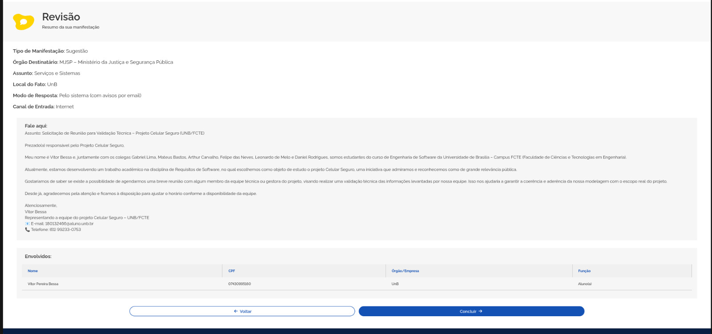

# Comprovação Informal

## Introdução 

No desenvolvimento do projeto Celular Seguro, que visa permitir o bloqueio remoto de celulares roubados, foi adotada a técnica de comprovação informal para validar os requisitos elicitados. Essa técnica consiste na leitura crítica dos documentos de requisitos por analistas, desenvolvedores e representantes dos usuários, com o objetivo de identificar inconsistências, ambiguidades e omissões, sem uso de métodos formais ou automatizados.

!!! Warning "Atenção!"
    O conteúdo deste tópico **poderá sofrer alterações** ao longo da Disciplina de Requisitos de Software. Portanto, as tabelas serão organizadas iniciando pela versão mais recente e finalizando com a versão mais antiga.

## Integrantes que atuaram no desenvolvimento do artefato

Esta tabela inicial terá somente os artefatos de alta relevância que cada integrante do projeto desenvolveu. O versionamento do artefato **completo** encontra-se ao final do artefato.

_Desenvolvimento do Artefato_

| Nome | Função |
| :--- | :--- |
| [Gabriel Lima](https://github.com/gabriel-lima258) | Autor do Desenvolvimento do Artefato |
| [Arthur Carvalho](https://github.com/arthurlleite) | Revisor do Artefato |
| [Vitor Bessa](https://github.com/Bessazs) | Autor do Envio para a Ouvidoria |
| [Daniel Rodrigues](https://github.com/zDrNz) | Autor do Envio do E-mail|

!!! Tip "Observação"
    Frizando claramente que as contribuições de cada integrante ainda que mínimas são ainda sim muito relevantes no desenvolvimento do artefo, considere verificar o histórico de versão. 

---

## Canal de Comunicação

Para validar os requisitos do projeto Celular Seguro, optou-se por utilizar dois canais principais de comunicação com os responsáveis: o e-mail institucional e a ouvidoria oficial da plataforma. O e-mail foi escolhido como o principal meio de contato, por ser um canal mais formal, apropriado para o envio de mensagens detalhadas, com linguagem técnica e estrutura clara, facilitando a compreensão dos documentos anexados.

Devido à seriedade do tema tratado **a segurança digital de dispositivos móveis**, a comunicação por e-mail seguiu um tom mais cuidadoso e direto, permitindo apresentar os artefatos desenvolvidos de maneira completa e profissional.

Além disso, o contato também foi reforçado por meio da ouvidoria do sistema, uma alternativa institucional que possibilita o encaminhamento oficial de questionamentos, sugestões e pedidos de validação. Esse canal se mostrou adequado para registrar formalmente o envio das informações e garantir que a mensagem chegasse aos responsáveis pelo projeto.

---

  
Figura 1 - Envio por e-mail.
 
  
  
Fonte: Daniel Rodrigues

---

  
Figura 2 - Envio pela Ouvidoria.
 
  
  
Fonte: Vitor Bessa

---

  
Figura 3 - Protocolo da Ouvidoria.
 
  
  
Fonte: Vitor Bessa

---

## Resposta do Celular Seguro

---

## Referências Bibliográficas

> 1. SERRANO, Milene. Requisitos - Aula 23. 2017. Apresentação de slides. Disponível em: [PDF](https://raw.githubusercontent.com/Requisitos-de-Software/2025.1-CelularSeguro/main/Docs/assets/pdf/verificacao/Requisitos - Aula 023 (2).pdf).

---

## Histórico de Versões 

| Versão | Data de produção   | Descrição da Alteração                               | Autor(es)             | Revisor(es)      |Data de Revisão |
| :----: | :----------------: | :--------------------------------------------------: | :-------------------: | :-------------:  |  :-----------: |
| 1.0  | 17/06/2025 | Criação do documento.  | [Gabriel Lima](https://github.com/gabriel-lima258)| [Arthur Carvalho](https://github.com/arthurlleite) | 17/06/2025 |
| 1.1 | 19/06/2025 | Inserção das imagens de comunicação ao Celular Seguro  | [Gabriel Lima](https://github.com/gabriel-lima258)| [Vitor Bessa](https://github.com/Bessazs), [Daniel Rodrigues](https://github.com/zDrNz) | 19/06/2025 |
| 1.2 | 23/06/2025 | Wornings e tabela de contribuição do grupo  | [Felipe das Neves](https://github.com/FelipeFreire-gf)| [Arthur Carvalho](https://github.com/arthurlleite) | 23/06/2025 |
