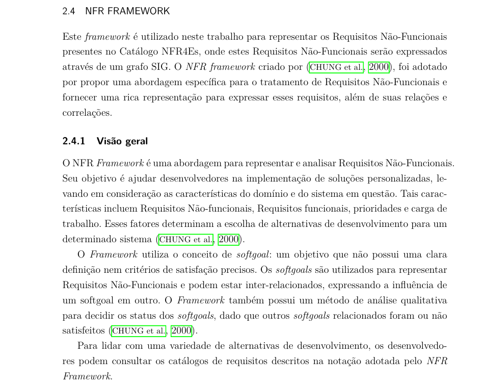
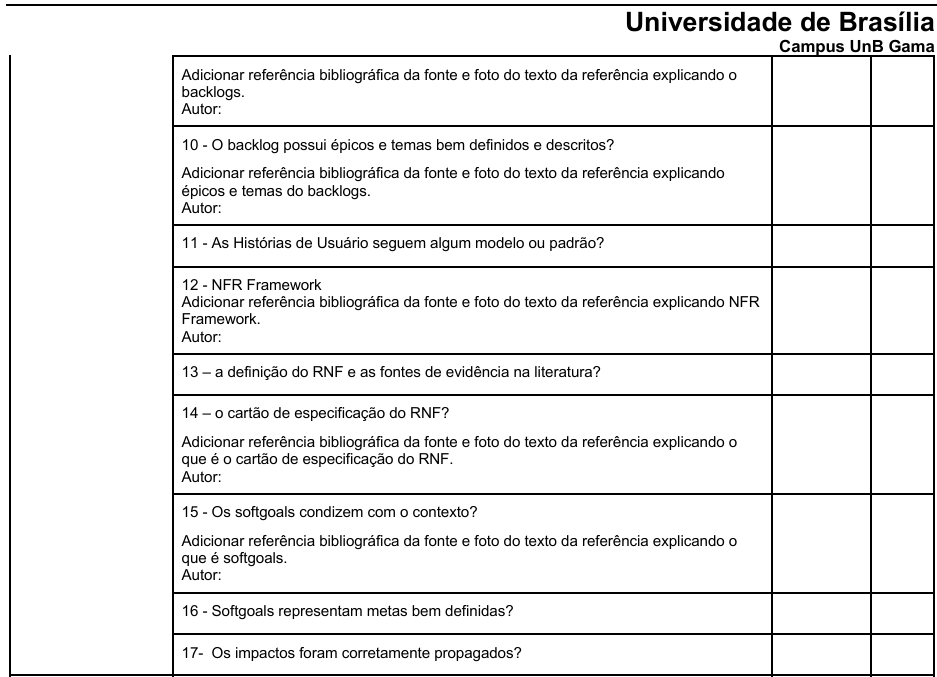

# Planejamento da Verificação da Etapa 4

---

## 1. Planejamento

### 1.1 Participantes
<ul style="text-align: justify; padding-left: 4em; margin-top: 0.5em;">
<li>Gabriel Lima;
<li>Arthur Carvalho;
<li>Daniel Rodrigues;
<li>Leonardo de Melo;
<li>Felipe das Neves;
<li>Mateus Bastos;
<li>Vitor Pereira.
</ul>

### 1.2 Lista de Inspeção

#### 1.2.1 Itens do Desenvolvimento do Projeto

Tabela 1: Itens do Desenvolvimento do Projeto
 

| ID | Item de Verificação | Autor(es) | Referência |
|------|-------|------|---------|
| <a href="#REF08">1</a> | O histórico de versão é padronizado? | [André Barros de Sales](https://sigaa.unb.br/sigaa/public/docente/portal.jsf?siape=1314342) |  <a href="https://raw.githubusercontent.com/Requisitos-de-Software/2025.1-CelularSeguro/main/Docs/assets/pdf/verificacao/Lista de Verifificação - Plano_de_Ensino RE 012025 Turma 03 v2.pdf" target="_blank">📄 PDF - Plano de Ensino </a> | 
| <a href="#REF09">2</a> | O(s) autor(es) e o(s) revisor(es) para cada artefato? | [André Barros de Sales](https://sigaa.unb.br/sigaa/public/docente/portal.jsf?siape=1314342) | <a href="https://raw.githubusercontent.com/Requisitos-de-Software/2025.1-CelularSeguro/main/Docs/assets/pdf/verificacao/Lista de Verifificação - Plano_de_Ensino RE 012025 Turma 03 v2.pdf" target="_blank">📄 PDF - Plano de Ensino </a>  | 
| <a href="#REF10">3</a> | Referências bibliográficas e/ou bibliografia em todos os artefatos? | [André Barros de Sales](https://sigaa.unb.br/sigaa/public/docente/portal.jsf?siape=1314342) | <a href="https://raw.githubusercontent.com/Requisitos-de-Software/2025.1-CelularSeguro/main/Docs/assets/pdf/verificacao/Lista de Verifificação - Plano_de_Ensino RE 012025 Turma 03 v2.pdf" target="_blank">📄 PDF - Plano de Ensino </a> | 
| <a href="#REF11">4</a> | As tabelas e imagens possuem legenda e fonte e elas chamadas dentro dos texto? | [André Barros de Sales](https://sigaa.unb.br/sigaa/public/docente/portal.jsf?siape=1314342) | <a href="https://raw.githubusercontent.com/Requisitos-de-Software/2025.1-CelularSeguro/main/Docs/assets/pdf/verificacao/Lista de Verifificação - Plano_de_Ensino RE 012025 Turma 03 v2.pdf" target="_blank">📄 PDF - Plano de Ensino </a> | 
| <a href="#REF12">5</a> | Um texto fazendo uma introdução dos artefatos? | [André Barros de Sales](https://sigaa.unb.br/sigaa/public/docente/portal.jsf?siape=1314342) | <a href="https://raw.githubusercontent.com/Requisitos-de-Software/2025.1-CelularSeguro/main/Docs/assets/pdf/verificacao/Lista de Verifificação - Plano_de_Ensino RE 012025 Turma 03 v2.pdf" target="_blank">📄 PDF - Plano de Ensino </a> | 
| <a href="#REF13">6</a> | O cronograma executado com quem realizou cada artefato/atividade com as datas de início e fim da construção/realização do artefato/atividade. | [André Barros de Sales](https://sigaa.unb.br/sigaa/public/docente/portal.jsf?siape=1314342) | <a href="https://raw.githubusercontent.com/Requisitos-de-Software/2025.1-CelularSeguro/main/Docs/assets/pdf/verificacao/Lista de Verifificação - Plano_de_Ensino RE 012025 Turma 03 v2.pdf" target="_blank">📄 PDF - Plano de Ensino </a> | 
| <a href="#REF14">7</a> | Ata(s) da(s) reuniões (com data, horário de início e do final, participantes, objetivo, atividades definidas etc). | [André Barros de Sales](https://sigaa.unb.br/sigaa/public/docente/portal.jsf?siape=1314342) | <a href="https://raw.githubusercontent.com/Requisitos-de-Software/2025.1-CelularSeguro/main/Docs/assets/pdf/verificacao/Lista de Verifificação - Plano_de_Ensino RE 012025 Turma 03 v2.pdf" target="_blank">📄 PDF - Plano de Ensino </a> | 
| <a href="#REF15">8</a> | A gravação da reunião do grupo. | [André Barros de Sales](https://sigaa.unb.br/sigaa/public/docente/portal.jsf?siape=1314342) | <a href="https://raw.githubusercontent.com/Requisitos-de-Software/2025.1-CelularSeguro/main/Docs/assets/pdf/verificacao/Lista de Verifificação - Plano_de_Ensino RE 012025 Turma 03 v2.pdf" target="_blank">📄 PDF - Plano de Ensino </a> | 
| <a href="#REF16">9</a> | Vídeo de apresentação na categoria “ listado” no YouTube? | [André Barros de Sales](https://sigaa.unb.br/sigaa/public/docente/portal.jsf?siape=1314342) | <a href="https://raw.githubusercontent.com/Requisitos-de-Software/2025.1-CelularSeguro/main/Docs/assets/pdf/verificacao/Lista de Verifificação - Plano_de_Ensino RE 012025 Turma 03 v2.pdf" target="_blank">📄 PDF - Plano de Ensino </a> | 

Autor: [Gabriel Lima](https://github.com/gabriel-lima258), 2025.

### 2. Itens do Conteúdo do Projeto

---

#### 2.1 Verificação NFR Framework

Tabela 2: Checklist para a Verificação do NFR.
 

| ID | Item de Verificação | Autor(es) | Referência |
|------|-------|------|---------|
| <a href="#REF08">1</a> | Os gráficos SIG foram validados por Fontes Externas? | [Gabriel Lima](https://sigaa.unb.br/sigaa/public/docente/portal.jsf?siape=1314342) |  SILVA, Reinaldo Antônio. NFR4ES: Um Catálogo de Requisitos Não-Funcionais para Sistemas Embarcados. Centro de Informática UFPE, Recife, 2019 | 
| <a href="#REF08">2</a> | Cada SIG possui sua respectiva propagação de Impacto? | [Gabriel Lima](https://sigaa.unb.br/sigaa/public/docente/portal.jsf?siape=1314342) |  SILVA, Reinaldo Antônio. NFR4ES: Um Catálogo de Requisitos Não-Funcionais para Sistemas Embarcados. Centro de Informática UFPE, Recife, 2019 | 
| <a href="#REF08">3</a> | Os softgoals se refinam até um nível de especificação bem definido? | [Gabriel Lima](https://sigaa.unb.br/sigaa/public/docente/portal.jsf?siape=1314342) |  SILVA, Reinaldo Antônio. NFR4ES: Um Catálogo de Requisitos Não-Funcionais para Sistemas Embarcados. Centro de Informática UFPE, Recife, 2019 | 
| <a href="#REF08">4</a> | Os cartões de especificação representam requisitos não-funcionais verificáveis? | [Gabriel Lima](https://sigaa.unb.br/sigaa/public/docente/portal.jsf?siape=1314342) |  SILVA, Reinaldo Antônio. NFR4ES: Um Catálogo de Requisitos Não-Funcionais para Sistemas Embarcados. Centro de Informática UFPE, Recife, 2019 | 
| <a href="#REF08">5</a> | Os cartões de especificação possuem: Identificador, Classificação, Descrição, Justificativa, Origem, Critério de Ajuste, Dependências, Prioridade, Conflitos e História? | [Gabriel Lima](https://sigaa.unb.br/sigaa/public/docente/portal.jsf?siape=1314342) |  SILVA, Reinaldo Antônio. NFR4ES: Um Catálogo de Requisitos Não-Funcionais para Sistemas Embarcados. Centro de Informática UFPE, Recife, 2019 | 
| <a href="#REF08">6</a> | Os Softgoals NFR estão representados apropriadamente dada a sua definição? | [Gabriel Lima](https://sigaa.unb.br/sigaa/public/docente/portal.jsf?siape=1314342) |  SILVA, Reinaldo Antônio. NFR4ES: Um Catálogo de Requisitos Não-Funcionais para Sistemas Embarcados. Centro de Informática UFPE, Recife, 2019 | 
| <a href="#REF08">7</a> | Os Softgoals de Operacionalização estão representados apropriadamente dada a sua definição? | [Gabriel Lima](https://sigaa.unb.br/sigaa/public/docente/portal.jsf?siape=1314342) |  SILVA, Reinaldo Antônio. NFR4ES: Um Catálogo de Requisitos Não-Funcionais para Sistemas Embarcados. Centro de Informática UFPE, Recife, 2019 | 
| <a href="#REF08">8</a> | Os Softgoals de Afirmação estão representados apropriadamente dada a sua definição? | [Gabriel Lima](https://sigaa.unb.br/sigaa/public/docente/portal.jsf?siape=1314342) |  SILVA, Reinaldo Antônio. NFR4ES: Um Catálogo de Requisitos Não-Funcionais para Sistemas Embarcados. Centro de Informática UFPE, Recife, 2019 | 
| <a href="#REF08">9</a> | Os requisitos não-funcionais apresentados nos cartões foram priorizados com algum método? | [Gabriel Lima](https://sigaa.unb.br/sigaa/public/docente/portal.jsf?siape=1314342) |  SILVA, Reinaldo Antônio. NFR4ES: Um Catálogo de Requisitos Não-Funcionais para Sistemas Embarcados. Centro de Informática UFPE, Recife, 2019 | 

Autor: [Gabriel Lima](https://github.com/gabriel-lima258), 2025.

---

#### 2.2 Verificação Backlog

Tabela 3: Checklist para a Verificação do Backlog.
 

| ID | Item de Verificação | Autor(es) | Referência |
|------|-------|------|---------|
| <a href="#REF08">1</a> | Há participação do cliente e/ou persona na elicitação de requisitos ? | [Gabriel Lima](https://sigaa.unb.br/sigaa/public/docente/portal.jsf?siape=1314342) |  <a href="https://raw.githubusercontent.com/Requisitos-de-Software/2025.1-CelularSeguro/main/Docs/assets/pdf/verificacao/Lista de Verifificação - Plano_de_Ensino RE 012025 Turma 03 v2.pdf" target="_blank">📄 PDF - Plano de Ensino </a> | 
| <a href="#REF08">2</a> | São apresentados os requisitos priorizados ? | [Gabriel Lima](https://sigaa.unb.br/sigaa/public/docente/portal.jsf?siape=1314342) |  <a href="https://raw.githubusercontent.com/Requisitos-de-Software/2025.1-CelularSeguro/main/Docs/assets/pdf/verificacao/Lista de Verifificação - Plano_de_Ensino RE 012025 Turma 03 v2.pdf" target="_blank">📄 PDF - Plano de Ensino </a> | 
| <a href="#REF08">3</a> | 	Os requisitos listados estão vinculados a uma história de usuário ? | [Gabriel Lima](https://sigaa.unb.br/sigaa/public/docente/portal.jsf?siape=1314342) |  <a href="https://raw.githubusercontent.com/Requisitos-de-Software/2025.1-CelularSeguro/main/Docs/assets/pdf/verificacao/Lista de Verifificação - Plano_de_Ensino RE 012025 Turma 03 v2.pdf" target="_blank">📄 PDF - Plano de Ensino </a> | 
| <a href="#REF08">4</a> | Os requisitos listados apresentam uma história de usuário condizente ao épico definido e vice-versa? | [Gabriel Lima](https://sigaa.unb.br/sigaa/public/docente/portal.jsf?siape=1314342) |  <a href="https://raw.githubusercontent.com/Requisitos-de-Software/2025.1-CelularSeguro/main/Docs/assets/pdf/verificacao/Lista de Verifificação - Plano_de_Ensino RE 012025 Turma 03 v2.pdf" target="_blank">📄 PDF - Plano de Ensino </a> | 
| <a href="#REF08">5</a> | O backlog possui épicos e temas bem definidos e descritos ? | [Gabriel Lima](https://sigaa.unb.br/sigaa/public/docente/portal.jsf?siape=1314342) |  <a href="https://raw.githubusercontent.com/Requisitos-de-Software/2025.1-CelularSeguro/main/Docs/assets/pdf/verificacao/Lista de Verifificação - Plano_de_Ensino RE 012025 Turma 03 v2.pdf" target="_blank">📄 PDF - Plano de Ensino </a> | 
| <a href="#REF08">6</a> | O backlog possui validação de um PO ? | [Gabriel Lima](https://sigaa.unb.br/sigaa/public/docente/portal.jsf?siape=1314342) |  <a href="https://raw.githubusercontent.com/Requisitos-de-Software/2025.1-CelularSeguro/main/Docs/assets/pdf/verificacao/Lista de Verifificação - Plano_de_Ensino RE 012025 Turma 03 v2.pdf" target="_blank">📄 PDF - Plano de Ensino </a> | 
| <a href="#REF08">7</a> | O backlog possui ligação com o artefato História de Usuário ? | [Gabriel Lima](https://sigaa.unb.br/sigaa/public/docente/portal.jsf?siape=1314342) |  <a href="https://raw.githubusercontent.com/Requisitos-de-Software/2025.1-CelularSeguro/main/Docs/assets/pdf/verificacao/Lista de Verifificação - Plano_de_Ensino RE 012025 Turma 03 v2.pdf" target="_blank">📄 PDF - Plano de Ensino </a> | 
| <a href="#REF08">8</a> | 	O backlog apresenta um tabela geral com todos os épicos, features e histórias de usuários ? | [Gabriel Lima](https://sigaa.unb.br/sigaa/public/docente/portal.jsf?siape=1314342) |  <a href="https://raw.githubusercontent.com/Requisitos-de-Software/2025.1-CelularSeguro/main/Docs/assets/pdf/verificacao/Lista de Verifificação - Plano_de_Ensino RE 012025 Turma 03 v2.pdf" target="_blank">📄 PDF - Plano de Ensino </a> | 
| <a href="#REF08">9</a> | O backlog possui uma metodologia identificada ? | [Gabriel Lima](https://sigaa.unb.br/sigaa/public/docente/portal.jsf?siape=1314342) |  <a href="https://raw.githubusercontent.com/Requisitos-de-Software/2025.1-CelularSeguro/main/Docs/assets/pdf/verificacao/Lista de Verifificação - Plano_de_Ensino RE 012025 Turma 03 v2.pdf" target="_blank">📄 PDF - Plano de Ensino </a> | 

Autor: [Gabriel Lima](https://github.com/gabriel-lima258), 2025.

---

#### 2.3 Verificação História de Usuário

Tabela 4: Checklist para a Verificação do História de Usuário.
 

| ID | Item de Verificação | Autor(es) | Referência |
|------|-------|------|---------|
| <a href="#REF08">1</a> | A História de Usuário possui uma metodologia identificada ? | [Gabriel Lima](https://sigaa.unb.br/sigaa/public/docente/portal.jsf?siape=1314342) | <a href="https://raw.githubusercontent.com/Requisitos-de-Software/2025.1-CelularSeguro/main/Docs/assets/pdf/verificacao/Lista de Verifificação - Plano_de_Ensino RE 012025 Turma 03 v2.pdf" target="_blank">📄 PDF - Plano de Ensino </a> | 
| <a href="#REF08">2</a> | As histórias de usuários estão escritas de forma clara e concisa, com descrição do "quem", "o que" e "por que"?? | [Gabriel Lima](https://sigaa.unb.br/sigaa/public/docente/portal.jsf?siape=1314342) | <a href="https://raw.githubusercontent.com/Requisitos-de-Software/2025.1-CelularSeguro/main/Docs/assets/pdf/verificacao/Lista de Verifificação - Plano_de_Ensino RE 012025 Turma 03 v2.pdf" target="_blank">📄 PDF - Plano de Ensino </a> | 
| <a href="#REF08">3</a> | Cada história de usuário possui um título auto-explicativo, isto é, que resuma o objetivo principal da história? | [Gabriel Lima](https://sigaa.unb.br/sigaa/public/docente/portal.jsf?siape=1314342) | <a href="https://raw.githubusercontent.com/Requisitos-de-Software/2025.1-CelularSeguro/main/Docs/assets/pdf/verificacao/Lista de Verifificação - Plano_de_Ensino RE 012025 Turma 03 v2.pdf" target="_blank">📄 PDF - Plano de Ensino </a> | 
| <a href="#REF08">4</a> | As histórias de usuários foram provenientes do cliente? | [Gabriel Lima](https://sigaa.unb.br/sigaa/public/docente/portal.jsf?siape=1314342) | <a href="https://raw.githubusercontent.com/Requisitos-de-Software/2025.1-CelularSeguro/main/Docs/assets/pdf/verificacao/Lista de Verifificação - Plano_de_Ensino RE 012025 Turma 03 v2.pdf" target="_blank">📄 PDF - Plano de Ensino </a> | 
| <a href="#REF08">5</a> | As histórias de usuário incluem critérios de aceitação que definam o que é necessário para que a história seja considerada concluída? | [Gabriel Lima](https://sigaa.unb.br/sigaa/public/docente/portal.jsf?siape=1314342) | <a href="https://raw.githubusercontent.com/Requisitos-de-Software/2025.1-CelularSeguro/main/Docs/assets/pdf/verificacao/Lista de Verifificação - Plano_de_Ensino RE 012025 Turma 03 v2.pdf" target="_blank">📄 PDF - Plano de Ensino </a> | 
| <a href="#REF08">6</a> | As histórias de usuário são testáveis, possibilitando a verificação e validação do sistema com base nos critérios de aceitação definidos? | [Gabriel Lima](https://sigaa.unb.br/sigaa/public/docente/portal.jsf?siape=1314342) | <a href="https://raw.githubusercontent.com/Requisitos-de-Software/2025.1-CelularSeguro/main/Docs/assets/pdf/verificacao/Lista de Verifificação - Plano_de_Ensino RE 012025 Turma 03 v2.pdf" target="_blank">📄 PDF - Plano de Ensino </a> | 
| <a href="#REF08">7</a> | As histórias possuem ao menos 4 requisitos funcionais e 2 requisitos não funcionais por integrante? | [Gabriel Lima](https://sigaa.unb.br/sigaa/public/docente/portal.jsf?siape=1314342) | <a href="https://raw.githubusercontent.com/Requisitos-de-Software/2025.1-CelularSeguro/main/Docs/assets/pdf/verificacao/Lista de Verifificação - Plano_de_Ensino RE 012025 Turma 03 v2.pdf" target="_blank">📄 PDF - Plano de Ensino </a> | 
| <a href="#REF08">8</a> | Há participação do cliente e/ou persona nas histórias de usuário? | [Gabriel Lima](https://sigaa.unb.br/sigaa/public/docente/portal.jsf?siape=1314342) | <a href="https://raw.githubusercontent.com/Requisitos-de-Software/2025.1-CelularSeguro/main/Docs/assets/pdf/verificacao/Lista de Verifificação - Plano_de_Ensino RE 012025 Turma 03 v2.pdf" target="_blank">📄 PDF - Plano de Ensino </a> | 

Autor: [Gabriel Lima](https://github.com/gabriel-lima258), 2025.

---

## Bibliografia

> BERGMANN, Ulf. Evolução de Cenários Através de um Mecanismo de Rastreamento Baseado em Transformações. 2003. Tese de Doutorado (Departamento de Informática) - Pontifícia Universidade Católica do Rio de Janeiro, [S. l.], 2003. p. 47-50.

> SERRANO, Milene. Requisitos – Aula 10. Apresentação de slides. Disponível em: [link](https://aprender3.unb.br/pluginfile.php/3096108/mod_resource/content/1/Aula%2010.pdf). Acesso em: 16/05/2023.

> SALES, André Barros de. Elicitação de Requisitos 2. Cap.7, Disponível em: [link](https://aprender3.unb.br/pluginfile.php/3096085/mod_resource/content/4/Elicitacao%20de%20Req%202.pdf). Acesso em: 18/05/2023.

---

Figura 1: Referências dos Itens de 1 a 9 do conteúdo [2.1](#21-verificação-nfr-framework).
 

---

Figura 2: Referências dos Itens de 1 a 9 do conteúdo [2.2](#22-verificação-backlog).
 

---

Figura 3: Referências dos Itens de 1 a 6 do conteúdo [2.3](#23-verificação-história-de-usuário).
 

---

## Histórico de Versões 

| Versão | Data de produção   | Descrição da Alteração                               | Autor(es)             | Revisor(es)      |Data de Revisão |
| :----: | :----------------: | :--------------------------------------------------: | :-------------------: | :-------------:  |  :-----------: |
| 1.0  | 29/05/2025 | Criação do documento.  | [Gabriel Lima](https://github.com/gabriel-lima258)| [Mateus Bastos](https://github.com/Bessazs) | 29/05/2025|
| 1.1  | 01/06/2025 | Desenvolvimento da lista de verificação de modelagem ágil.  | [Gabriel Lima](https://github.com/gabriel-lima258)| [Mateus Bastos](https://github.com/Bessazs) | 01/06/2025|
| 1.2  | 01/06/2025 | Adição de imagens de referências  | [Gabriel Lima](https://github.com/gabriel-lima258)| [Mateus Bastos](https://github.com/Bessazs) | 01/06/2025|